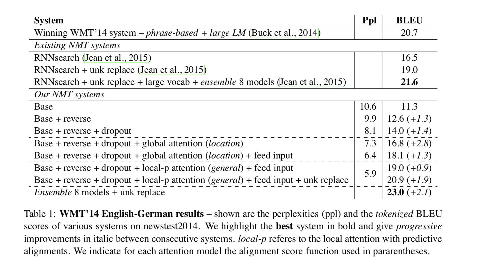
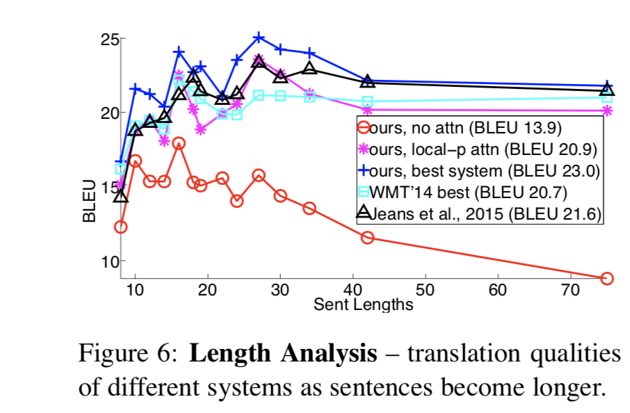

# Citation  

Neural Machine Translation by jointly learning to align and translate
Luong Pham Manning 2015

# Tags  

Attention, NMT

# Significance

Builds on top oF Bahnadau attention [notes here](./NLP/Attention_Bahdanau_2015.md) 
Generalizes Bahnadau attention by proposing different variants of the affinity function between si-1 and hj, using the notation in that paper
Call this global attention

In addition, propose local attention, where instead of attending on all words in source sentence for a given target word,
only a small context within the source sentence/paragraph is attended on -> especially useful in case of long sentences / para
in source sentence

# Context and summary  

Same context and summary as [here](./NLP/Attention_Bahdanau_2015.md) 

# Method in more detail

# Global attention  

1) Different architecture compared to Bahnadau attention. Specifically, the differences are  - 
    - How are representations of source and target obtained ?
      In Bahnadau, for encoder, for each word, the forward and backward hidden state representations are concatenated, 
      for decoder, hidden state representations of non-stacking (basically 1 layer RNN) are used
      Here, though, the hidden states of the top layer is used for encoder representations (no concatenation of forward and backward)m
      and for decoder
    - Exact architecture is different in terms of computation paths
      Computation path : Bahndadau :  ht-1 (previous hidden state in target) -> at (a(ht-1,hs)) -> ct (context vector) -> ht (hidden state of current word) -> yt (predicted target)
      Computation path : here : : ht (current hidden state) -> at (a(ht,hs)) -> ct -> hthat -> yt  
    - Input feeding - Luong uses input feeding (described below) to give previous target word alignment information when current word is translated, by concatenating ht-1hat with prediction yt-1hat at time t as input,
      this is needed as we can see from the computational graph above, to create ct, only ht is used and not ht-1. Bahdanau does not use this, as context vector there uses ht-1 instead
    - The alignment function a(ht-1,hs) was a simple NN in Bahnadau with a tanh activation ie a(ht-1,hs) = vaTtanh(Wa[ht-1;hs]) - concatenation opration
      Here, other even simpler alternatives are tried for the alignment function and found to be better a(ht,hs) = htTWahsT    - called general operation   
      

Some equations : hthat = tanh(Wc[ct;ht]) , where ct and ht are simply concatenated  
                 p(yt|y< t,x) = softmax(Wshathat)  , the final target probabilities    
      
# Local attention  

The main idea here, is that if source sentence/para is very large, we would not want to globally attend over the representations 
of all the words, as that becomes very expensive/impractical. So use a local attention mechanism that chooses to focus on only
small subset of source positions per target word.   
Here, for every target word t, an aligned position pt in source sentence is obtained. The context vector ct 
is then obtained by fixing source as all words in window [pt-D, pt+D] where D is an empirical constant 
Note that unlike the global approach, a is now of fixed dimension 2D+1 .
How is pt (anchor word in source sentence given target word t) obtained  ? Two variants - 
montonic alignment - simple method, where pt is assumed to be equal to t ie use same position as anchor in source sentence as current position in target. 
predictive alignment -  where pt is predicted for every word t in target sentence. given hidden stage ht of t. 

  
Image credit - Equation 9 in paper  

In addition, a gaussian distribution around pt thus identified is used to compute alignment scores  
ie instead of a(ht,hs), use equation below 

  
Image credit - Equation 10 in paper , standard deviation sigma of this gaussian is set empirically to D/2  

# Input feeding  

When translating each word, we want the network to use past alignment choices made .
To do so, at every step t , ht-1hat (hidden output of previous target word) is concated with input at time t. 

# Experiments

1) Dataset - WMT english to german and german to english . Trained on WMT 14 data - 116M english words, 110 M german words. Newstest 2013 (3000 sentences) is used to select hyperparameters 
   Translation performances are reported on newstest 2014 (2737 sentences) and newstest 2015 (2169 sentences)  
   tokenized BLEU and NIST BLEU used for evaluation 
2) Vocab limited to top 50K (30K used in Bahdanau) words  in each language , words not in vocab are called UNK
3) Similar to Bahdanau, filter out sentences with > 50 words 
4) Stacking LSTM has 4 layers, each with 1000 cells, 1000 dimensional embeddings. 
5) Parameters uniformly initialized in -0.1,0.1, train for 10 epochs using SGD. 
6) start with learning rate 1, after 5 epochs, reduce learning rate by half 
7) Use dropout of 0.2 
8) Window size D set to 10 for local attention models. 

# Results   

English -> german translation results  

  

Image credit - table 1 in paper 

We see that every step adds to an increment in performance - reversing (Sutskever et al 2014), dropout, global attention, global attention + feed input , local attention,
local attention + feed input, local attention + feed input + UNK replace (Luong 2015)  

In addition, an 8 model ensemble is built (different attention approaches, with and without dropout, etc) to attain a SOTA BLEU score of 25.9

German -> english translation results   . Not SOTA but prety good. 
    

Image credit - table 3 in paper 

Variation of performance of different models as sequence length increases : attention models perform much better with increase in sequence length  .. 

  

Image credit - Figure 6 in paper   

Variation of performance with different alignment models - dot, general, concat , etc and local mononotic alignment vs local predictive alignment vs global attention  -
local attention with general alignment, predictive alignment gives best performance

  

Image credit - Table 4 in paper  

