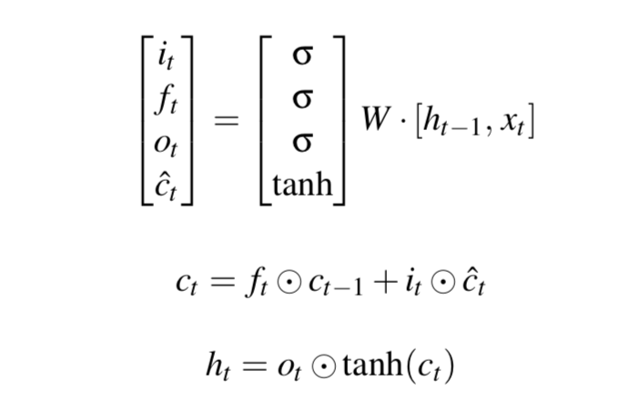
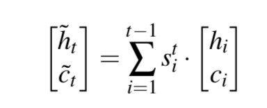
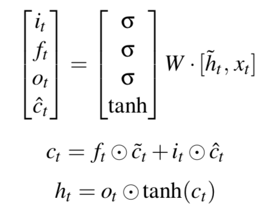
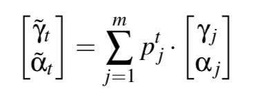
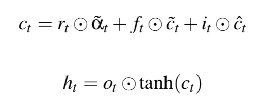
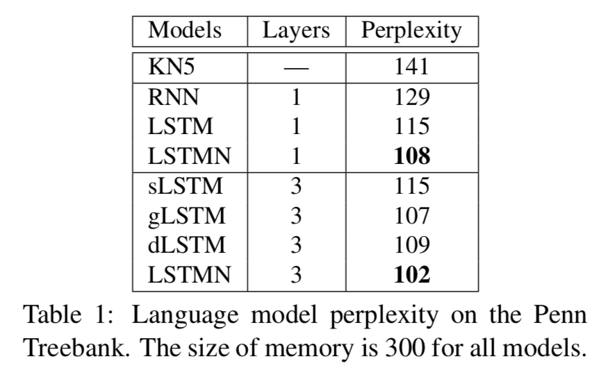
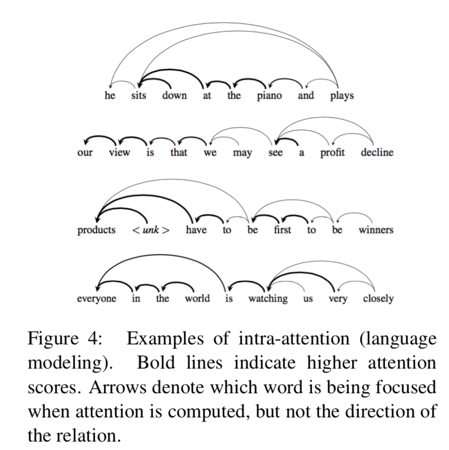
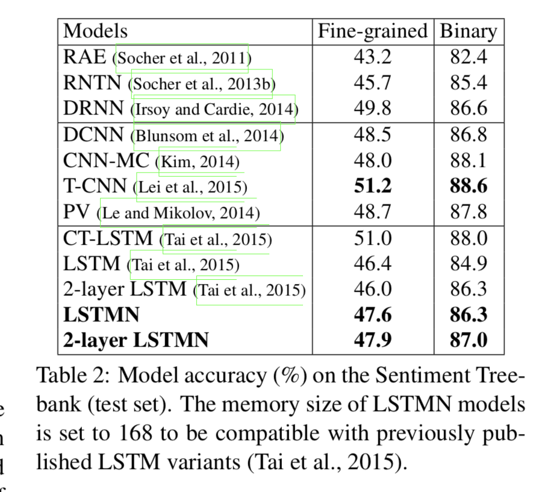
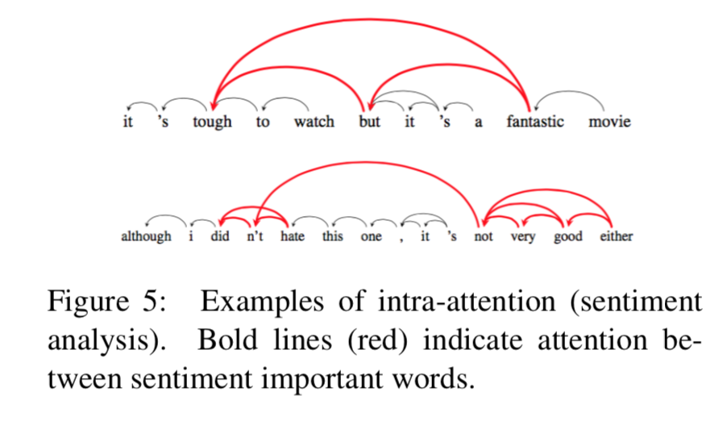
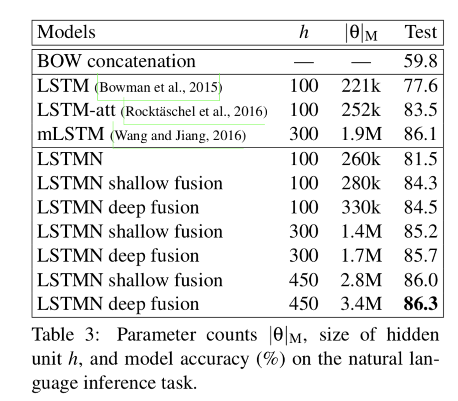

# Citation  

Long Short Term Memory Networks for Machine Reading
Cheng Dong Lapata 2016

# Tags  

LSTM, LSTMN, self-attention

# Significance

Improve LSTM by using a memory network instead of a memory cell, memory network uses self attention (or intra attention)

# Context and summary  

Traditional RNN's have 3 main issues - 
1) Exploding and vanishing gradients - handled partially through clipping, BPTT,  architectures like LSTM and GRU
2) Memory compression  - Entire input sequence (whether of length 5 or 50 or 500) is represented by 1 dense vector - usually the hidden state
of the last  cell - handled by Bahdanau et al 2014 by attention between current target token to all the source tokens
3) Not able to capture structure of the input - LSTM sees one token at a time, and there 
is no way to explicitly reason across tokens , and modeling relations between tokens,
Attempts to solve it involve using external memories in the context of RNN's (Weston 2015, Sukhbaatar 2015, Grefenstette 2015)
- using multiple memory slots outside the recurrence to store piece-wise representations of input. 

In this paper, 3) is handled by using a memory network internal to the recurrence, enabling tigher coupling between the memory and recurrent units  
For 2) attention between tokens of current sequence (intra-attention) is used in the architecture  

# Method in more detail

1)  Essence of this approach is an LSTM unit with an extended memory tape which simulates human memory. Implicit relation
analysis between tokens is performed with an attention based memory addressing mechanism at every step. 

2) Conventional LSTM - 
processes a variable length sequence x (x1..xn) by incrementally adding new content to a memory slot , with gates controlling 
how much new content should be memorized (via the input gate), old content should be erased (via the forget gate)
and current content should be exposed (via the output gate). At any time step t, the cell state ct and the hidden stage ht are updated with 
equations below  

 

Image credit equations 1,2,3 in paper 
i,f,o are input, forget , output gate activations respectively. 
Compared to standard RNN, LSTM decouples cell state / memory (which is internal) and hidden state (which is exposed to the environment)  

One assumption of LSTM based on the equations above is that they follow a markov process 
ie ht+1 , given ht, is conditionally independent of h1... ht-1, and x1...xt 

The assumption therefore is that the current state alone summarizes all the tokens seen so far, which fails in practice
when sequence is very long, or when memory size is not large enough    

The other limitation, as mentioned earlier, is that since the standard LSTM sees one token at a time, there is no way to explicitly
model inter-token structure/relations  

3) The LSTMN attemps to solve the problems above.. 
The memory cell is replaced by a memory network, where each token's representation is stored in a unique memory slot. 
The size of the memory slot grows with time as more tokens are processed, until an upper bound is reached. 
This enables using a neural attention layer on top of the memory network to learn inter-token relations,  and perform
non-markov state updates. 

Concretely, each token is associated with a hidden vector and a memory (cell state vector) 
Therefore, for current input xt, the memory tape Ct-1 = (c1,c2..ct-1) (note how  unlike a traditional lstm where only ct-1 is in memory, here all vectors from c1.. ct-1 are stored)
Similary, the hidden tape Ht-1  =(h1,h2...ht-1)   

At time step t, the model computes relation of xt with all the previously seen tokens  x1..xt-1 through the previous hidden states 
h1..ht-1 with an attention layer. 

A concat attention is used , similar to Bahdanau for the alignment score,
ie alignment score a(xt,hi) = vTtanh(Whhi + Wxxt + Whathhatt-1) 
sit = softmax(a(xt,hi))
where hhatt-1 is adaptive summary vector for previous hidden state ht-1   given by the following equations - 

  

Image credit equation 6  

The update equations , anologous to the standard LSTM update equations, but not identical are below , 

  

3) The above equations are for modeling one sequnce, for modeling a two sequence problem (ala encoder - decoder architecture)
 , the equations change a bit   - 
 
 two kinds of attention are described here - 
 
 a) shallow attention fusion  - treats LSTMN as a seperate module   which can be used in a standard encoder decoder architecture 
 instead of an RNN or LSTM. Both encoder and decoder are modeled seperrately with intra-attention 
 In addition, inter-attention between the current target token and the source sentence is treated similar to the Bahdanau approach. 
 
 
 b) Deep attention fusion - intra and inter attention are combined when computing state updates. 
 If C and H are context/memory and hidden state tapes of target sentence, let A (alpha1, alpha2...alpham) be  and  Y  = (gamma1, gamma2...gammam) be
 the context and hidden state tapes of source sentence .., where m is length of source sentence..  
 
 The alignment score between input in target sentence at time step t and hidden state j in source sequence is computed as  --
 a(xt,gammaj) = uTtanh(Wgamma*gammaj + Wxxt + Wgammahat*gammahatt-1)
 pjt = softmax(a(xt,gammaj))   
 
where gammahatt and alphahatt are given by the following equations, exactly analogous to similar equations for the target sequence above .. 

 
 
Image credit - equation 13 in paper   

Now, we need to transfer the source target memory/cell state to target memory..

There is an additional term rt.alphahatt we thus add while computing target cell state ct, where rt is a gate operation  analogous to the LSTM gate operations. 
rt = sigma(Wr.[gammathat,xt])

 
Image credit - equations 15 and 16 in paper

rt.alphahatt helps in inter alignment, ft.cthat helps in intra-relation between target, and it.cthat helps get new information..

The difference between shallow and deep attention fusion is the presence of the rt.alphahatt term.

# Experiments

1) Language modeling  

Dataset - English Penn Treebank Dataset. 
Trained on sections 0-20 (1 MM words), validated on sections 21-22 (80 K words) and tested on sections 23-24 (90K words)
SGD for optimization with an initial learning rate of 0.65, which decays by a factor of 0.85 per epoch. 
Gradient renormalized if norm greater than 5.
150 - word embedding dimension
Compared LSTMN with Kneser Nay 5 gram model, basic LSTM and more advanced LSTM architectures such as stacked LSTM and 
gated feedback LSTM   

    

Image credit table 1 in paper

Intra attention scores can tell you word relations in the context of a sentence 

    

Image credit figure 4 in paper

 
  
 
 
 
2) Sentiment analysis  

Dataset - Stanford sentiment treebank (socher 2013a) - 5 class problem :  very positive, positive, neutral, negative, very negative
Similar to earlier work, 8544 sentences for training, 1101 for validation and 2210 for testing. 
Also used a coarse grained representation for a binary classification task after removing neutral label (just positive, negative are classes) 
Glove used to initialize word embeddings
Adam for optimization with two momentum  parameters set to 0.9 and 0.99
Drop out rate 0.5, initial learning rate 2e-3

Architecture - on top of LSTMN,  take averaged hidden vector and pass through 2 layer classifier with ReLU as activating function. 

     
 
 Image credit table 2 in paper  
 
 LSTMN is almost comparable to the best performing model - (T-CNN, Lei etal 2015)

     
 
 Image credit Figure 5 in paper   
 
 We can observe attention values between words indicating sentiment in the plots above using LSTMN
 
 
 
 3) Natural Language Inference  
 
 Whether two premise-hypothesis pairs agree (entaiment), contradict or are neutral
 Dataset - Stanford NLI
 549367 sentence pairs for training, 9842 for development and 9824 for testing 
 vocab size 3609
 preprocessing - tokenization and lower case for entire data set 
 Method - 2 LSTMN to read the premise and hypothesis,
 match them by comparing hidden states
 average pooling of hidden state tape of each LSTMN, concatenate 
 two averages to form input to a 2 layer NN classifier with ReLU as activation function 
 300-D Glove 840B vectors for initialization, OOV vectors initialized randomly with gaussian samples, mean 0, sigma 1   
 ONly OOV vectors updated in first epoch, after which all embedding vectors were updated
 Drop out rate 0.1 or 0.2 or 0.3 or 0.4 based on hyper parameter optimization 
 adam, mini batch size 16 or 32   
 
      
  
  Image credit table 3