# Citation  

Albert: A Lite Bert for self-supervised learning of language representations
Lan et al 2020

# Tags  

albert

# Significance

A lighter (lesser no of parameters) bert model with comparable or better accuracy on NLP tasks

# Context and summary  

Albert works on top of [BERT](../bert_devlin_2018/bert_devlin_2018.md) 
Bert and subsequent works ([roberta](../roberta_liu_2019/roberta_liu_2019.md), [OpenGPT2](../opengpt2_radford_2018/opengpt2_radford_2018.md)) go for larger and larger transformer based models,  so the question
the authors are asking is - is it possible to have smaller models with comparable performance. 
The advantages of course are  - reducing memory bottlenecks, faster training, lesser communication bottlenecks

Previous ways of reducing memory - model parallelization (Shazeer et al 2018, Shoeybi et al 2019);
memory management (Chen et al 2016, Gomez et al 2016) which address the memory bottleneck problem,
but not the communication overhead. 

In this contect, albert introduces two parameter reduction techniques which reduce model size
a) factorized embedding parametrization - Decompose large embedding matrix into two smaller matrices, 
which decouple size of embedding from size of hidden layers
b) cross-layer parameter sharing - Prevents parameter size from exploding as depth of network increases
These techniques reduce parameters of BERTLarge by 18x, training time by 1.7x, and has comparable performance. 

In addition, albert modies the next sentence prediction objective of bert to a sentence order prediction objective
instead.
albert achieves SOTA on GLUE (89.4 percent), SQUAD 2.0 (92.2 percent), RACE (89.4%)

# Method in more detail   (mainly changes on top of the BERT architecture)

Basically BERT with GELU nonlinearities. 
Following BERT notation, vocab size denoted by V, number of encoder layers as L, hidden size as H. 
Following Devlin, number of attention heads = H/64, feed-forward/filter size = 4H

## Factorizing embeddings :

in bert, XLNet and Roberta, the hidden size H is set to embedding size E (for each word,
the input and output of each layer is of dimension E/H). 
This is suboptimal as the purpose of E and H is different, (word-piece) embeddings are meant to learn context
independent representations, and hidden layer embeddings are meant to learn context dependent representations
since the power of techniques like BERT is to learn context dependent represetations, we
would want H >> E, to learn better context dependent representations, which is not possible
in BERT/Roberta/Xlnet as H is tied to E

In albert, embedding parameters are factorized. instead of projecting one-hot vectors directly 
into hidden space of size H, they are projected into lower dimensional embedding of size E,
and then from E to H
So Instead of no of parameters being V*H, it will be V*E + E*H. If H>>E, then V*E + E*H << V*H.
Same E is chosen for all word pieces

## Cross-layer parameter sharing 

Default decision for albert is to share parameters (both attention and feedforward) across all layers. 

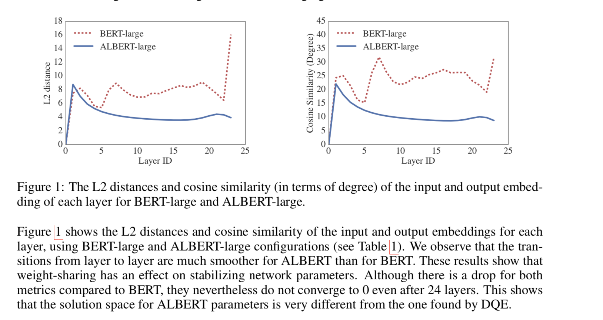  

Image credit - Figure 1 from paper

Looking at L2 distances between input and output for every layer, albert is smoother because of parameter sharing compared
to bert

## Inter-sentence coherence loss  

the original BERT paper uses a next sentence prediction task (NSP) as one of the objections, apart from masked language modeling
This is posed as a binary classification problem , if two sentences occur next to each other in the corpus,
label is 1, we also get completely unrelated random sentence pairs from different documents corpus, and assign label 0.

Subsequent works such as [roberta](../roberta_liu_2019/roberta_liu_2019.md) remove the NSP objective, as they
do not find it effective 

In albert the authors use a sentence order prediction loss which they claim is better because it is a harder objective than NSP, and forces the model to capture coherence, and hence forces the model to learn better
Simply put, similar to NSP, if two sentences occur next to each other in corpus, label is 1.
However, for negataive labels, instead of random sentences, sentences occuring next to each other are flipped in order, and assigned label 0. 

albert models are seen to perform much better on multi sentence tasks. 

# Experiments  

1) Comparison of albert with bert on no of parameters 

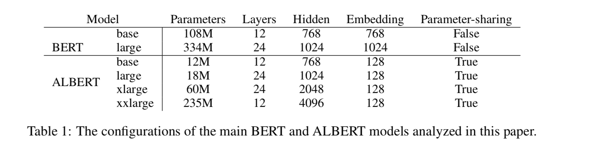  

Image credit - Table 1 from paper  

albert large has 18x fewer parameters  than bert large. 

2) Training - since authors want to compare with bert,  use the same bookcorpus + english wiki
which bert uses for pretraining LM. 
Inputs formatted similar to bert as (cls)x1(sep)x2(sep) where x1 = (x11,x12..) and x2 = (x21, x22..) are two segments
vocab size of 30k, sentence piece embedding similar to xlnet used. 
limit  input length to 512 tokens, and randomly generate input sequences with length less than 512 with prob 10%

(segments are comprised of more than one natural sentence usually)  

masks are generated using n-gram masking (Joshi et al 2019), with length of each n-gram selected randomly. 
p(length n) = 1/n/(1 + 1/2 + 1/3...)
set maximum length of n gram allowed to 3. 

Batch size 4096, LAMB optimizer with LR 0.00176(You et al 2019). train all models for 125K steps unless otherwise specified

# Results

1) albert vs bert

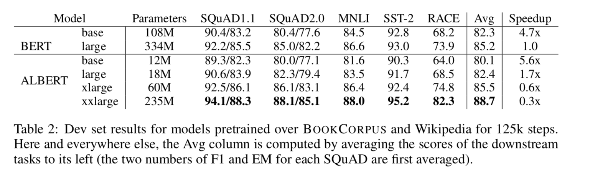  

Image credit - table 2 from paper

With around 70% of bert large's parameters, albert xxlarge better accuracies on many downstream tasks. 

2) Effect of factorized embeddings 

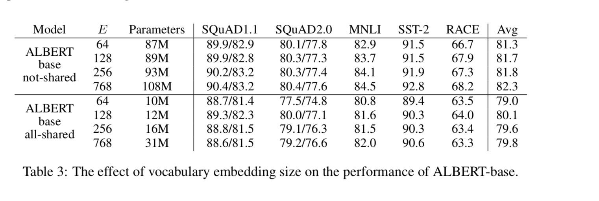 

Image credit - table 3 from paper

Embedding size E of 128 seems best in a shared setting, used for all tasks downstream  .

3) Effect of cross-layer parameter sharing  
Compare impact of no-sharing (bert style), all-sharing (albert style), sharing only self-attention weights, sharing only FFN weignts
with two different embedding sizes (E=768 and E=128)

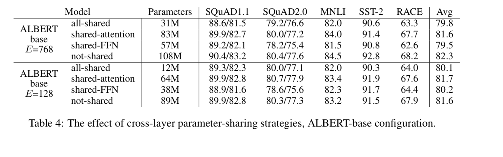 

Image credit - table 4 from paper

all-shared strategy is worse, but less severe when E=128. 
in addition, sharing attention parameters does not cause much of a performance drop,
most of the drop comes from sharing FFN parameters. 

The all-shared strategy is picked (even though it has worse performance)  

4) Effect of sentence order prediction cost function. 

compare no NSP loss (roberta, xlnet style), NSP loss (bert loss), and sop instead of NSP (albert style)  

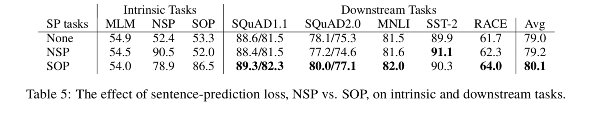 

Image credit - table 5 from paper  

While training for NSP does terribly on the SOP task (52% accuracy), training for SOP does quite well on NSP (78.9%)
For down-stream tasks, for multi-sentence encoding tasks, SOP helps quite a bit..

5) Effect of training time

Since bert large has 3.17x higher dataa throughput than albertxxlarge , 
instead of controlling for datathroughput (no of training steps), 
we allow  bert large and albertxx models to train for same amount of time and compare

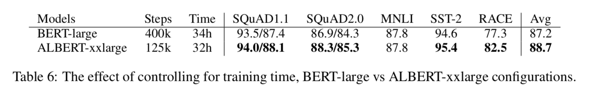 

Image credit - table 6 from paper  

After training for similar time, albert xx large is 1.5% better than bert large on ave, and 5.2% better on race. 

6) Using additional data to train

Instead of restricting to wiki and books corpus data used by bert,
add training data used by roberta and xlnet and check whether performance improves. 

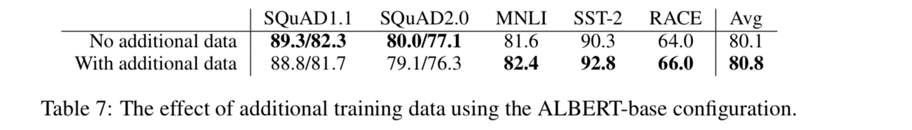 

Image credit - table 7 from paper  

performance improves for all tasks except squad tasks. 

7) Effect of dropout

the authors note that even after training for 1 MM steps, the largest models don't overfit training data
so they remove dropout (!) to see if it helps

effect of removing dropout on MLM accuracy on dev set

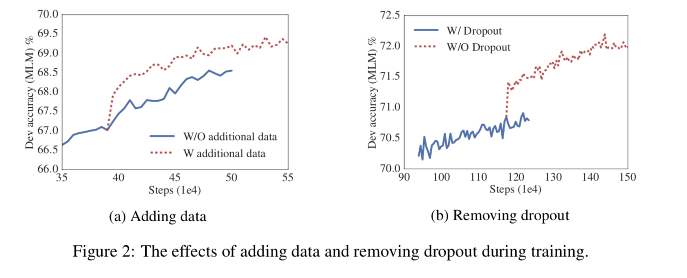 

image credit - figure 2 from paper

effect of removing dropout on downstream tasks 

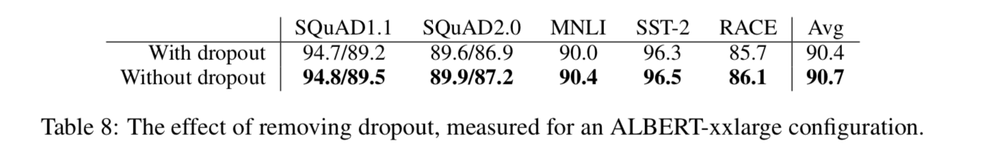 

image credit - Table 8 from paper

The first study which shows that adding dropout can hurt transformer based models !!

8) SOTA on NLU - GLUE

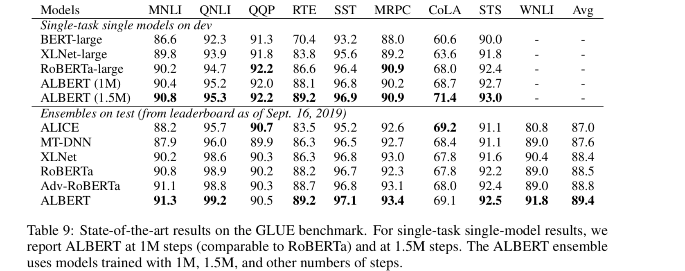 

Image credit - table 9 from paper

9) SOTA on NLU - SQUAD and RACE

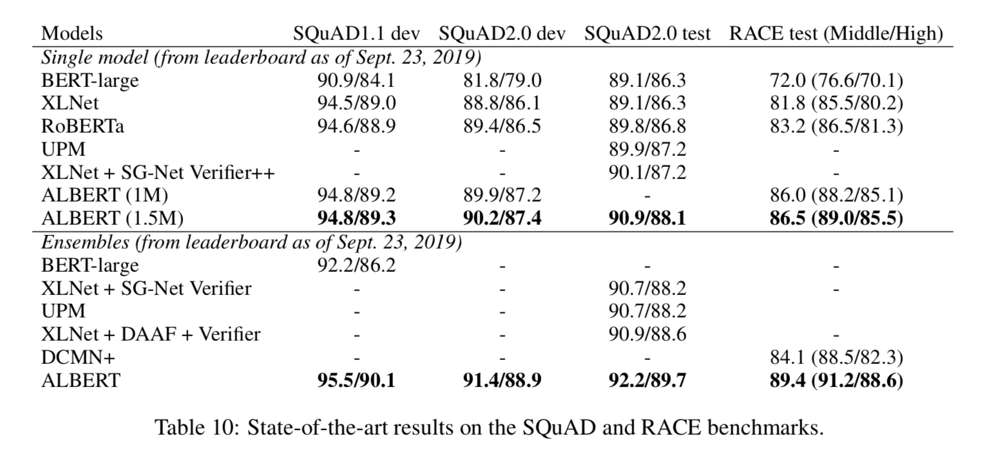 

Image credit - table 10 from paper

