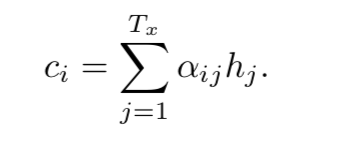
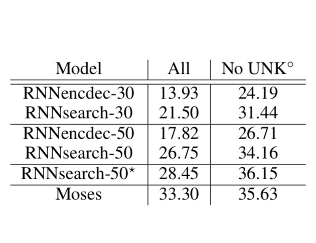

# Citation  

Neural Machine Translation by jointly learning to align and translate
Bahdanau Cho Bengio 2015

# Tags  

Attention, NMT

# Significance

Instead of encoding source sentence into a fixed length vector before decoding in a classic encoder decoder architecture, 
automatically (soft) search for parts of source sentence that are relevant to predicting a target word 

# Context and summary  

Previous work on encoder - decoder architectures (Sutskever et al 2014, Cho et al 2014a) compress all information 
of source sentence into a fixed-length vector (typpically the hidden state corresponding to the last word) .
This makes it difficult for model to perform well on longer sentences, where all the information across the many words in the sentence
are captured in a single vector. 
Instead, in this work, the architecture allows for aligning and translating jointly, where the input sentence 
is enoded a a sequence of vectors instead of a single vector . Every time  a new word is generated , a subset of the 
sequence of vectors is chosen adaptively while decoding the translation.  

# Method in more detail

1)  Mathematically, the goal of NMT is to find target sentence y given phrase sentence x which maximizez p(y|x)  
i.e. yhat = argmaxyp(y|x)  

2) In traditional RNN based encoder-decoder architectures , the encoder reads the sentence x = (x1,...xTx),
where x1..xTx are vector representations/embeddings of words 1..Tx in sentence x, and converts this sentence to a context vector c

c = q({h1,...hTx}) where q can be any function, h1...hTx are hidden states at times 1...Tx, ht = f(xt,ht-1)  

Sutskever etal 2014 used c = hTx   

Next, the decoder predicts the next word yt', given all the previously predicted words y1..yt'-1 and the context vector c  

If y is the target sentence to be predicted, y = (y1,y2...yTy)

 

Image credit - equation 2 in paper  

where p(yt|{y1,y2..yt-1},c) = g(yt-1,st,c) where st is the hidden stage of RNN      

3) In this paper, the encoder is a bidirectional RNN, and the decoder dynamically searches through source sentence ..

So at a high level, instead of p(yt|{y1,y2..yt-1},c) = g(yt-1,st,c) where c is independent of time step t,

p(yt|{y1,y2..yt-1},c) = g(yt-1,st,ct) where ct changes depending on the time step t   

4) How exactly is ct computed ? Changing notation below as per the paper where t is called as i,

at time step i, 

    

Image credit - equation 5 in paper 

So ci is a weighted sum of all the hidden states of the source sentence , weights representence by alphai1..alphaiTx  

Note that since Bi-RNN's are used in this paper, each hidden stage hj is a concatenation of forward and backward hidden states  

5) Next question - how are these alpha's obtained ? 

We want to constrain that \sum{j}alphaij = 1 in equation 4, so an obvious solution is to generate alphai1..alphaiTx  
using a softmax function 

So alphaij are obtained by taking a softmax over energies eij as below  

   

Image credit - equation 6 in paper  

7) Next question- How are eij obtained :) ? Intuitively, eij is a score which should be higher if the predicted word yi in target sentence is more related to word j in source sentence  
We don't know what output at position i is going to be (that's what we want to predict) - so we use si-1 (hidden state of previous word yi-1) as a proxy for yi  
So eij = a(si-1,hj)  where a is an affinity function / alignment model as this paper calls it
a could be something as simple as a cosine distance, but in this paper , they 
use a simple feedforward network for a which is trained jointly  

Another way to think about ci is that it is the expected annotation over all annotations  (hidden states) with probabilities alphaij    

8) Once ci is obtained, si, the hidden state of current word vector = f(si-1,ci,yi-1)  (a simple NN layer),
and y (predicted word) = g(si,ci,yi-1) where g is a softmax over the vocab of target words
 

# Experiments

1) Dataset - WMT 14 which contains the english-french parallel corpora from multiple sources such as Europarl, news commentary, 
and two crawled corpora - total 850MM words -> reduced to 348 MM words by a data selection method   

2) Tokenization - from Machine translation script Moses  

3) Use 30k most frequent models in each language to train models , any word not included in shortlist is represented by UNK

4) No other preprocessing such as lowercase or stemming is used . 

5) Two models trained - 1 baseline (traditional RNN encoder decoder, Cho 2014 called RNNencdec) and the current model - called RNN search  
Train each model twice, once with sentences upto length 30, next with sentences upto length 50  

6) Encoder and decoder have 1000 hidden units each, minibatch stocastic gradient together with Adadelta  

(For more details on architecture or parameter, check appendix)

# Results   

  

Image credit - table 1 in paper 

RNNsearch is as good as Moses which uses a conventional phrase based translation system, when only sentences 
consisting of known words are considered, even though Moses uses a seperate monolingual corpus which is much larger  

2) We can visualize the annotation weights between any pair of sentences alphaij, to get a feel of which words are "attended" too
by looking at a heat map of all alphaij, i=1..Tx, j=1.Ty     

   

Image credit - Figure 3d in paper

One advantage of using soft alignment, is that in the plot above, we see that l' in l'homme depends on both the and man in english
which is correct as l' is declided differently in french depending on whether the following word is man or woman, etc  

Another advantage of soft alignment is that it automatically handles sentences of differing lengths in source and target languages,  

3) From results 1 above, this method is much better than conventional sentences as the sentences become longer .. 

