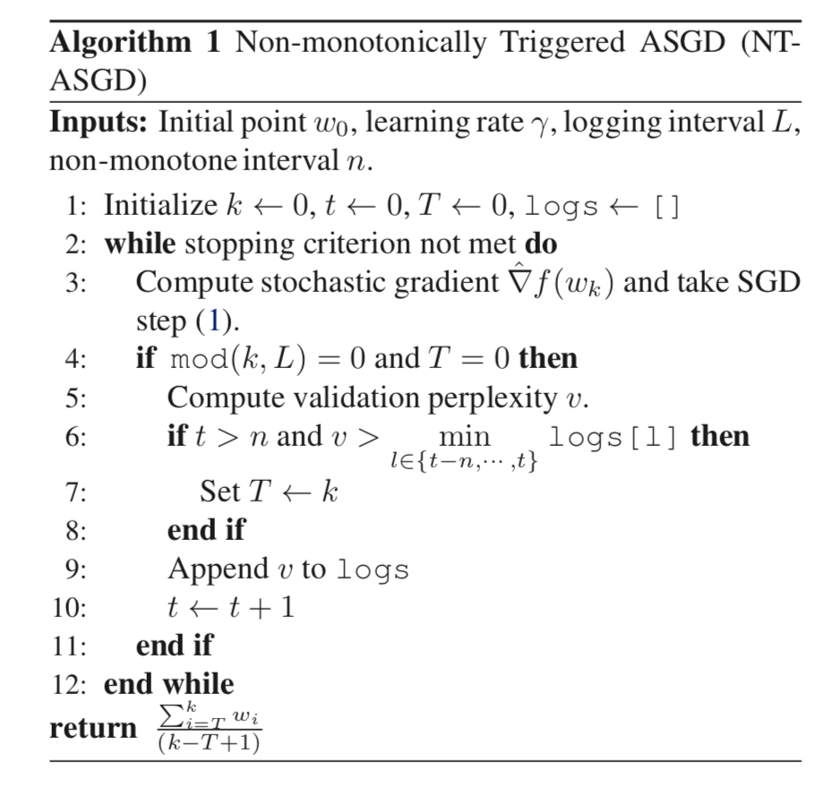

# Citation  

Regularizing and Optimizing LSTM Language Models
Merity Keskar Socher 2017

# Tags  

LSTM, dropout, AWD LSTM

# Significance

Improve LSTM's using regularization techniques to achieve state of art (As of 2017) performance (word level perplexities) 
on two data sets

# Context and summary  

Applying dropout to RNN is not as easy as applying it to DNN, as naively applying dropout will mess up with the temporal
structure of RNN's, and it's ability to model long range dependencies well (Zaremba et al 2014). 
Previous techniques to handle this include - 
a) retaining same drop out mask across multiple time steps , as opposed to having a new random binary mask at every time step (Gal and Ghahramani 2016). 
b) Applying regularization not through conventionaldropout but through limiting updates to the RNN's hidden states - Semeniuta (2016) where updates to network units such as LSTM input gates are dropped, instead
of the units themselves.  
c) Apply regularization through restrictions on the recurrent matrices instead of the RNN hidden state activations (Arjovsky et al 2016, Wisdom et al 2016, Bradbury 2016, etc))  
d) Through Batch or layer normalization techniques  

In this paper, the authors come up with a different regularization strategy for RNN's which is both highly effective, 
and can be used with no modifications for existing LSTM implementations.  
The different techniques the authors use here are 
a) Weight dropped LSTM which apply regulazation through a drop connect mask on hidden-hidden recurrent weights 
b) randomized length BPTT
c) Embedding dropout
d) Activation regularization (AR)
e) Temporal activation regularization (TAR)  
f) Using non monotonically triggered-averaged stochastic gradient descent (NT ASGD) instead of classical SGD for training  

# Method in more detail

1)  The standard RNN formulation is below   

    

Image credit : Equations in page 2 of paper  

2) Dropconnect/Weight drop applies dropout on the hidden to hidden weight matrices Ui, Uf, Ua, Uc. 
This prevents overfitting from occuring on recurrent connections, and on current weight matrices of other RNN cells,  
In BPTT, the same dropped weights remain dropped for the entire forward and backward pass. 

3) Instead of using SGD for optimization , use NT-ASGD

Instead of standard gradient descent, 

   ,

Image credit - equation 1 in paper

ASGD (Polyak and Juditsky 1992)

return the average of the last K-T+1 SGD weights as current ASGD weights. more  precisely , (1/k-T+1)*\sigma_{i=T,K}wi
where  K is total number of iterations, and T<K is user specified averaging trigger.   However, this has two tunable parameters
learning rate and T which are hard to fine tune  

NTASGD - makes a triggering decision based on a non-monotonic criteria  that triggers averaging when perplexity on validation set
fails to improve for multiple cycles.  This is better than triggering averaging instantanteously when performance fails to improve which is a common strategy. 
It introduces two additional parameters L and n - Logging interval and non-monotone interval , but L= no of iterations in epoch, and n = 5 works well in practice

   

Image credit - algorithm 1 in paper. 

4) Other regularization techniques used . 

4a) Variable length BPTT  

In standard truncated BPTT, where long sequences are truncated into fixed sub-sequences of length k, 
every kth element will never have any elements to backprop into. More precisely, every element
has a backprop length = i mod k where i is element index, so different indices always undergo different amounts of backprop. 

This is inefficient, sequence length k is not kept a constant but selected randomly  for a given forward and backward pass. 
base seq length is selected to be seq with a prob p and seq/2 with prob 1-p, where p is close to 1. 
This spreads starting point of BPTT window to mostly seq, but rarely seq/2. Then, actual seq length for a given forward backward pass run is selected from distribution N(seq,s) 
where s is standard deviation. This ensures average seq length remains around base seq length for computational efficiency, but given enough epochs for a given sequence ensures all 
elements have equal amount of back prop independent of index.  
This also necessitates having different learning rates for short and long sequences, as having a fixed learning rate favors
short sequences over longer ones. Therefore, learning rates are scaled based on seq length  

4b) Variational dropout

While drop connect is used for hidden to hidden weights, variational dropout is used for all other dropout operations. 
In variational dropout, instead of a new dropout mask being generated every time, for a given forward backward pass, 
the same dropout mask is used.  (Gal and Gahramani 2016)

4c) Embedding dropout  

Dropout performed on embedding matrix at word level, where all all weights for a given word are set to 0 randomly, while
other words are scaled by 1/(1-pe) where pe is probability of embedding dropout.  (Gal and Gahramani 2016)
This is performed once  forward-backward pass  which means all occurences of a specific word will disappear for that pass. 
(This is equivalent to performing variational dropout between the one-hot embedding matrix and the embedding matrix)  

4d) Weight tying  

Weight tying (Inan 2016, Press and Wolf 2016) shares weights between embedding and softmax layer. 

4e) Independent embedding size and hidden size.  
Unlike standard LSTM models where by convention embedding size (between 100 to 400) is same as hidden size,
here w vector sizes are chosen smaller than hidden layer size.  

4f) Activation regularization (AR) and temporal activation regularization (TAR) 

Use L2 regularizations on individual unit operations (AR) and on difference in RNN output at different time steps (TAR)  
AR penalizes activations significantly larger than 0. AR = alpha*||m . ht || where || is the L2 norm, ht is output of RNN at step t, m is dropout mask
TAR =   beta * ||ht - ht+1||

The whole method is called AWD-LSTM for ASGD Weight dropped LSTM

# Experiments

1) 3 layer LSTM model used with 1150 units in hidden layer and embedding size of 400  
2) Embedding weights initialized uniformly in -0.1,0.1 interval, other weights initialized in -1/sqrt(H),1/sqrt(H) interval  
3) train model for 750 epochs using NT-ASGD with L = 1 epoch, n = 5 
4) Emperically, NT-ASGD works better for larger batch sizes (40-80) than smaller (10-20)  
5) Gradient clipping with maximum norm 0.25
6) BPTT ~ N(70,5) with prob 0.95 and N(35,5) with prob 0.05
7) Dropout prob (0.4,0.3,0.4,0.1) on word vectors, output between LSTM layers, output of final LSTM layer and embedding dropout
8) For weight dropped LSTM/ dropconnect, droput of 0.5 on all recurrent weight matrices for Penn Bank dataset and 0.65 for wiki text-2 dataset
9) AR and TAR values of 2 and 1
10) Tie embedding and softmax weights  

The above parameters were obtained through hyperparameter tuning  

# Results  

 
Image credit - table 1 in paper  

# Ablation analysis  

  
Image credit - table 4 in paper

