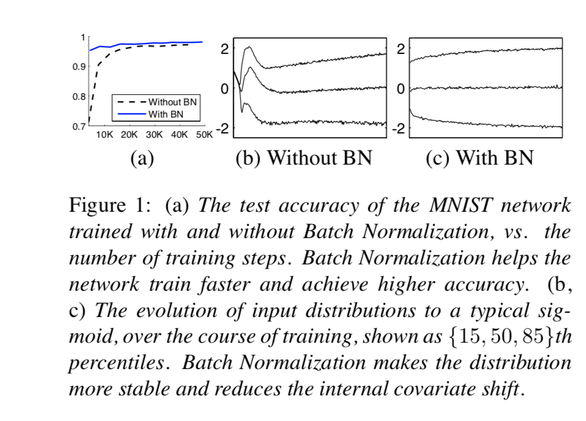
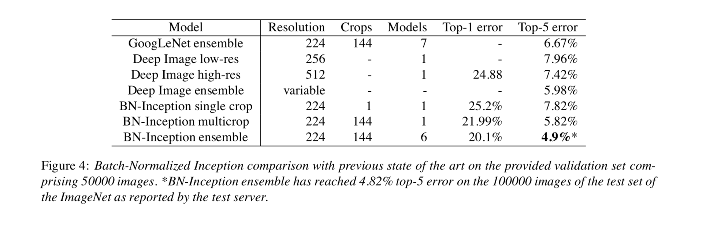

# Citation  

Batch Normalization: Accelerating Deep Network Training by Reducing Internal Covariate Shift
Ioffe and Szegedy 2015

# Tags  

Batch Norm

# Significance

Layer wise mini batch wise normalization technique to mitigate internal covariate shifts in data. Enables faster learning,
and also a little bit regularization 

# Context and summary  

In ML/DL , change in distribution of original input to network can affect model performance.
Ways to handle in classical ML include normalization (subtracting mean and dividing by SD to center inputs. However, this principle
can be applied to each layer of the NN in addition to only the input layer

Stochastic gradient descent uses mini-batches instead of whole batch while gradient descent, making GD parallelizable and faster
In SGD, inputs to every layer during forward pass are affected by parameters of all layers before that layer.So If we normalize the input
to every layer in some way, that makes learning better (reduces vanishing gradient) and ensures a near circular cost function resulting in faster convergence
Since at a single time, during training, network sees only one mini-batch worth data, mean and SD from the minibatch are used to
normalize inputs at every layer, resulting in faster training, and also some regularization effect

During inference, since mini batches are not used and whole test data is used, we use Exp. Weighted moving average of all
mean and SD during training, store it, and use it to transform input of every layer

Results are on Image Net. Using an ensemble of batch norm networks, improve best earlier performance on image net, and can match
imagenet performance with only 7% training time

# Method in detail

Given Zlkr, the input (sigma wixi) to node k in layer l in mini batch r (phew !) before applying non linear activation 
(why not apply batch norm to a (after applying non linear activation ? - some research done, but ppl typically use z)

zlkr = f(all layers from 1 to l-1)
So during training, as weights change, the distribution of zlkr can change (covariate shift) resulting in non-ideal cost functions,
and gradients vanishing. 

To prevent this, we first transform zlkr by subtracting mean of that layer for that mini batch, and dividing by std dev, with an epsilon
to prevent instability
zlkr_new = (zlkr - mean(zlkr across all r))/sqrt(variance(zlkr across all r) + epsilon) - normalization step results in mean 0 and variance 1
ylkr = gammal*zlkr_new  + betal

Why us gamma and beta necessary ? because otherwise if we use zlkr_new only, that would constrain data to linear part of sigmodi always, 
we sometime want ylkr te be in non-linear part of sigmoid

To acheive that balance between normalization, and losing info abt input data , we compromise and first have a normalization step, and then restandardize using gamma and beta
note that gamma and beta are layer specific across minibatches, and are learnt during training 

Its a completely differentiable transformation which does not affect backprop

During inference, we want to use mean and std dev from whole pop rather than just mini batch
so we do 
zlkr_new = (zlkr - mupop)/sqrt(variancepop + epsilon)
mupop is population mean, obtained by taking an ave or an EWMA over  means used during training for each minibatch,
variancepop is population var, obtained by taking an ave or an EWMA over  variance used during training for each minibatch,

and then ylkr = gammal*zlkr_new  + betal,  gammal and betal learnt during training

Also can be extended for CNN. where we have the additional constraint that normalization should obey the convolutional property
(diff elements of same feature map are normalized the same way)
To do this, we jointly normalize all activations in a mini batch over all locations

# Advantages

Enables higher LR. As activations are normalized, prevents small changes to parameters from causing suboptimal changes in gradients
prevents training from getting stuck in non linear ranges, 
BN makes Backprop invariant to scale of parameters
in fact, BN(Wu) where W is weight, u is input to network = BN(aWu) where a is a scalar

Also helps in reglarization, why ? - hypothesis : mean and variance of each mini batch is computed during training just on that mini batch
this adds in some noise while computing ylkr, noise adds to regularization just dropout 

# Experiments  

1) On MNIST, higher accuracy with BN with lesser training steps
Simple architecture - 28*28 input, 3 FC layers, 100 actvations each, sigmoid activation functions

  
Image Credit - Figure 1 from paper

2) Image Net Classification

Variant of inception trained on imagenet
  
Image Credit - Figure 4 from paper

In addition to BN, do other tricks such as further increasing the learning rates, removing dropout, etc

REFERENCES :
See Andrew Ng DL videos on batch norm

[On how batch norm and L2 norm interact](https://vitalab.github.io/article/2020/01/24/L2-reg-vs-BN.html)
