# Citation  

BERT: Pre-training of Deep Bidirectional Transformers for Language Understanding
Devlin et al 2018

# Tags  

BERT

# Significance

A semisupervised approach (pre-training unsupervised LM step using transformers followed by fine tuning for target task where labels are present)
which uses masking to allow for bidirectionally trained LM. Gives SOTA performances on several tasks

# Context and summary  

There are two kinds of approaches for applying pre-trained language representations to downstream tasks -
feature-based and fine-tuning
a) The feature-based approach such as [Elmo](../elmo_peters_2018/Elmo_peters_2018.md) uses task specific architectures
that uses pre-trained representations as additional features. For example, in Elmo, both forward and backward LM's are trained separately 
, hidden states at several shallowly concatenated and fedas features to final task specific layers. Note that even though both forward
and backward contexts are used in ELMO, unlike OpenGPT for example, they are trained seperately end to end and concatenated only before the final
task. This prevents the model from cheating , but is not as powerful as Bert, since forward and backward contexts are used independently. 
b) Fine-tuning approach such as [OpenGPT](../opengpt_radford_2018/opengpt_radford_2018.md) and [umlfit](../ulmfit_howard_ruder_2018/ulmfit_howard_ruder_2018.md)
OpenGPT uses [transformers (more precisely, decoder part of transformer)](../transformers_vaswani_2017/transformers_attention_vaswani_2017.md) which are more parallelizable than LSTM's,
but trains only forward directional LM. The disadvantage of this approach is that it uses context from only one direction (training a joint
bidirectional LM is not the right thing to do as it allows the model to cheat (backward LM gives forward LM direct glimpses of the future)

Ulmfit uses an AWD LSTM architecture, not transformers. It uses a bidirectional setup similar to Elmo because trained independently,. (see notes on Elmo above)

The advantage of Bert is that because of the masking approach, it is able to jointly train in forward and backward directions, without the
peeking the the future problem [here's a nice explanation](https://www.reddit.com/r/MachineLearning/comments/e71vyr/d_why_does_the_bert_paper_say_that_standard/f9xox9b/)

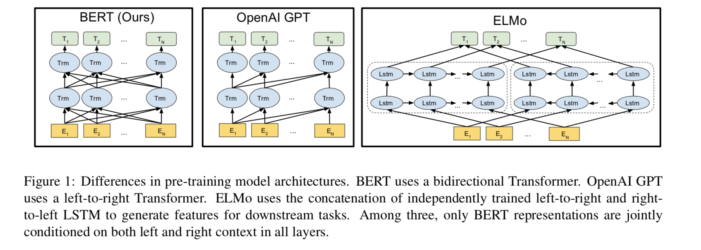  

Image credit - figure 1 from paper 

# Method in more detail  

## Transformer

1) Unlike OpenAI, uses the transformer encoder part which allows for self attention in both directions,
(openAI uses the transformer decoder which allows for only uni directional self attention) 

2) Hyperparameters chosen
Bertbase : L = 12 (no of layers), H = 768 (no of hidden states), A = 12 (no of heads in multi headed attention), Total parameters = 110M
Bertlarge : L = 24, H = 1024, L = 16, Total parameters = 340M 

## Input representation 

1) Every token representation is constructed as a sum of token embedding, segment embedding and positional embedding. 

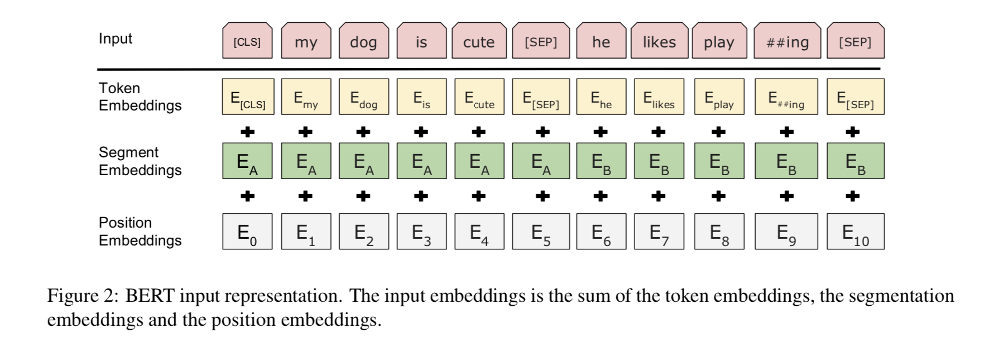  

Image credit - figure 2 from paper 

2) First token is always the CLS token. Final hidden state corresponding to the CLS token is used as aggregate sequence 
representations for classification tasks. This vector is ignored for non-classification tasks

3) Sentence pairs are used with a single sequence. 
The two sentences of a sentence pair are differentiated in two ways 
a) We have a SEP token between both the sentences 
b) Segment embeddings (learned) are different for the two sentences in a sentence pair (see step 1 above)  

## Pre-training tasks 

### Task-1 Masked LM

In a deep bidirectional representation, mask a percent of input tokens at random, and predict those masked tokens. 
This is called a Masked LM (MLM). The final (after all the layers) hidden vectors corresponding to the masked tokens 
are fed to an output softmax over the vocab as in standard LM. 
Around 15% of all word-piece tokens are masked at random in every sequence. 

The disadvantage of this is that 
a) mismatch between training and fine-tuning is created. 
This is because the MASK token is seen during training, but never during finetuning. 
To mitigate this, the "masked" words are not actually  always replaced with the MASK token. Instead
    i) 80% of the time, replace the word with the MASK token  Eg  : My dog is hairy -> My dog is MASK
    ii)10% of time, replace word with random word Eg : My dog is hairy -> My dog is apple
    1ii) 10% of time, keep the word unchanged.  Eg : My dog is hairy -> My dog is hairy
 Since the transformer does not know which of these 3 cases happened, it is forced to keep a distributional context representation 
 of every token. Also, since random replacement happens only 0.01*0.15 = 0.015 times, it doesn't seem to harm the trained LM
b) Since only 15% of tokens are predicted in each batch, more time for the model to converge. Empirically, this is true,
but the accuracy improvements are much better 

## Task-2 Next sentence prediction 
1) LM model does not capture relationships between sentences, which is necessary for tasks such as QA and NLI
2) To accomplish this, pre-train a next sentence prediction model .
When choosing sentence pairs A and B for this task, 50% of time , B is chosen as the correct next sentence, and
50% of time, it is a random sentence from the corpus. 
Example  
Input = CLS the man went to MASK store SEP he bought a gallon MASK milk SEP 
Label isNext

Input = CLS the man went to MASK store SEP  penguin MASK are flight ##less birds SEP
Label NotNext

Model is 97-98% accurate at this task. 

## Pre-training procedure

1) For LM dataset, use concatenation of BooksCorpus (800MM words) and English wikipedia (2500 MM words) 
For wikipedia, only text passages are used, lists, labels and headers are ignored. To extract long contiguous
sentences for LM, this kind of corpus is better than    corpora like the Billion word benchmark which contain shuffled sentences (hence no long range dependency
in data)
2) To generate each input sequence, from corpus, sample two spans of text, called "sentences" even though
they are typically much longer than regular sentences (can be shorter also). 
The first sentence receives the A embedding, the second sentence the B embedding. 
50% of the time, B is the actual next sentence to A, 50% of the time, it's a random sentence from anywhere in the corpus. 
Sampling is such that combined length <= 512 tokens. 
3) LM masking is applied after word piece tokenization, with a uniform masking rate of 15%
4) batch size of 256 sequences, with 1MM steps, which is approximately 40 epochs over the 3.3 B corpus
5) adam with learning rate of 1e-4, beta1 = 0.9, beta2 = 0.999, L2 weight decay of 0.01, Learning rate warmup over the first 10K steps
6) gelu activation used instead of relu
7) cost function is sum of mean masked LM likelihood and mean next sentence prediction likelihood. 

## Fine tuning

1)  For sequence classification, take final hidden state of CLS token (RH dimension), 
have a single simple classification layer with W of dimension RK*H where K is the number of desired class labels,
final softmax. All parameters of BERT and W are finetuned jointly to mazimize log probability of correct label 
2) Hyper parameters of finetuning - most model parameters are similar to the pretrained LM, 
except for batch size (16 or 32), LR (5e-5 to 2e-5), and number of epochs (3-4)  

3) For other tasks such as QA and token classification, the following picture from the paper describes the formulation 

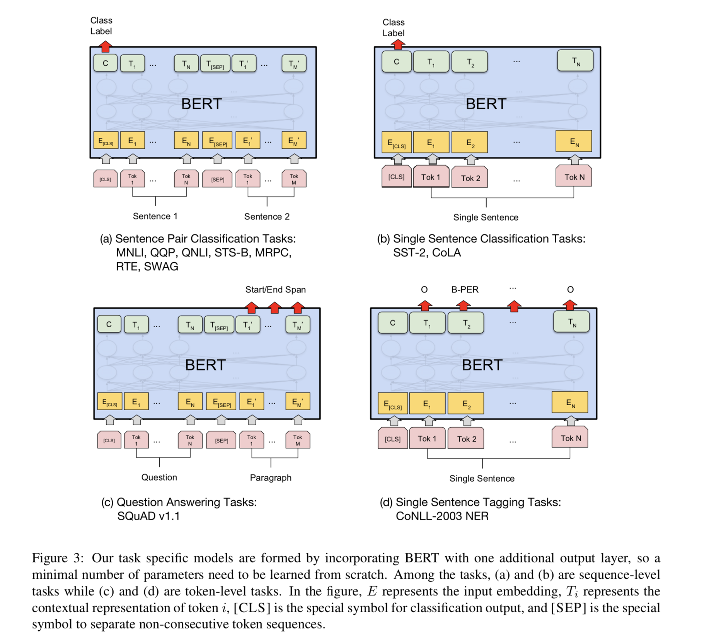  

Image credit - Figure 3 from paper  

## Comparison with OpenGPT

apart from teh architectural differences discussed above,  these are the changes between OpenGPT and BERT
a) GPT is trained on the Books corpus (800MM words), BERT on books corpus + wikipedia (2500MM words)

b) GPT uses a SEP and CLS only during finetuning, BERT uses them during pretraining  

c) GPT trained for 1MM steps with a batchsize of 32K, BERT with a batch size of 128K

d) For all finetuning tasks, BERT uses the same LR of 5e-5, Open GPT chooses different learning rates based on what is best for each fine tuning task. 

# Experiments  

Experiments and Results on 11 NLP tasks below    

## GLUE

Run on a variety of tasks (Wang et al 2018), including  
a) MNLI (Multi-genre NLI) (Williams 2018) - Determine whether pair of sentences entail, contradict or are neutral 
b) QQP (Quora question answering tasks) (Chen et al 2018)) -Determine whether two quora questions are semantically equivalent 
c)  QNLI (Question NLI) (a version of stanford QA dataset (Rajpurkar et al 2016) converted to a binary classification task  -  positive examples
are question,sentence tuples which contain right answer and negative examples are question, sentence pairs from same para which do not contain right answer
d) SST-2 (Socher et al 2013) - stanford sentiment treebank, binary sentence classification task containing sentences extracted from movie reviews with human annotations of sentiment
e) CoLA (corporus of linguistic acceptability) (Warstadt et al 2018) - goal is to predict whether english sentence is linguistically acceptable or not
f) STS-B (semantic textual similarity benchmark) -(Cer et al 2017) collection of sentence pairs - binary classification as to whether sentences similar or not 
g) MRPS (Microsoft research paraphrase corpus) (Dolan and Brockett 2005) - sentence pairs from online news pairs, with annotation as to whether sentences are identical or not 
h) RTE (Recognizing textual entailment) (Bentivogli et al 2009) - similar task to MNLI with much less training data 
i) WNLI (Winograd NLI)  (Levesque et al 2011) - small NLI dataset, excluded because of some issues in dataset   

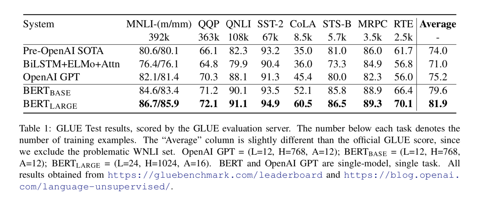  

Image credit - Table 1 from paper  

## Squad v1.1

a) Collection of 100K crowdsourced QA pairs (Rajpurkar et al 2016) 
Given a question and a paragraph from wikipedia containing the answer, task is to predict span in paragraph corresponding to the answer

Represent Question SEP paragraph as a sentence pair, with Question using A embeddibg, and paragraph B embedding
We want to learn a start vector S (RH) and   end vector E (RH) which corresponds to the start and end token 
in the paragraph containing the answer. 
Let Ti (RH) be final hidden vector from BERT from the ith token. 
Probability of word i being the start token is Pi = exp(S.Ti)/\sum_j(exp(S.Tj))
The end token has the same formula, maximimum scoring span is used as correct prediction, training objective is the log likelihood of correct start and end position. 
Train for 3 epochs, LR of 5e-5, batch size of 32. Add a constraint that end must come after start. 
Training is jointly done on SQUAD and Trivia QA 

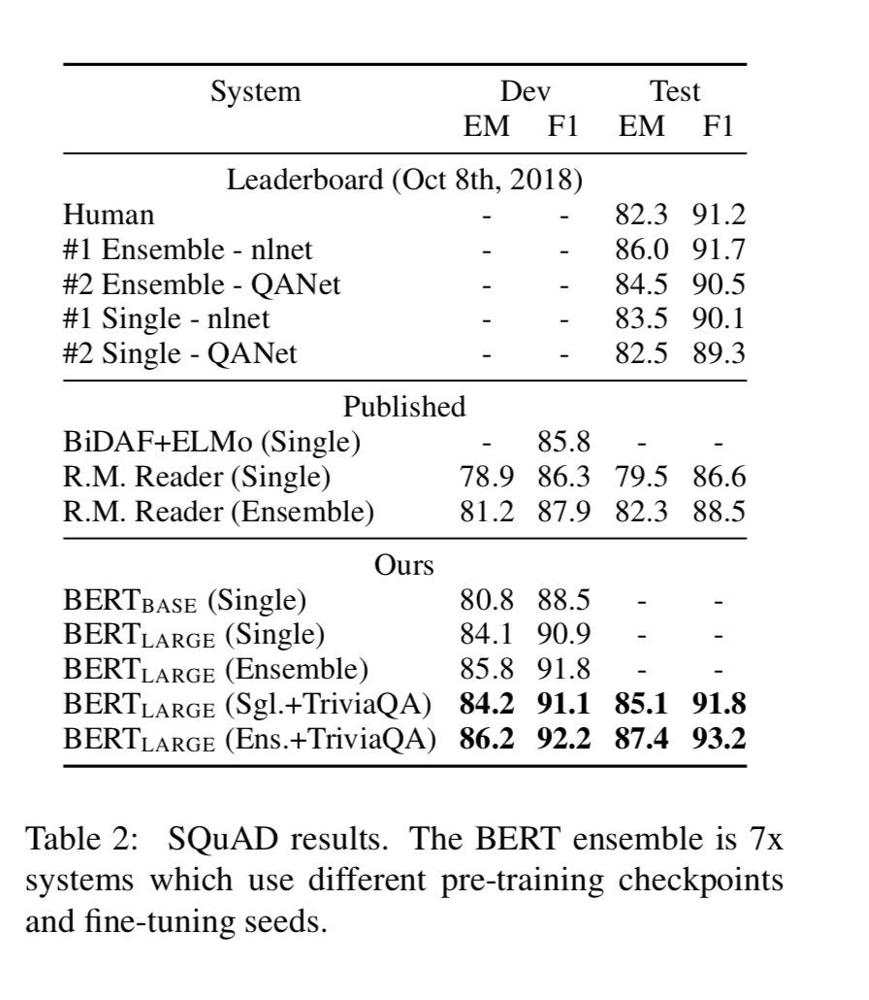  

Image credit - Table 2 from paper  

## NER

Fine tune on ConLL (2003) NER task - 200K training words annotated as Person, Org, Location, Misc, other

For fine tuning, final hidden representation Ti (RH) of each token is fed to a classification layer. 
predictions are not-conditioned on surrounding predictions (non-autoregressive and no CRF) 
To adjust to word piece tokenizer used by BERT, each token for NER fed to word piece tokenizer, 
and hidden state corresponding to first subtoken used as input to classifier  

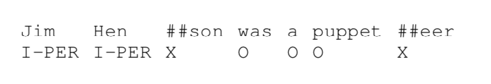

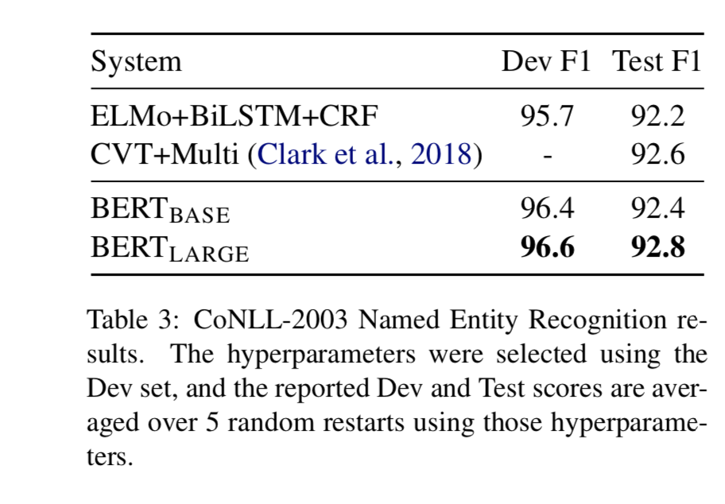

Image credit - table 3 from paper  

## SWAG  

Situations with adverserial generations dataset (Zellers et al 2018) 
contains 113K sentence pairs 
Given a sentence from a video captioning dataset, task is to decide which among 4 choices is the most obvious continuation 

Finetuning task constructed similar to GLUE. For each example, 4 input sequences constructed which are the concatenation 
of the given sentence (sentence A) and a possible continuation (sentence B). 
For the task, introduce vector V(RH)  whose dot product with final aggregate representation (representation of CLS token)
Ci(RH) for each of the 4 choices  is sent through a softmax
Pi = exp(V.Ci)/(\sigma_j=1to4 exp(V.Cj))  
Model finetuned for 3 epochs with LR of 2.e-5 and batch size of 16  

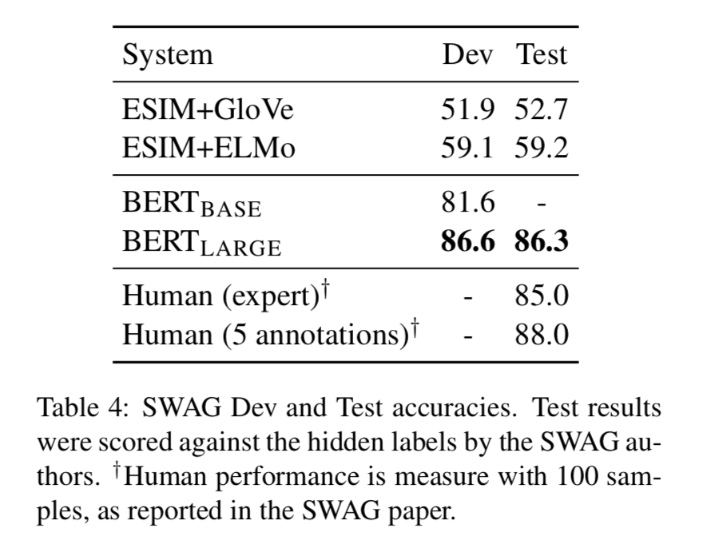

Image credit - table 4 from paper 

# Ablation studies  

## Effect of pre-training  

Two ablation studies - a) No NSP (trained using masked LM, but no next sentence prediction), and b) LTR and no NSP 
(trained using a left to right LM without masking)  

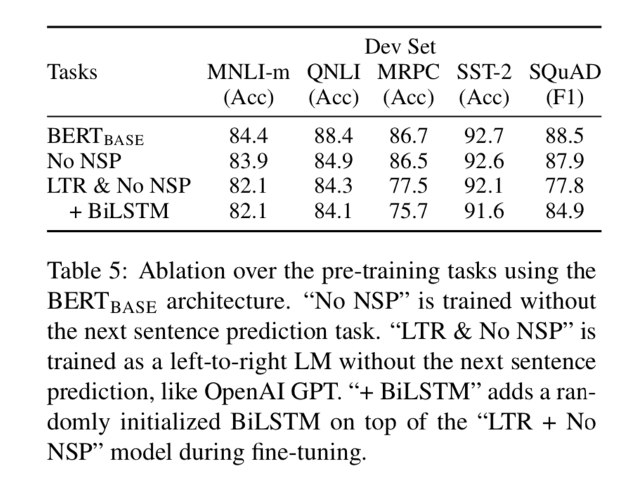  

Image credit - table 5 from paper  

## Effect of model size  

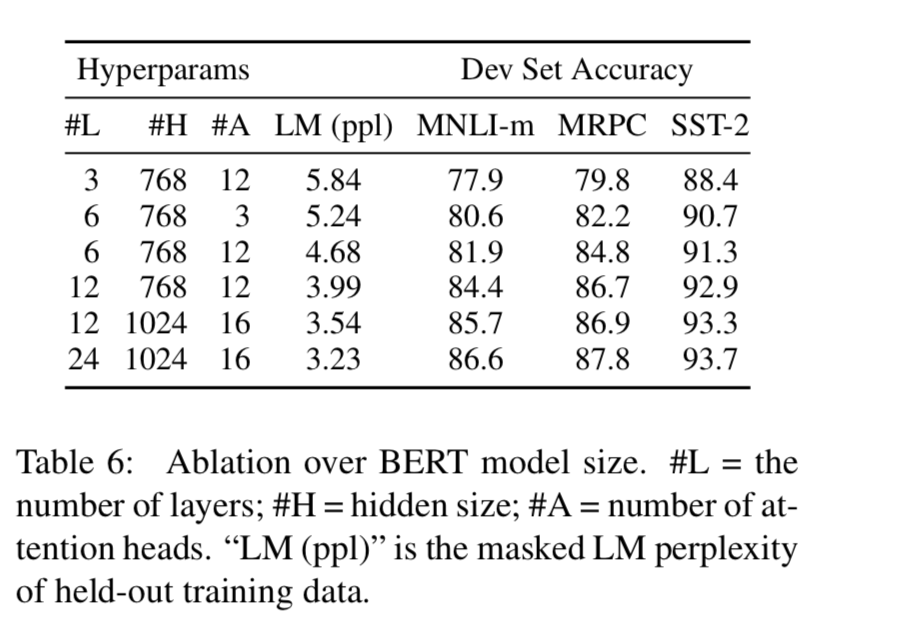  

Image credit - table 6 from paper

## Effect of number of training steps 

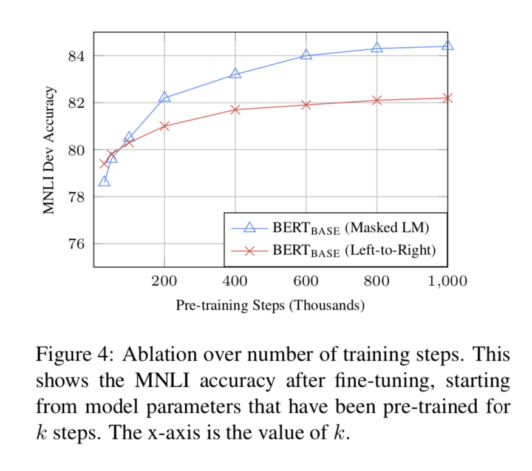  

Image credit - figure 4 from paper  

# Using BERT with a feature based approach instead of a fine tuning approach

Instead of the finetuning approach, get features from different hidden states similar to ELMO and use on downstream tasks

Tested on NER task, found to be effective  (contextual embeddings from BERT used as an input to randomly initinalized 2 layer 768 dimensional
Bi-LSTM followed by classification layer)  

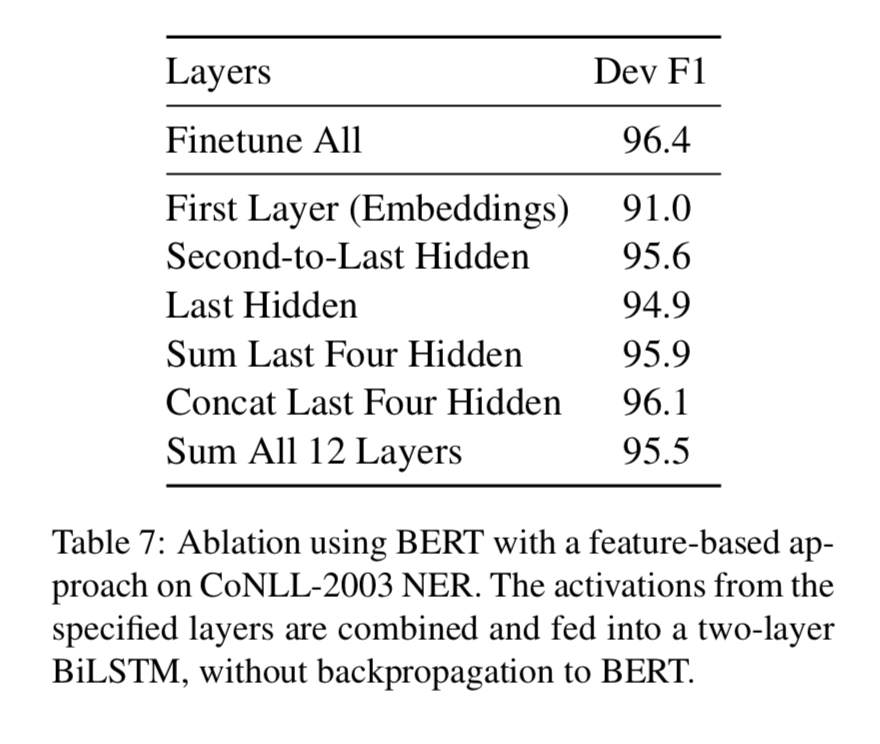 

Image credit - table 7 from paper  

