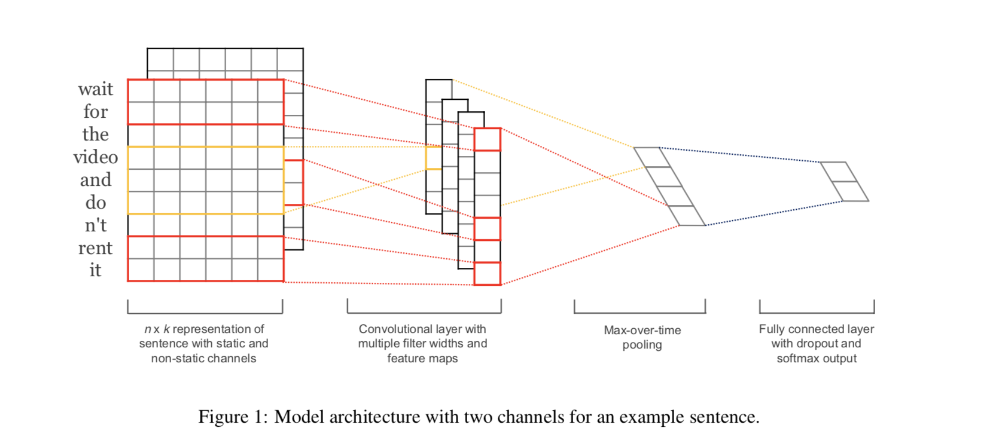
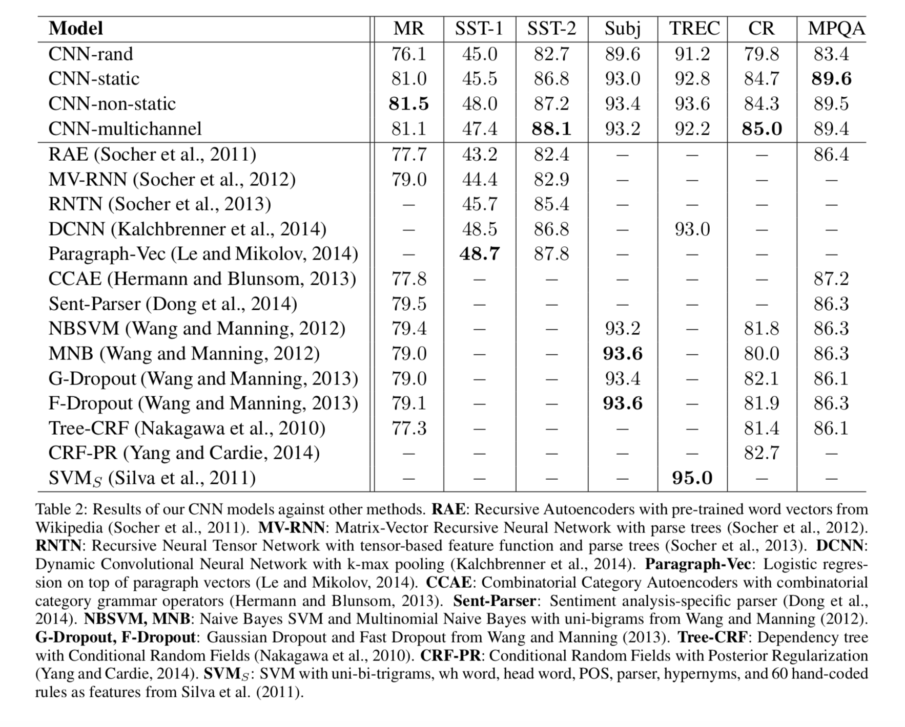

# Citation  

Convolutional Neural Nets for Sentence Classification
Yoon Kim 2014

# Tags  

CNN, classification, using w2vec

# Significance

Uses simple CNN for sentence classification on top of w2vec. Tries both static embeddings (where w2vec embeddings are not updated) 
and dynamic (where w2vec embeddings are updated). Able to get great accuracies on multiple benchmarks 
in comparison to more complex models. Also CNN's had been historically used for Computer Vision before this,
able to use CNN for text as well  in combination with word vectors

# Context and summary  

Uses simple CNN models on top of w2vec embeddings. Tries both static embeddings and dynamic embeddings.  
CNN models are more popular for CV, but have been used for NLP as well. Here, CNN's are combined with  
w2vec for classification  

# Method in more detail

1) Use W2VEC trained by Mikolov on 100B words of google news.  
2) Each word is represented by a word vector of dimension k.  a sentence of n words (with padding as needed) is represented by  an n*k matrix of numbers, n words, each word is of embedding k  

3) Construct convolutional filter f1 of size h, h<n. Filter matrix is of dimnension h*n.  On applying this convolutional window on a subset of words of input sentence x0:xh, we get 1 scalar on which we apply a tanh function to get c1
4) We move the filter along the sentence, to get n-h+1 terms for filter f1. c1..cn-h+1.  
5) Apply max pooling on c1...cn-h+1 to get 1 scalar chat_f1  
6) Repeat steps 3 to 5 for m filters, each of different size. So we get a vector z = chat_f1, chat_f2..chat_fm  
7) This is passed through a fully connected layer  the final softmax layer  
8) Dropout is applied on stop 7, so instead of y = w*z + b for a single output node,  perform y  = w*(zor) + b, where r is a masking vector of ones and zeros, randomly assigning elements of z to 0 depending on dropout probability p 
Gradients are backpropagated through non-masked units.  
9) At inference time of course, just like standard dropout, the neurons are not set to 0, instead all weights learnt during training are increased by a factor of p.  
10) Also, constrain l2 norm of weight vectors to a scalar s if l2norm > s  

  

Image credit : Figure 1 in paper

11) Different variants are tried out - a) embeddings are not finetuned, b) embeddings are finetuned c)
have two channels, one in which embeddings are finetuned and one in which they are not.  

12) Hyperparameters used - filter window size in step 6 chosen as 3 , 4 and 5, a 100 windows of each size  
   dropout rate p 0.5 in step 8, l2 constraint s - 3 in step 10, mini batch size 50.  - Obtained via grid search on SST-2 dev dataset  
   SGD with shuffled mini batches using adadelta   

# Results  

Datasets used - MR (Movie review dataaset, Pang and Lee 2005), SST-1 (Stanford Sentiment Treebank, Socher 2013), SST-2 (same as SST-1, with neutral labels removed), 
Subj (subjectivity dataset - classify sentence as being subjective or objective Pang and Lee 2004), 
TREC  (Trec question dataaset - classifying question into 6 question types - Li and Roth 2002) CR (Customer review dataset -Hu and Liu 2004)  
MPQA (Opinion polarity detection subtask of MPQA dataset - Webe et al 2005)   

    

Image credit : Table 2 in paper   

# Discussion - 

Baseline model is called CNN-Rand, where all the word vectors are initialized randomly. This performs poorly across tasks. Even a model where embeddings are not updated 
gives a significant performance bump over CNN-Rand. The multichannel work gives mixed results (1 channel which is static and 1 where weights are updated)    

