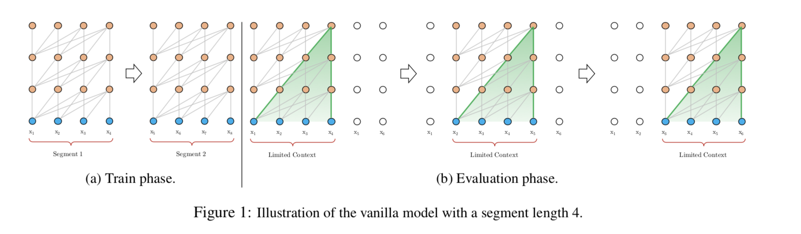
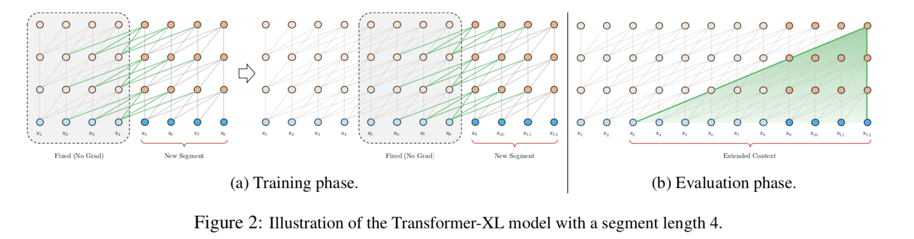
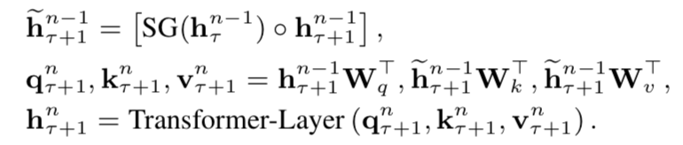
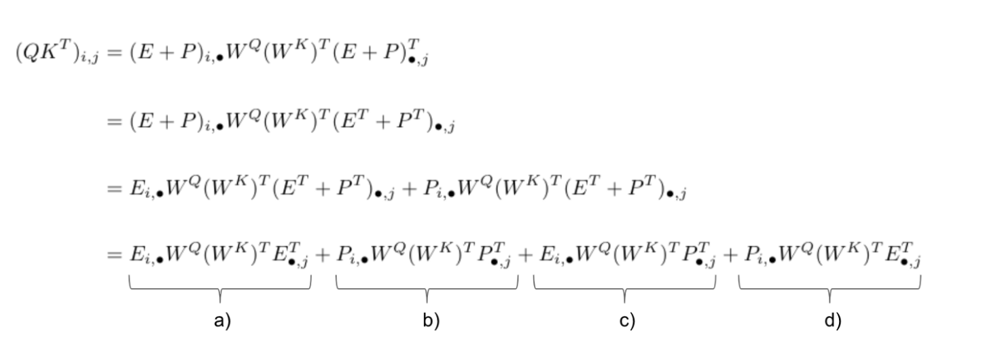
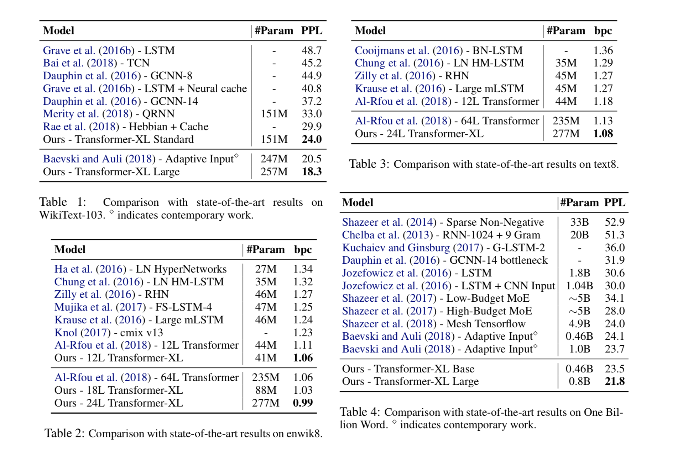
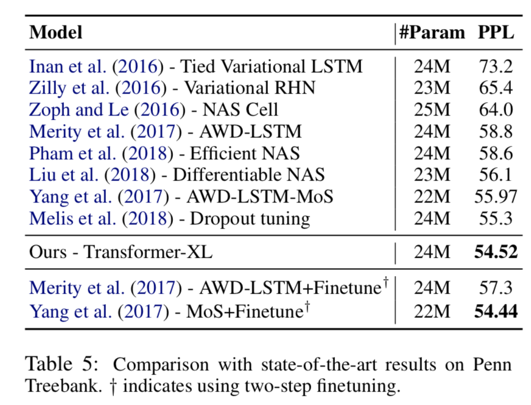
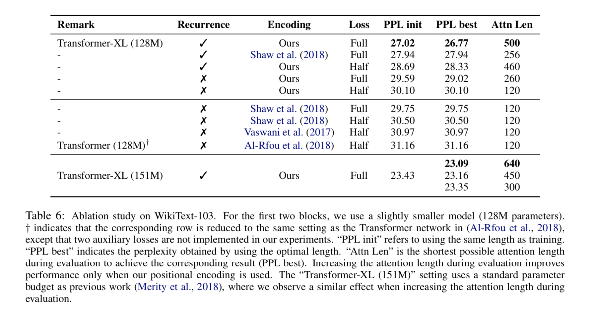
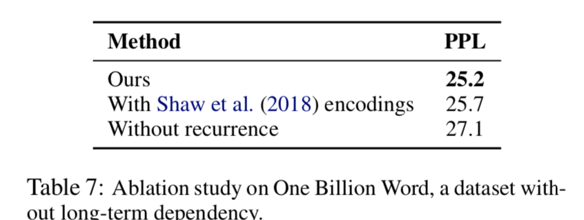
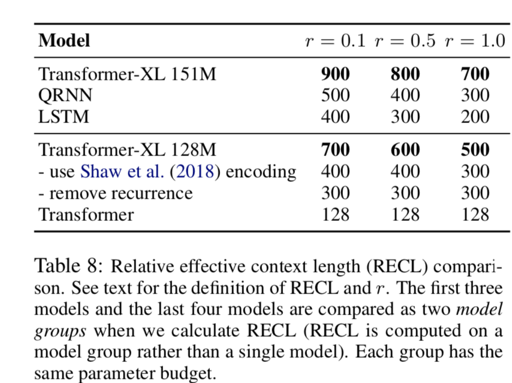

# Citation  

Transformer-XL: Attentive Language Models Beyond a Fixed-Length Context
Dai et al 2019

# Tags  

Transformer-XL

# Significance

Modification to the [transformer architecture](../transformers_vaswani_2017/transformers_attention_vaswani_2017.md)
to enable learning dependencies beyond a fixed length (unlike the transformer), also solving the context 
fragmentation problem. 

# Context and summary  

Language modeling has used traditionally RNN based architectures (LSTM) which are hard to optimize due to issues like
vanishing and exploding gradient which are partially addressed by gating and clipping but not completely. 
Emperically, LSTM's use 200 context words on an average (Khandelwal et al 2018)

A parallel approach is using direct connections between words pairs with attention mechanisms 
([Bahdanau attention](../attention_bahdanau_2015/Attention_Bahdanau_2015.md), [transformers](../transformers_vaswani_2017/transformers_attention_vaswani_2017.md)))
which mitigate the optmization issues of LSTM's somewhat. However , transformers rely on fixed length context sizes
and are unable to learn dependencies beyond that. 

Another issue with transformers is what the authors call context fragmentation - fixed length contexts
are selected without necessarily respecting sentence and semantic boundaries, making it hard for the models
to predict especially the first few symbols..

The transformer-XL architecture addresses both the dependency and context fragmentation issue by 
introducing the concepts of
    - recurrence : instead of computing hidden states from scratch for every segment,
    hidden states from previous segments are cached and used for computing hidden states of current segments,
     This allows for modeling long term dependency, and also mitigates the issue of context fragmentation. 
    - relative positional encoding - instead of absolute position encoding used in conventional transformer architecture,
    a relative positional encoding scheme is used which generalizes to attention lengths longer than that seen in training
    
    

As a result , transformer-XL learns dependencies 80% longer than RNNs and 450% longer than vanilla transformers,
with 1800 greater speed during evaluation. Achieves SOTA perplexity - 0.99 on wiki 8, 1.08 on text 8, 18.3 on wikitext 103

# Method in more detail  

1) The goal of a LM is to estimate P(x1,,,xT), which is decomposed autoregressively as P(x1)*P(x2|x1)*P(x3|x1,x2)...
a NN encodes the context x<t into a fixed hidden state, which is multipled with word embeddings to obtain logits,
which are fed to a softmax function to get the probablity of next word. 

2) Vanilla transformer LM 

The main goal is to encode an arbitrarily long sequence / context into a fixed size representation. 
This is not practical for very long sequences because of finite computation resources - 
Why ?

The self-attention matrices are of dimension seqlength*seqlength. If seq length becomes very large,
This matrix size [blows up][1]

Therefore, in practice - sequences are split into chunks of length n (512 tokens or lesser typically)
and models are trained within each segment, ignoring cross segment information flow - 
This has two disadvantages
a) No information flow across segments - so longer term dependencies cannot be captured
b) In practice, for ease of use, chunking of the corpus into segments is done w/o bothering about 
sentence boundaries, semantic boundaries, etc. So you have the context fragmentation issue,
Example : 
she has a nice dog which was gifted by her brother 
If this sentence is broken into segments as segment 1 - she has a nice dog  ; segment b - which was gifted by her brother ,
the information that word which in segment b is connected to dog in segment a is lost, affecting language modeling.

One more computational disadvantage during evaluation is that at each step,
the model consumes a sequence of same length as what was used in training, makes prediction at last position,
slides by 1 to the right, again consumes a sequence of same length, makes prediction, etc

More concretely, assuming a segment length used during training of 4 as a toy example 
(real segment lengths are typically 512, etc),

1,2,3,4 -> predict next token 5hat
2,3,4,5 -> predict next token 6hat

in each step, there is a signicant repetition of tokens, making this computationally expensive, even though
it mitigates the context fragmentation problem.  

   

Image credit figure 1 in paper   

3) transformerXL improvement 1 - segment level recurrence :  

The basic idea here is to cache the hidden states of the previous segment, and use when model processes a new segment,
instead of treating each segment separately. 

    

Image credit figure 2 in paper  

Using equations, 

Let the two consecutive segments be 
sT and sT+1, both containing L tokens. 
sT = (xT,1 ; xT,2; xT,3.. xT,L)
sT+1 = (xT+1,1 ; xT+1,2; xT+1,3.. xT+1,L)  

Let d be the hidden dimension (which is equal to embedding dimension in classical transformers)  

For the T'th segment, let the nth layer hidden state sequence be hTn  (this will be of dimension L*d, one d dimensional vector for each of the L tokens).  

The equations for computing the hidden states of layer n for segment T+1, using hidden states of layer n-1 in segment T and T+1 are below  -

   
Image credit based on page 3 in paper.

Basically, instead of using just the output/hidden states of the previous layer of current segment to compute queries, keys and values for current layer,
we use output of previous layers of both current segment and previous segment, and concatenate them , to get key and values for current layer (for query, only the hidden states
of the previous layer of the current segment is still used, not the concatenated version.) 

These connections to the output of the previous layer of the previous segment are marked as green in the figure above. 

One comment - you can see a SG or stop gradient function term operated on hidden states on the previous segment
This is to prevent backprop on hidden states of previous segment when computing hconcat for current segment .
this is to prevent memory issues as listed above in disadvantages of the vanilla transformer. 

More on dimensions - 
for a single head of attention
specifically, the query Qi = h*WQ will have dimension L*dq (h has dimension L*d, WQ will have dimension d*dq)
Ki = hconcat*WK will have dimension 2L*dk (hconcat has dimension 2L*d , WK has dimension d*dq)  (dq=dk usually, set to d/no of heads)
Vi = hconcat*WV will have dimension 2L*dv (hconcat has dimension 2L*d, WV has dimension d*dv) 

For more info, see [this link][1]

Also, since hT = f(hT-1) = f(f(hT-2)).., even  though recurrence is explicitly encoded for consecutive segments,
effective segment dependency spans more

Depending on memory, a modification of XLNet could be directly using information from the last 2 segments,
or last K segments in general instead of depending on this indirect flow of information. 

In terms of speed compared to vanilla transformer, during evaluation as discussed above,
the vanilla transformer moves one step to the right and therefore repeats a lot of computations

In XLNET , representations from previous segments can be reused, resulting in 1800X faster speed during 
evaluation. 

Relation with BPTT - In general, the largest dependency length is O(N*L) where N is the number of layers.
This is similar in philosophy to BPTT, except that in BPTT, only the last hidden state is cached, 
whereas here, all the hidden states across layers and tokens are. 

4) transformer XL improvement 2 - relative positional encoding  

One technical challenge when implementing segment level recurrence - how should positional information 
be kept coherent when using hidden states across segments ?

The issue with using the positional embedding scheme of the standard transformer - 
remember that in a standard transformer, each token is represented by a positional embedding of dimension d
Therefore, the entire sequence is represented by a positional embedding matrix of dimension L*d,
the ith row of this matrix is the absolute position of token in sequence of length i.  

Every segment uses the same positional embedding matrix - which means
that in the formulation above, the ith token of  both segment sT and sT+1 have the same positional embedding 
So the model has no information to distinguish between the ith position of segment sT and ith position of segment sT+1 for all i !
During self attention on the concatenated hidden states across the two segments ; instead of seeing each and every token
across the two segments having a different positional embedding, a token sees pairs of tokens across the two segments having the same positional embedding !

This leads to performance loss.  

How is this solved ?

Note that when self attention between a query vector and key vector is computed,
it is enough to know how far the tokens generating the query and key vector are separated relatively, 
absolute representations are unnecessary. 

Therefore, instead of using absolute positional embeddings as matrix,
create a matrix of relative positional embeddings of dimension L*d

Some math below - 

In the vanilla transformer,

Looking at the self-attention matrix QKT, where Q is of dimension L*dq, and K is of dimension L*dq, QKT has dimension L*L

Looking at the i,j element of this matrix QKT ,
we know that Q = h*WQ, K = h*WK
h = (E+P) - word embedding + position embedding

Using notation where (i,.) refers to ith row and (.,j) refers to jth column , 

    [Reference][1]  

 Image credit equations 1 to 4 in paper

a) refers to how much attention the word corresponding to row i should pay to word corresponding to column j
This term has only word embeddings E, and is agnostic to the position of the words

b) refers to how much attention Position i should pay to position j (there is no word embedding component here,
it just refers to positions)

c) refers to how much attention a specific word should pay to other positions. This is a cross term,
where term 1 (corresponding to query) is a word embedding and term 2 (corresponding to key) is a position embedding,

d) refers to how much attention a specific position should pay to other words, again a cross term,
where term 1 (corresponding to query) is a position embedding and term 2 (corresponding to key) is a word embedding. 

For xlnet, changes to the formulation above are as follows : 

i) instead of using P(,j) to capture absolute positional embeddings which go into computing the key vectors,
we use R(,i-j) which is the relative positional embedding in terms b) and c) .  R is a sinusoidal embedding matrix without learnable
parameters, as per the original transformer formulation. Whereever P(,j) is replaced by R(,i-i), instead of using WR as the weight matrix
ii) The term P(i,)*WQ occurs in two places. in term b) and term d)
In term b) P(i,)  is replaced by a learnable vector u of dimension 1*d, which is independent of i
In term d), the same term P(i,) is replaced by a learnable vector v of dimension 1*d, which is independent of i. 
iii) Since both WK and WR are present now, we disambiguate content based key vectors and position based key vectors. 

# Experiments and Results

1) Apply transformer XL on both word and character level LM task (training happens as an LM task, not as a seq 
2 seq model unlike the traditional transformer), compare with other models on 
wikitext-103, enwik8, One Billion word and Penn treebank 

2) set attention length to 384 during training and 1600 during evaluation. Use adaptive softmax and input representations.

Image credit tables 1 to 5 in paper

3) Ablation studies

Image credit table 7 and table 8 in paper

4) RECL

The authors come up with a concept called RECL (relative effective context length), where RECL is defined over
a group of models , and is a measure of relative improvement of the longer model over the best shorter model

# Experiments

# Results

# References
[1] : https://medium.com/@mromerocalvo/dissecting-transformer-xl-90963e274bd7
[2] : https://mlexplained.com/2019/07/04/building-the-transformer-xl-from-scratch/

