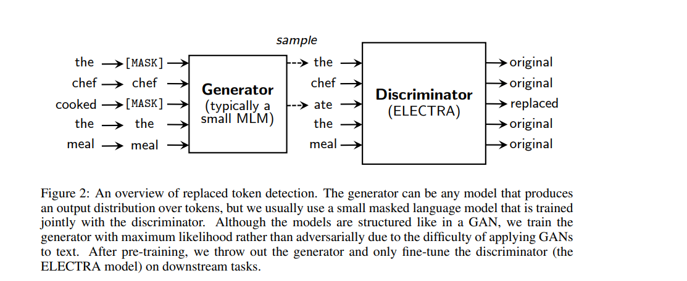
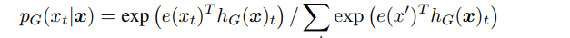
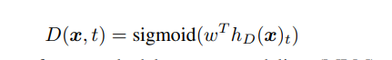
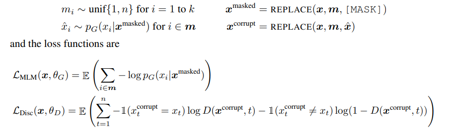
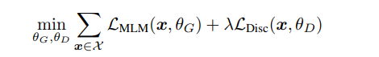
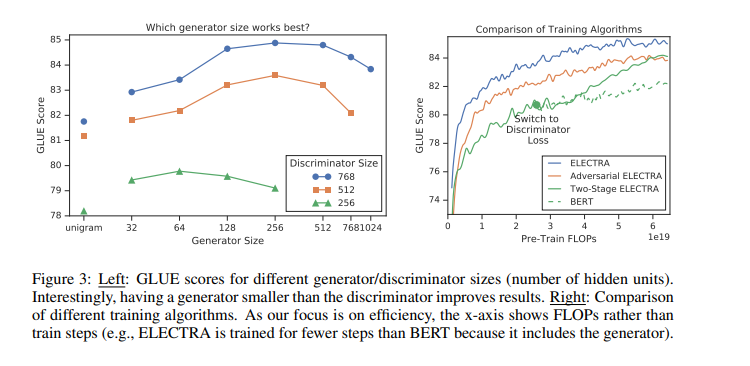
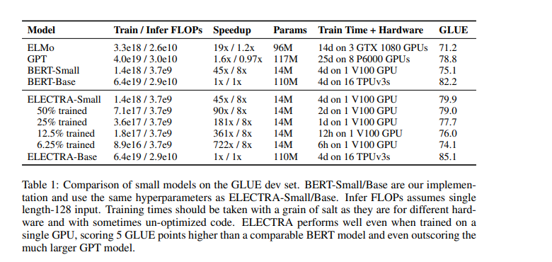
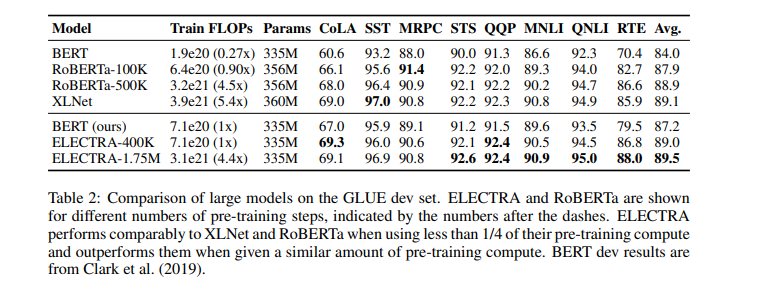
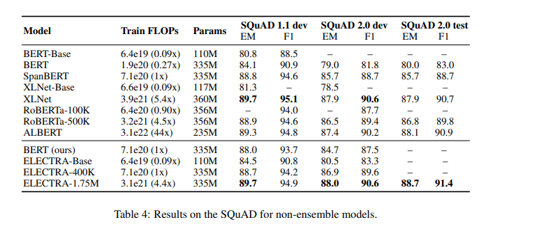
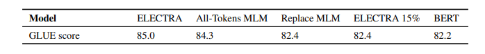

# Citation  

ELECTRA: PRE-TRAINING TEXT ENCODERS AS DISCRIMINATORS RATHER THAN GENERATOR
Clarke et al 2020

# Tags  

ELECTRA

# Significance

Changing the BERT cost function to train as a discriminator instead of generator

# Context and summary  

In BERT like architectures, either a certain percent of tokens (15%) are masked as in the original [BERT](../bert_devlin_2018/bert_devlin_2018.md) paper,
or instead of masking tokens, mask attention to tokens (Using permutations in [XLNET](../yang_xlnet_2019/yang_xlnet_2019.md), for example). 
However, two disadvantages with this approach is that a) the model learns only from 15% of tokens
and b) this results in a train/test discrepancy, as during test time, masks don't exist

In ELECTRA, we try to use all tokens instead to enable faster learning . How is this done ? By corrupting certain tokens in input by replacing with
words from a small LM, such as maybe BERT small; and training a discriminator to predict whether the token is corrupted or not

A key advantage of this is that the model learns from all input tokens instead of just the small masked-out subset, making it more computationally efficient

# Method in more detail

 

Image Credit - Figure 1 from paper

Two Neural networks are trained, a generator G and a discriminator D
The generator could be something like a BERT small or any transformer architecture that outputs probability of generating a particular token ,
trained using a masked LM

 

Image Credit - Equation from Page 3 in paper

The discriminator tries to predict whether the token is original or corrupted, using a transformer with a logistic function

 

The whole workflow

 

 

Image Credit - Equation from Page 3 in paper

Note that this is NOT  a GAN, even though there is a discriminator and generator, as both discriminator and generator are not trained adversially,
but using an MLE function

# Experiments  

Evaluate on GLUE and SQUAD datasets. Evaluation metrics are Spearman correlation for STS, Matthews correlation for CoLA, and accuracy for the
other GLUE tasks
For SQuAD,  evaluate on versions 1.1, in which models select the span of text answering a question, and 2.0, in which some questions are unanswerable by the passage. We use the standard evaluation metrics of Exact-Match
(EM) and F1 scores    

## Pretrained dataset
For most experiments, same as BERT ( 3.3 Billion tokens from Wikipedia and BooksCorpus )
except for large model where same dataset as XLNET was used  (BERT data + data from clue web, common crawl and gigaword)
All pretraining on english

## Architecture

Architecture and hyperparameters mostly same as BERT. For fine-tuning on GLUE, add simple linear classifiers on top of ELECTRA.
For SQuAD,  add the question-answering module from XLNet on top of ELECTRA, which is slightly more sophisticated than
BERT’s in that it jointly rather than independently predicts the start and end positions and has a
“answerability” classifier added for SQuAD 2.0. 

## Model Extensions 

1) Weight sharing - In case G and D are of same size, transformers share weights between them
In case G is smaller than D (which works well in practice), embeddings are shared between G and D
GLUE scores are 83.6 for no weight tying, 84.3 for tying token embeddings, and 84.4 for tying all weights.
Tying all weights does not help much, so go for just tying embeddings for other experiments

2) Sizes of G and D

If G and D are of same size, model will be compute wise twice as expensive as BERT.
Therefore, use smaller G and D (smaller meaning lesser  layer sizes) 
find that models work best with generators 1/4-1/2 the size of the discriminator

 
Image Credit - Figure 3 from paper

3) Cost function

Tried alternative cost functions, both were worse than the formula above
Experiment 1 - Instead of jointly training G and D, tried sequentially training (first training G, initialize weights of D with weights of G, then freeze G and train D) (Works reasonably well only when D is initialized with weights of G, otherwise D doesn't learn at all, probably because G has trained much more than D)

Experiment 2 - training G and D adversarially like a GAN (using reinforcement learning to accommodate the
discrete operations of sampling from the generator ? ) 
Has 2 problems - 
1 adversial generator worse at MLM compared to MLE; it achieves 58% accuracy at masked language modeling compared to 65% accuracy
for an MLE-trained one. (Is worse accuracy due to the poor sample efficiency of reinforcement learning when working in the large action space of generating text ? )
2) Secondly, the adversarially trained generator produces a low-entropy output distribution where most of the probability mass is on a single token, which means there is not much diversity in the generator samples.

(Both of these problems have been observed in GANs for text in prior work)

## Small Models
Small model that can be quickly trained on a single GPU. Starting with the BERT-Base hyperparameters, 
we shortened the
sequence length (from 512 to 128), 
reduced the batch size (from 256 to 128), 
reduced the model’s
hidden dimension size (from 768 to 256), 
used smaller token embeddings (from 768 to 128).

and compare with BERT-small with same hyperparameters
Electra does better

 
Image Credit - Table 1 from paper

## Large Models

ELECTRA LARGE same size as BERT LARGE, trained for much longer. 
In particular, train a model for 400k steps (ELECTRA-400K; roughly 1/4 the pre-training compute of RoBERTa)
and one for 1.75M steps (ELECTRA-1.75M; similar compute to RoBERTa). Use batch size
2048 and the XLNet pre-training data. We note that although the XLNet data is similar to the data
used to train RoBERTa, the comparison is not entirely direct. As a baseline, we trained our own
BERT-Large model using the same hyperparameters and training time as ELECTRA-400K.

 
Image Credit - Table 2 from paper

ELECTRA-400K performs comparably to RoBERTa and XLNet with 1/4 of the compute
ELECTRA-1.75MM better than RoBERTa and XLNET with lesser compute

## Performance on SQUAD

Again Electra better

 
Image Credit - Table 4 from paper

## Ablation to better understand where gains from Electra are coming from

Hypothesis - Electra learns from all tokens, BERT only from 15% masked tokens. Is this true ?

Experiment 1 - Electra loss function is summed over just 15% masked tokens, not all tokens, forcing it to learn from smaller no of tokens
Result : Performs much worse than Electra , suggesting that learning from all tokens helps

Experiment 2 - In BERT, Instead of replacing masked out tokens with MASK, replace directly by tokens from G model. To answer the question :  To what extent ELECTRA’s gains come from solving the discrepancy of exposing the model to [MASK] tokens during pre-training but not fine-tuning
Result : BERT's performance slightly improves by doing this

Experiment 3 : Repeat Experiment 2, but in addition, model predicts identity of all tokens in input, not just masked tokens
Result  : almost comparable to ELECTRA

 
Image Credit - Table 5 from paper

