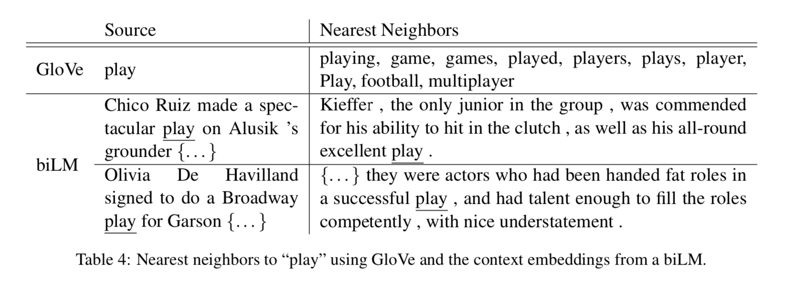

# Citation  

Deep Contextualized word representations  
Peters et al, 2018

# Tags  

vector space models, representations, contextual embeddings  

# Significance

Deep Contextual embeddings. Instead of static embeddings obtained by models such as w2vec or glove where every word has a fixed embedding independent of context ,
here, the embeddings of word change depending on context. For example, the word "bank" has different embeddings in this approach depending on 
"I went to the bank" vs "I crossed the river bank", whereas earlier models like w2vec or glove had a fixed embedding for the word bank
independent of context   

# Context and summary     

Models like [w2vec](../w2vec1_mikolov_2013/w2vec1_mikolov_2013.md) or [glove](../glove_pennington_2014/glove_pennington_2014.ipynb) use static embeddings ie the representation of a word  
does not depend on context. This can be enriched by using [subword information](../fasttext_bojanowski_2017/fasttext_bojanowski_2017.md) which is useful for getting better representations of unseen words  
However, these representations are still context independent. Previous techniques which leverage contextual representations to learn embeddings are context2vec (Melamud et al 2016) which uses bidirectional LSTM to encode 
context around pivot word, or using the pivot word itself in the representation (CoVe, McCann etal 2017 uses encoders of a supervised Neural machine translation system, or unsupervised language models)  
Also , previous work indicates that different layers of a deep biRNN encode different types of information.  

In summary, ELMo represenations are functions of entire input sequence, computed on top of 2 layer biLMs with
character convolutions (which help with capturing subword information) as a linear function of internal network states. 
This allows semi-supervised representations (the LM needs no annotation, the final classification layer needs annotations)    

# Method in more detail  

1) Given a sentence of k tokens, use L layers of bidirectional LSTMs. For each token tk, 2L+1 representations are obtained , 1 from intial embedding of token, L from L layers of hidden stages of forward LSTM and another L from hidden stages of backward LSTM  
Separate parameters are maintained for LSTM in each direction, except that parameters are tied/shared for token representation and softmax layers  

Rk = {xk; hforwardk,j; hbackwardk,j | j=1..L} is the representation of the kth token, xk is embedding of token, hforwardk,j is vector at hidden layer j for token k in forward direction,  hforwardk,j is vector at hidden layer j for token k in backward direction  

2) For a downstream model, all layers in R are collapsed into a single vector . In simplest case, only the top layer is selected. but more generally, a weighted sum of hidden layers are taken , 
       
    
    Image credit equation 1 in paper   
    
    Note : This is similar to the attention formulation, except that for attention, weighted sum of hidden representations across tokens is obtained, here , for each token weighted sum of hidden representations across layers is obtained  
    

3) In context of a supervised model, freeze the weights of biLM, for each token concatenate ELMO vector ELMOktask with xk, and pass {xk;ELMOktask} to task RNN.  
For some tasks like SNLI and SQUAD, include ELMO at output of RNN too ! Concatenate ELMOk with hk 

4) A moderate amount of dropout is added to ELMo   

5) Architecture of LM parameters - 4096 units , L = 2, 512 dimension embedding . Also added residual connection from first to second layer  
Character representation uses 2048 character n-gram convolutional filters followed by two highway layers  , and a linear projection down to 512 dimension.  
Trained for 10 epochs, obtaining perplexity of 39.7 

For domain specific tasks, finetuning of the language model helps  

6) Note - In comparison with [OpenGPT](../opengpt_radford_2018/opengpt_radford_2018.md) and [BERT], one key idea here is shallow concatenation 
ie forward and backward LM's are trained indepedently across all layers, and combined using the equation in step 2 for the final task of interest. 
Why independent and not jointly ? because if it were trained jointly, it would be cheating, where 
the backward model has seen the future and can tell the forward model that .
OpenGPT handles this by using only a unidirectional language model (which has the obvious disadvantage 
that you are learning only from previous words and not next words); BERT handles this 
by masking [here's a nice explanation](https://www.reddit.com/r/MachineLearning/comments/e71vyr/d_why_does_the_bert_paper_say_that_standard/f9xox9b/)

# Evaluation  

Performance of ELMo compared to other SOTA models (2018) for 6 key NLP tasks  

   

1) Question Answering - On SQUAD dataset .  Baseline  (Clark and Gardner 2017) is improved version of BiDAF (Bidirectional attention flow model), with self attention after the bidirectional model 
Adding ELMO to SQUAD increases test F1 by 4.7% (81.1->85.8)  

2) Textual entailment - determine if hypothesis and premise align or not. Use SNLI (Stanford Natural Language Inference dataset) Baseline is ESIM model (Chen 2017) 
which uses a biLSTM to encode hypothesis and premise, followed by a matrix attention layer, a local inference layer, another biLSTM inference compositional layer and finally a pooling operation before output layer
Adding ELMo to this model improves accuracy by 0.7 % on average  

3) Semantic role labeling (SRL) - answers question "Who did what to whom" - models predicate-argument structure of sentence  
Baseline - He et al (2017) modeled SRL as a BIO tagging problem ,using an 8-layer deep biLSTM with forward and backward directions interweaved.  
Adding ELMo improves results (F1) by 3.2% (81.4->84.6) on OntoNotes benchmark  

4) Coreference resolution    - Goal is to cluster mentions in text that refers to same entity. Dataset  - Ontonotes coreference annotations on CoNLL 2012 dataset.  
Baseline - Lee et al (2017) - End to end span based neural network . Uses biLSTM and attention to compute span representations, then applies softmax mention ranking model  to find coreference chains. 
Adding ELMo improved average F1 by 3.2% (67.2->70.4)  

5) NER - Dataset - ConLL 2003 data set containing 4 different entity types - PER, LOC, ORG, MISC  
Baseline model -    pre-trained word embeddings, character based CNN representation, two biLSTM layers, CRF loss. Adding ELMo increases accuracy from 90.15 -> 92.22  

6) Sentiment analysis - Fine grained sentiment classification task in SST-5 . Baseline model - biattentive classification network (BCN) (McCann 2017) (51.4% -> 54.7%)  

# Analysis  

1) Ablation analysis - change values of regularization parameter lambda. also use only last layer hidden representations instead of weighted average embeddings ELMo  

    
  
  Image credit - table 2 in paper
  
  
2) The results in performance above are when ELMo is included along with input token in downstream task  

ie Instead of xk, the representation  of word k, use (xk;ELMOk)  . in task RNN.  

For SQUAD and SNLI, perfornance is even better if ELMO is concatenated both at input of downstream RNN and output . However,performance is a bit worse for SRL.  
One explanation for this is that - since SQUAD and SNLI use attention layers after biRNN in downstream task -> using ELMO directly allows downstream model to attend to internal states of the LM.  For SRL, the worse performance could be because task specific context 
reprentation are more important than biLM  

3) Examples of ELMo capturing context information 

    
  
  Image credit  - table 5 in paper 
  
  Comparted to GloVe, ELMo is able to capture contexts of a polysemous word such as play better depending on context  
  
  The top layer of ELMo does better on WSD, whereas bottom layer of ELMo does better on predicting POS tags.  
  indicating that top layers capture semantic information, and bottom layers syntactic  
  
  
4) Sample Efficiency - Adding ELMo decreases training set size, and time taken for training to reach a benchmark performance considerably  
   For example, SRL model reaches maximum F1 after 486 epochs without ELMo and 10 epochs with.  
   
5) Visualization of weights - 

       
    
    Image credit - Figure 2 in paper  
    
    
  

