# Citation  

Enriching word vectors with subword information
Bojanowski Grave Joulin and Mikolov 2017

# Tags  

vector space models, representations, embeddings subword, fasttext

# Significance

Subword modeling. Unline word embeddings where a vector distribution is learnt for every word, here,
a vector representation is learnt for character n-grams, and words are represented by sums of corresponding
character n-grams . This is especially useful in modeling rare words, and in languages which are morphologically rich (same word has many different inflections)  

# Context and summary  

word embeddings are very popular but they don't capture morphological information. ie word embeddings don't guarantee that words like eat, eaten, eating , etc
have similar representations even though they have a common root word. Previous methods which include morphological information are factored neural net models (Andrescu and Kirschhoff 2006) where 
words are represented as sets of features, obtaining words from morphemes which rely on morphological decomposition of words (Lazaridou 2013, Luong 2013, etc), 
constraining morphologically similar words to have similar representations (Cui 2015), jointly learn embeddings of words and characters (Chen 2015), 
representing words through character n-gram count vectors (Wieting 2016), learning representations of 4-grams through SVD and summing these to get word representations (Shcetze 1993)  

In addition, work exists on purely character level embeddings which are fed to RNN's or CNN's

# Method in more detail

1) Basic skipgram cost function :

  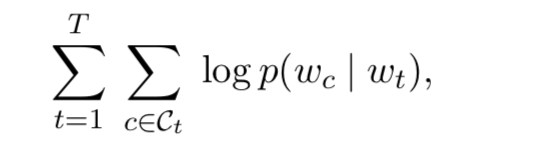

  Image credit : equation 1 in paper

  where

  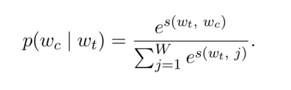  

  Image credit : equation 2 in paper

  This formulation is impractical as cost of computing grad log p(wo|wI) is proportional to vocab size W which is very large  

2) Instead of forumlation above, negative sampling is used, where instead of a softmax function over all words in vocabulary, for each training example, we feed 1 true sample and k negative samples, each of
   which is formulated as a binary classification task  [see notes on w2vec negative sampling](w2vec_2_mikolov_2013.md)  
   
   Therefore,  we get the following cost function  
   
   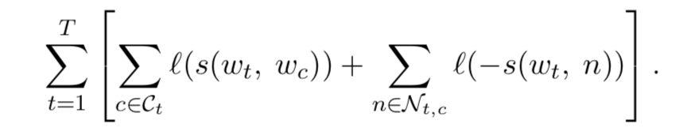  
   where l = log(\sigma(x)) , \sigma being the logistic function   
   
   Image credit : equation 3 in paper
   
   
3) Thus far, is the w2vec representation. Now, the scoring function s is changed as follows to account for sub word information. 
Each word is represented as a bag of character n-grams . Add < and > to beginning and end of word, include word itself. 
For example, where represented as <wh, whe, her, ere, re> and <where>  . Extract all ngrams for n between 3 and 6 

Instead of scoring function between word w and c defined as log\sigma(uwTuc) as in classic w2vec,
it is defined as 

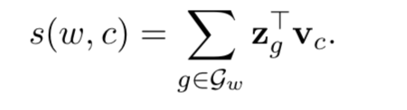  

where Gw is set of all n grams for word w

Image credit : equation 4 in paper  

In addition, for memory efficiency, we map n-grams to integers in 1 to K using a hashing function  

4) Optimization details - stochastic gradient descent of cost function above. Use a linear decay of step size as in original skip gram model .
Step size at time t = gamma0*(1 - (t/(TP))) where gamma0 is a constant, T is no of words in training data set, P is no of passes of data  

5) Implementation details  
i) Word vectors have dimension 300  
ii) For each positive pair, we sample 5 negative exampes with probability proportional to square root of unigram (unlike U**2/3 in original skip gram model )  
iii) Context size sampled between 1 and 5 . 
iv) This model on english is 1.5 times slower than original skip gram model  

5) Data details - train model on wikipedia data in 9 languages. preprocessing done by perl script. 5 passes  

# Results  

1) Human similarity - Compute spearman correlation between human judgement and cosine similarity between vector representations. 

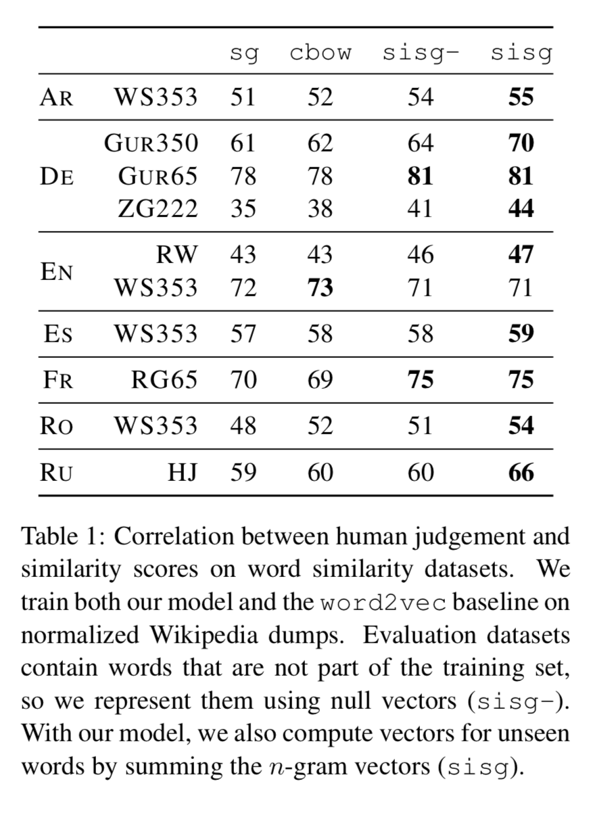  

Image credit : table 1 in paper

where sg and cbow are skip gram and cbow of baseline w2vec, sisg is this model (subword information skip gram)  . sisg- is when OOV words are represented by null vectors, sisg when OOV words are represented by sum of constituent subgrams 

Observations - sisg outperforms baseline w2vec on almost all dataasets. sisg (representing OOV words by summing n-grams) is always at least as good as sisg- (null vectors for OOV)  

2) Performance on word analogy tasks  

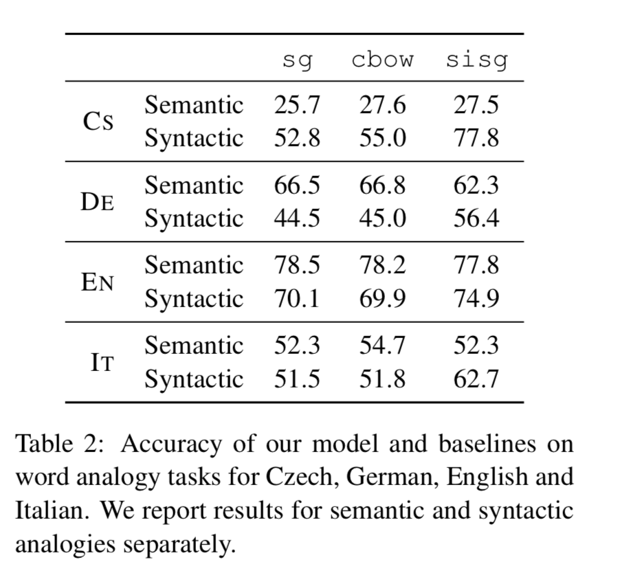    

Image credit : table 2 in paper  

Using subword modeling improves performance on syntactic tasks but not semantic tasks.  
Improvement over baselines is more important for morphologically rich languages like czech and german.  

3) Comparison to previous morphological methods  

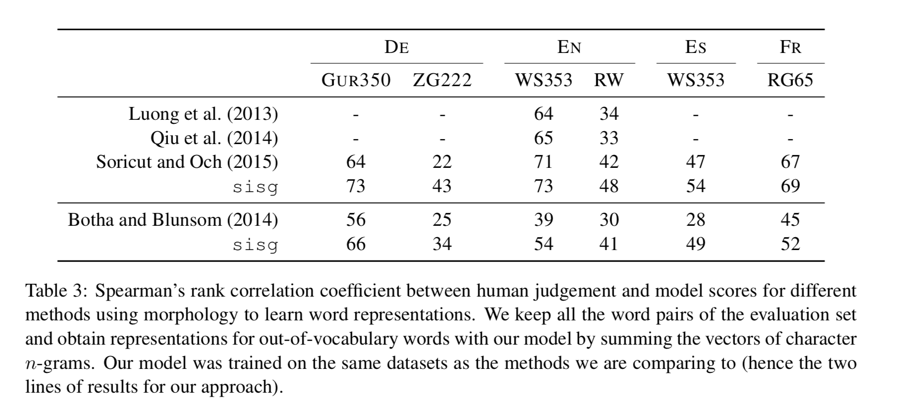     

Image credit : table 3 in paper  

4) Effect of size of training data  

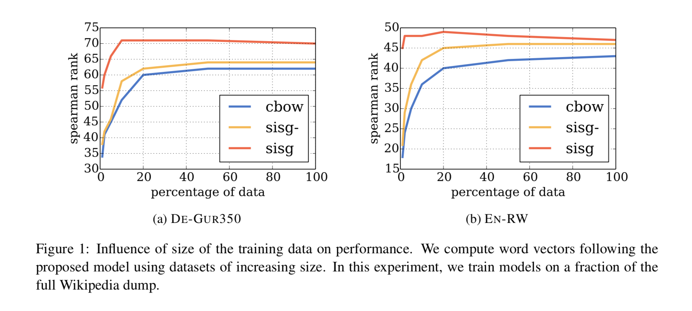     

Image credit : figure 1 in paper    

Intuition - since character level similarity between words are exploited, we are able to better model infrequent words.  

sisg gives good vectors even when trained with small dataset sizes.  

5) Effect of size of n-grams  

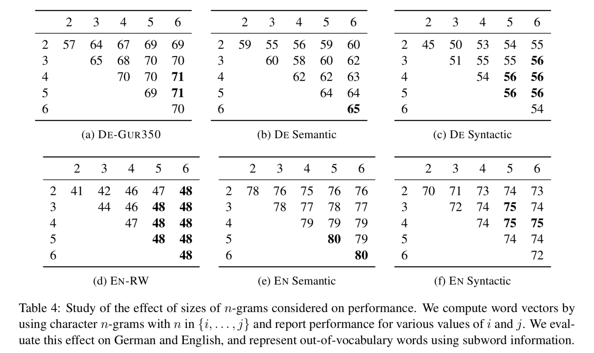   

Image credit : Table 4 in paper   

Use Different n-gram sizes and evaluate accuracy on english and german word analogy tasks. 
3-6 seems to be an optimal choice  

6) Language modeling  

Evaluate vectors obtained on language modeling tasks  for 5 languages. 

 Model is a recurrent neural network with 650 LSTM units, regularized with dropout (probability of 0.5) and weight decay  
 Embeddings used are sisg embeddings
 
 Compared to 2 baselines - log-bilinear langauge model (Botha and Blusom 2014) and character level language model (Kim et al 2014)  
 
 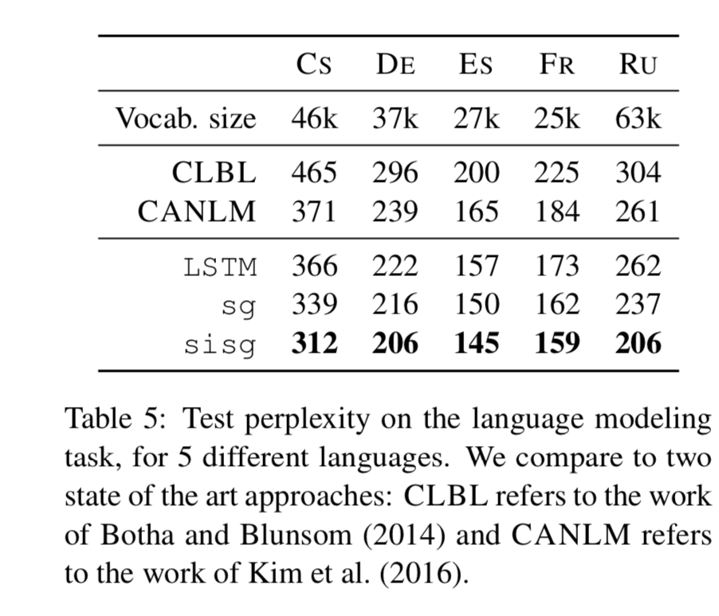   
 
 Image credit - table 5 from paper  
 
 
7) Qualitative analysis  

  nearest neighbours for some rare words  
  
  
 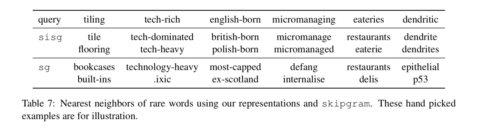   
 
  Image credit - table 7 from paper  
  
  
  character n-grams and morphemes - 
  
  check if most significant character n-gram in a word corresponds to morphemes  
  To do this, for each n-gram g, omit g from computing representing word w (ie if uw is original word embedding = \sumzi, i C {Gw}, uw\g is embedding after removing representation of n-gram g from u)  (ie  \sumzi, g C {Gw - g}  )and see which causes biggest difference in cosine similarity with original representation.  
  
  We see that for german, for example, such n-grams correrspond to valid morphemes, for english, it can correspond to affixes.. 

  
   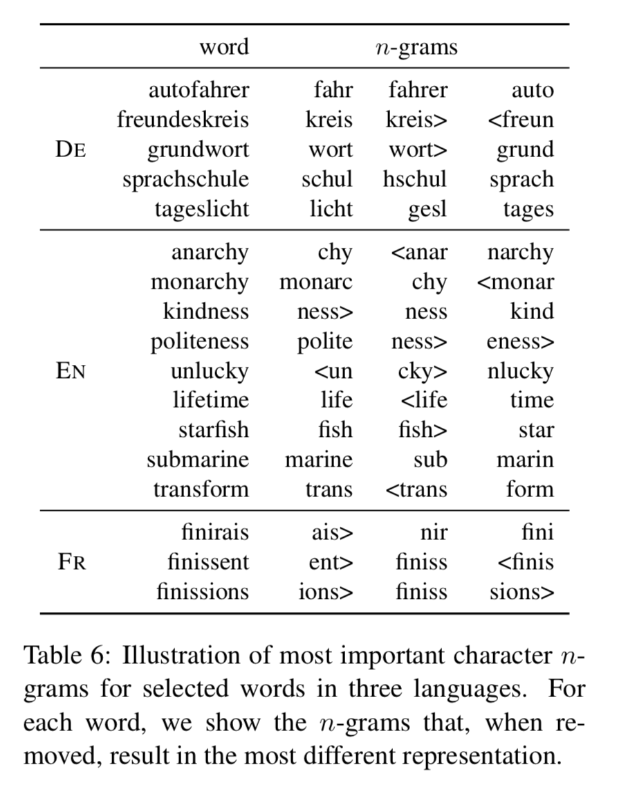   
   
   Image credit - table 6 from paper  
   
   
8) Word similarity for OOV words  

OOV words are represented by average of vector representations of constituent n-grams  

To study this, we take pairs of similar words in english, where 1 word is in training vocab and 1 word is not  
For  2 words, find cosine similarity between all pairs of constituent n-grams    

    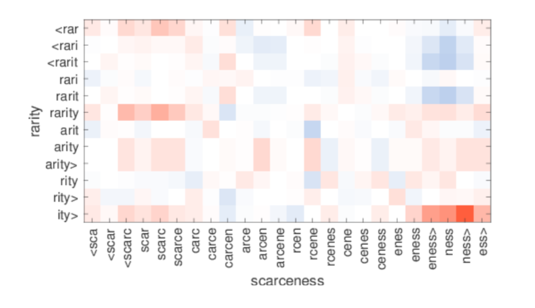   
    
    Image credit - figure 2 from paper   
    
    
# Conclusion  

A simple method to learn word representations using sub word information. fast, does not require much preprocessing or supervision    
    
    
    

    
  
  

 

