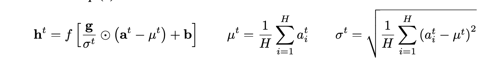
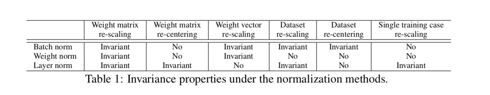
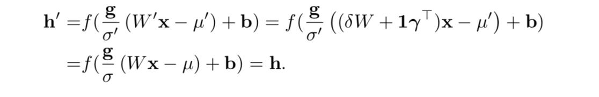
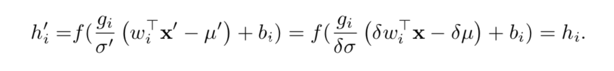
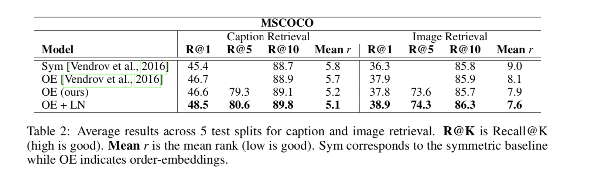
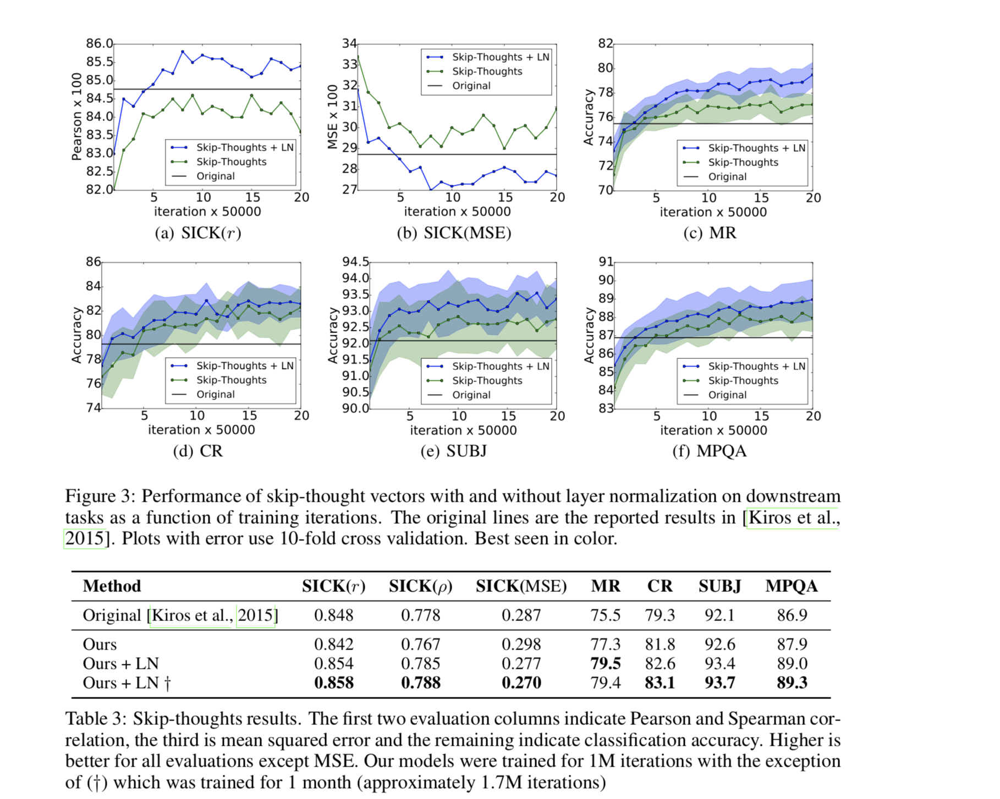
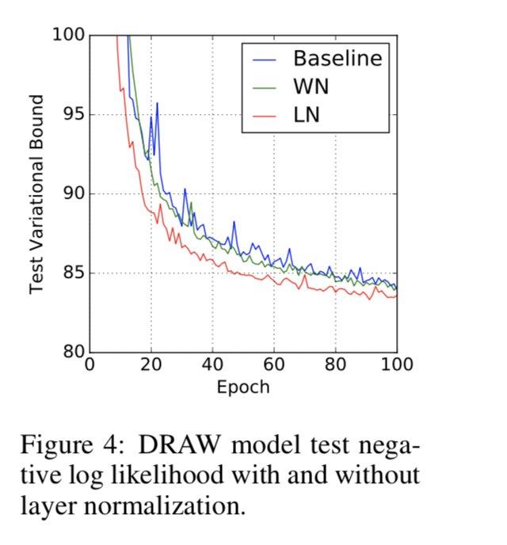
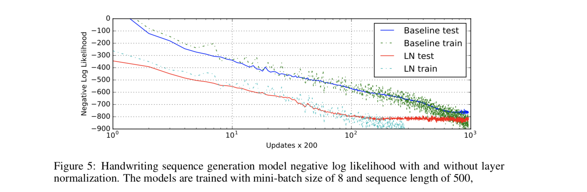
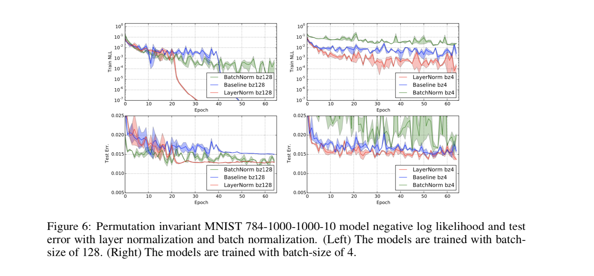

# Citation  

Layer Normalization : 
Ba, Kiros, Hinton 2016

# Tags  

Layer Norm

# Significance

Extension of batch norm to RNN like architectures. One problem with batch norm is - no straight forward way to apply to RNN,
dependent on mini batch size. Layer norm solves this problem by extending philosophy of batch norm to even minibatch of size 1

# Context and summary  

[Batch Norm](../batchnorm_ioffe_2015/batchnor_ioffe_2015.md) normalizes summed inputs (z) to each layer by mean and variance across 
mini batch, resulting in reducing internal covariate shift , and hence faster training, also adding regularization because
of stochasticity across mini batch

Batch norm requires storing running averages across summed inputs per layer, easy for DNN and CNN, but unclear on how to store
for recurrent architectures with variable sequence length. Also, cannot be applied to online learning or situations where mini batch
size is small

Unlike batch norm, layer norm does not need information across training examples (such as minibatch) to do normalization,
hence can be applied with mini batches of size 1, and also RNN

# Method in detail

In batch norm, given input ,  given Zlkr, the input (sigma wixi) to node k in layer l in mini batch r (phew !) ,
we do zlkr_bn = (zlkr - mean(zlkr across all r))/sqrt(variance(zlkr across all r) + epsilon) - normalization step results in mean 0 and variance 1
ylkr_bn = gammal*zlkr_bn + betal

Instead, in layer norm
zlkr_ln = (zlkr - mean(zlk across all k))/sqrt(variance(zlk across all k) + epsilon) 

(mean and variance is thus computed across all units in same layer for that 1 sample, not all training examples in mini batch
for same hidden unit for same layer) -
so basically becomes independent of mini batch size, and can even be applied to 1 training example

This can be directly applied to recurrent networks,
as each layer of RNN is independent of other layers as far as computing mean/variance is concerned using layer norm,
unlike batch norm where this gets more complicated

  
Credit : Figure 4 from paper

# Comparison between different normalization schemes

Compare batch, weight and layer normalization techniques.
In general, if zi is the summed weight at node i in any layer,
hi = f( (gi/sigmai)*(zi - mui) + bi)
For batch and layer, mu and sigma are computed as above.
In weight normalization,  mu = 0, sigma = L2 norm of weight w

  
Credit : Table 1 from paper

## Weight rescaling and recentering : 

Under batch and weight normalization, if weight is rescaled, BN(gamma*wixi) = BN(wixi) and LN(gamma*wixi) = LN(wixi)

  
Credit : Figure 6 from paper

## Data rescaling and recentering

All methods are invariant to recentering the data set, but layer norm specifically is invariant in recentering a single training 
example too

  
Credit : Figure 7 from paper

## Geometry of parameter space

Math - check later

# Experiments  

Experiments with layer normalization on 6 tasks, with a focus on recurrent neural net- works: image-sentence ranking, 
question-answering, contextual language modelling, generative modelling, handwriting sequence generation and 
MNIST classification. 

1) layer normalization to  order-embeddings model  (Vendrov et al) for learning a joint embedding space of images and sentences

  
Credit : Table 2 from paper

2) Unidirectional attentive reader model

layer normalization not only trains faster but converges to a better validation result over both the baseline
BN variants also not sensitive to the initial scale in the same way that recurrent BN is

3) skip thought vectors (Kiros et al 2015) 

Given contigous text, sentence is encoded with RNN, and decoder RNN used to predict surrounding sentences
applying layer normalization results both in speedup over the baseline as well as better final result

  

Credit : Figure 6 from paper

4) Generative modeling on MNIST dataset using DRAW

  

Credit : Figure 4 from paper

5) Handwriting sequence generation

  

Credit : Figure 5 from paper

6) Permutation invariant MNIST
tested layer norm in Feed forward network
  

Credit : Figure 6 from paper

