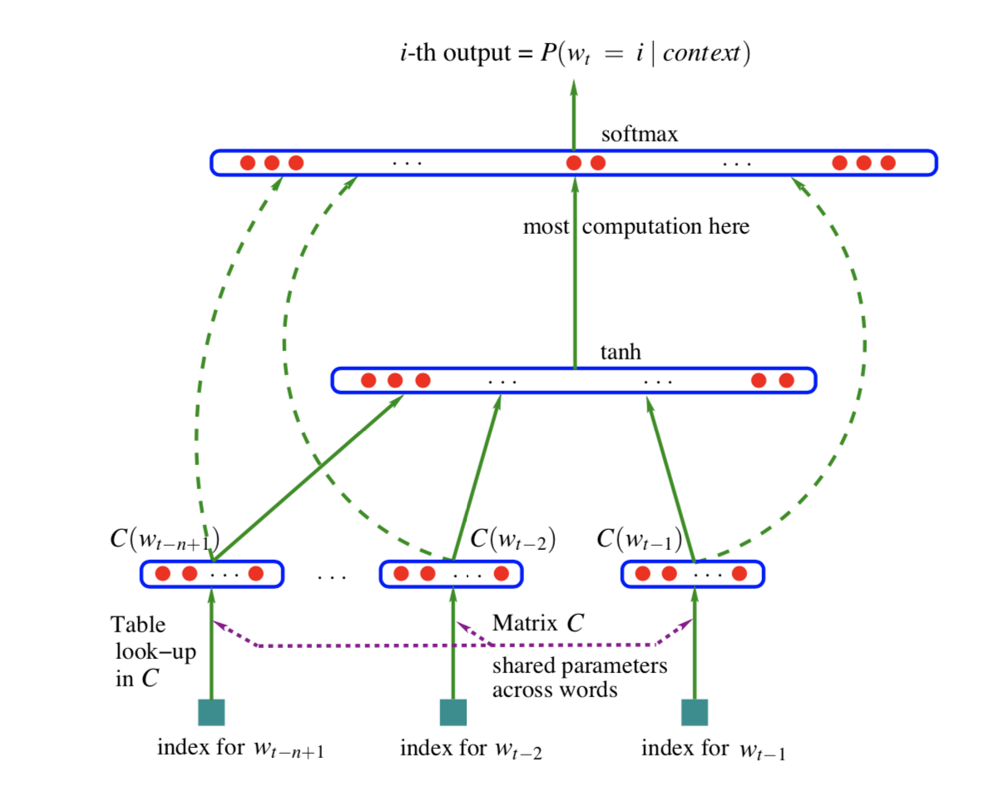
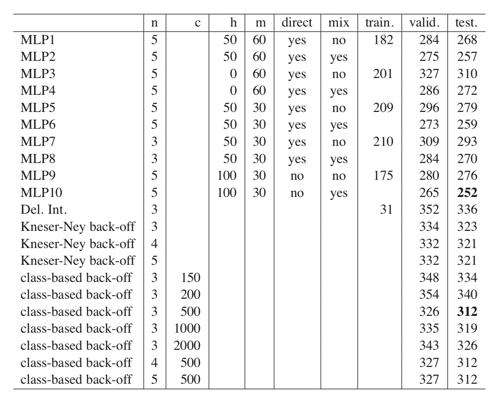

# Citation  

A Neural Probabilistic Language Model
Bengio et al, Journal of Machine Learning Research, 2003

# Tags  

vector space models, representations, embeddings

# Significance

The earliest paper to talk about using Neural Networks to get vector representations of words/word embeddings  
Subsequent papers like Mikolov's 2013 paper built on this  

# Context  
1) Curse of dimensionality - In NLP, even a sentence of 10 words, assuming each word can be drawn from a vocab of 100K words, potentially ~ 10(100K) possibilities; therefore modeling the joint distribution P(w1,w2..w10) has 10(100K) - 1 free parameters)  
2) Typically, language models model P(w1,w2...w10) = P(w1)*P(w2|w1)*P(w3|w1,w2)*P(w4|w1,w2,w3)..., under n-gram assumptions (for example n=1), RHS simplifies to P(w1)*P(w2|w1)*P(w3|w1)*P(w4|w3)... )  
3) Backoff techniques  
    - In case we see new words in test data not seen in train data, the above approach assigns 0 probability, which is undesired. especially for longer contexts. This is handled by techniques like Katz backoff trigram models (Katz 1987) or in smoothed trigram modeling (Jelinek and Mercer 1980)))  
    - The philosophy of techniques like this  is to generate new word sequences by "gluing" together short or overlapping sequences in train data .   
    - Two disadvantages with this approach  
        a) Does not take context more than 1 or 2 words into account
        b) Does not take "similarity" of words into account. Example : It is desired that sentence "The cat is walking in the bedroom" helps us model the sentence "The dog is running in the room", as cat and dog are syntactically and semantically very similar. This approach does not do that  .
        
4) Solution - use *distributed representations* to fight the curse of dimensionality - represent words as vectors !  
    - Associate every word with a vector  
    - Express joint probability of word sequence in terms of feature vectors corresponding to those words  
    - Learn simultaneously the word feature vectors and parameters of the joint probability function  
5) Vector space representations have been learnt using techniques like LSA (Shutze 1993) where feature vectors are obtained by looking at cooccurence matrices (Techniques like GloVe (2014) build on this idea); in contrast, this techniques uses a local context to jointly learn probabilities of word sequences and vector representations of words  
6) Parameter sharing used across different positions of sentence. ie in the NN model, the weights are independent of position of word  

# Details of model  

  

Image Credit : Figure 1 in paper   

1) Model P(wt|w1,w2...wt-1)) = f(wt-n+1, wnt-n+2...wt-1)  
2) We want to estimate f. We decompose f(wt-n+1 wt-n+2...wt-1)   = g(i, C(wt-n+1) , C(wt-n+2)... C(wt-1))))  
3) Let C be a matrix of dimension |V|*m where m is size of distributed representation desired, |V| is vocab size - basically C is embedding matrix  with |V|*m parameters  
4) g is represented as a feedforward (could be recurrent as well )neural net with weights w  
5) Total set of parameters theta = (C,w))
5) Train NN by defining likelihood L = (1/T)*sum(log f(wt-n+1 wt-n+2...wt-1)); theta)) + R(theta)) where R(theta) is a regularization term applied to every parameter except biases of NN  
6) Therefore, at the softmax layer, P(wt|w1,w2...wt-1) = exp(ywt)/sum(exp(ywi))))  where ywi is unnormalized energy of word wi = b + Wx + Utanh(d + Hx). W is actually a skip connection directly connecting x to the target layer ! x = (C(wt-n+1),C(wt-n+2)...C(wt-n+1))  
7) Total no of parameters : Assuming W = 0 (no skip connections), theta = (C,w) = (C,d,H,U,W,b). 
    -   C is of dimension |V|*m and is the embedding matrix  
    -   d is the bias term of the first layer (tanh) - has h elements (no of hidden layers)  
    -   H is the weight matrix of first layer - has dimension h * ( (n-1)*m)  (n-1 input words, each word has dimension m , flattened)  
    -   b is bias term of second layer (softmax) - has |V| elements  
    -   U is weight matrix of second layer (softmax) - has dimension |V|*h  
    -   W (if present) is a skip connection - has size |V|*((n-1)*m)  
    -  Total number is therefore |V|*m + h + h*(nm-m) + |V| + |V|*h + |V|*n*m - |V|*m = |V|*(1+h+n*m) + h*(1+nm-m). Dominating terms are |V|*(h+n*m)  
    
    
# Parallelization  

(Note : This was before GPU's :) )  

Two levels -   
1) Data-parallel : Each processor works on different subset of data  - asynchronous implementation  
2) Parameter-parallel : parallelized SGD, where each CPU computes unnormalized probability for subset of outputs, and performs updates for correspondong parameters (weights going into that output)  even if there is some small amount of duplication  

# Results  

1) Results compared with baselines of smoothed trigram models and back off n-gram models with modified Kneser Ney   method  on Brown data set  - 33% lower text perplexity compared to other models  

   

Image Credit : Table 1 in paper   

# Remarks  

In comparison to W2Vec models (2013), the main differences are  - 
1) W2Vec used a shallower network 
2) No recurrent connections  
3) Of course GPU's enabling training on larger data sets  
4) Negative sampling / contrastive divergence techniques to make  last layer computation faster (The h*|V| term)