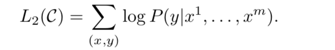
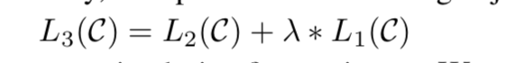
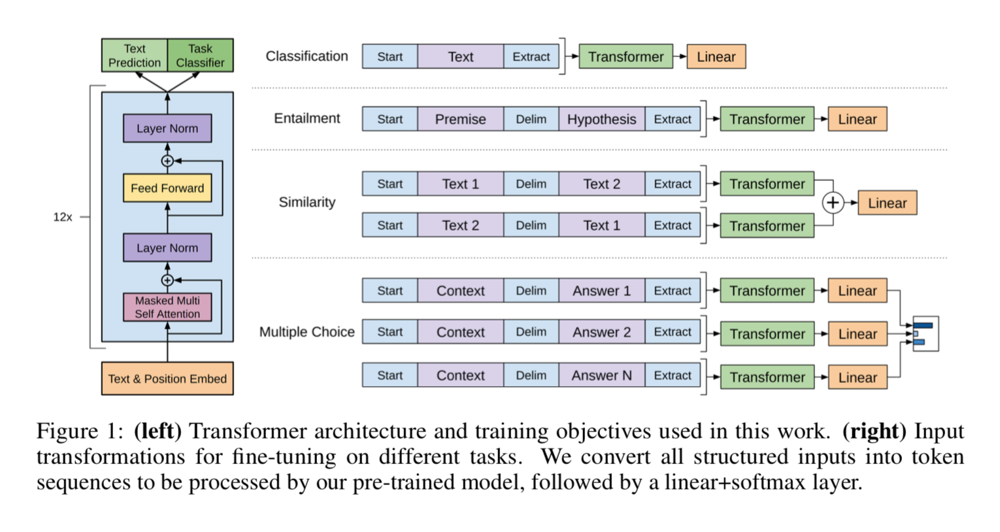
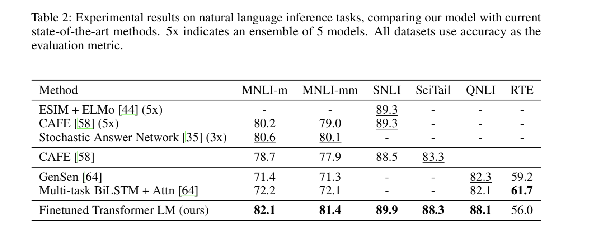
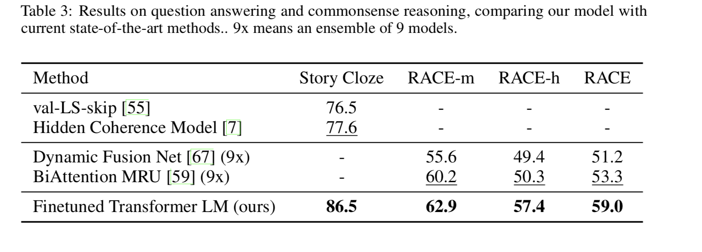
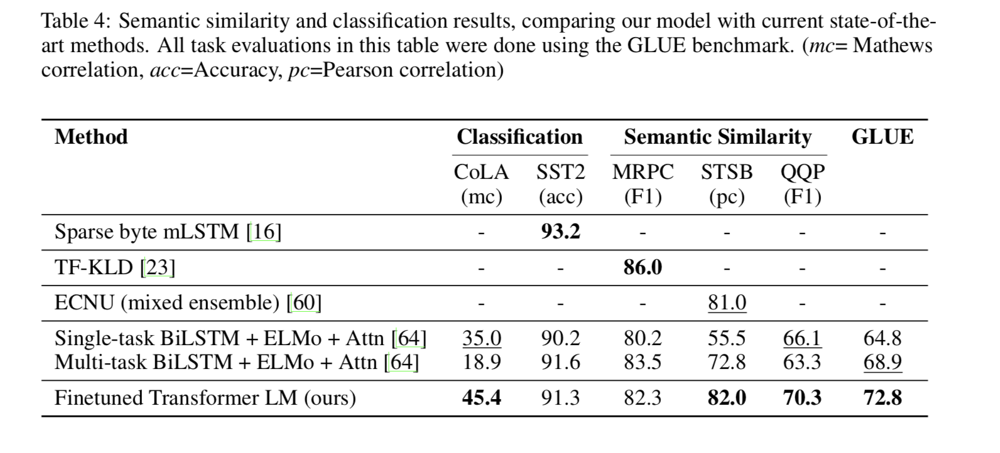
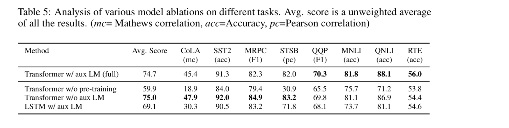

# Citation  

Improving Language Understanding by generative pretraining
Radford et al 2017

# Tags  

OpenGPT, Open AI Transformers

# Significance

A semisupervised approach (pre-training unsupervised LM step using transformers followed by fine tuning for target task where labels are present)
Gives SOTA performances on several tasks

# Context and summary  

A generalized semi-supervised approach with two steps : unsupervised pre-training and supervised task specific finetuning.
Similar to the broad philosophy of [ulmfit](../ulmfit_howard_ruder_2018/ulmfit_howard_ruder_2018.md) except that 
transformer decoder, a component of [transformers](../transformers_vaswani_2017/transformers_attention_vaswani_2017.md) are used instead of the 
AWD LSTM in ulmfit for the LM. 

# Method in more detail  

## Unsupervised LM  

1) Given a corpus U of tokens u1..un, use a LM to maximize 

Image credit  - equation 1 from paper 

2) For architecture, use transformer-decoder. with multi-headed self attention followed by position wise feed forward attentions.
Note that since the encoder of the transformer is not used, the sublayer in the decoder corresponding to attention between decoder and encoder is not present. 

The equations are below : 

  

Image credit - equation 2 from paper 
where U = (u-k...u-2,u-1) are the k context token vectors, 
n is the number of layers in the transformer-decoder, 
We is embedding matrix, Wp is position embedding matrix.  
Note that weight sharing happens between the embedding layer and the final softmax layer  

## Supervised Fine tuning  

1) Once the LM model is trained, for the target task, assume a labeled dataset C, where each instance consists 
of tokens x1..xm with label y  
2) Inputs are passed through pre-trained LM to obtain final transformer-decoder block activation for each token 
hlm (hidden state of token m after l tranformer-decoder layers). 
3) This is passed through a linear output layer with parameters Wy to predict y. 
P(y|x1,..xm) = softmax(hlmWy)    
4) The cost function to maximize is 

 
Image credit - equation 4 from paper  

5) However, adding the LM cost function too to the target classification task as a additional term with weight lambda helps.   
 
Image credit - equation 5 from paper    

## Task specific input transformations  

While the above formulation is suitable for classification tasks, we would like this architecture to be
useful across other NLP tasks as well such as QA, NLI, etc
So we transform inputs in these other tasks to the formulation above.  instead of building task specific
architectures on top of the above network. 

Textual entailment - concatenate premise and hypothesis with a $ token in between 

Sentence similarity - concatenate sentence 1 $ sentence 2, get hidden representation hml1. Similarly concat sentence 2 $ sentence 1 get hidden representation hml1.  add hml1 and hml2, feed to linear output layer , softmax  

QA - given context document z, question q and set of possible answers ak, concat z;q with every possible answer with delimiter in betwee to get k sequences (z;q;$;ak)  
Each of these sequences processed independently, normalized via softmax to get distribution over answers. 

 

Image credit - Figure 1 from paper  

# Experiments  

1) Used Bookscorpus dataset to train LM. Contains 7K unique unpublished books which are contiguous
Preferred over the 1B word benchmark dataset which is shuffled at sentence level, destroying long term dependencies. 

2)  LM Model spec - 12 layer decoder only transformers, 768 dimensional hidden states, 12 attention heads , 
adam optimization with amx LR of 2.51e-4, LR was increased from 0 linearly for first 2000 updates, annealed 
to 0 using cosine schedule, train for 100 epochs on minibatches of 64 randomly sampled, contiguous  
sequences of 512 tokens, layernorm used, Byte pair encoding vocabulary (BPE) with 40K merges, 
residual, embedding, attention dropout of 0.1, L2 regularization with w = 0.01 on all non-bias or gain weights. 
Used GeLU (Gaussian error linear unit) for activation. Use learned positional embeddings for transformer-decoder
instead of sinusoidal in original paper, ftfy library to clean raw text, spacy tokenizer. 

3) Finetuning model spec - reuse hyperparameters from LM in general. add dropout to classifier with rate of 0.1 
Use LR of 6.25e-5 and batchsize of 32.  3 epochs training. . Linear LR decay schedule with warm up of 0.2% over training.
lambda set to 0.5 (equal weight to finetuning, LM during LM)  

## Results

1) Textual entailment  

  

Image credit - Table 2 from paper

2) QA

Image credit - Table 3 from paper

3) Classification  

Image credit - Table 4 from paper  

## Ablation analysis  

  

Image credit - Table 5 from paper 