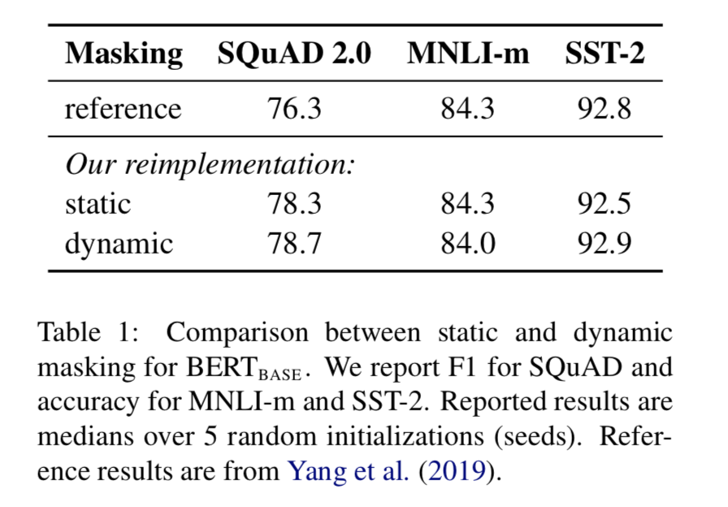
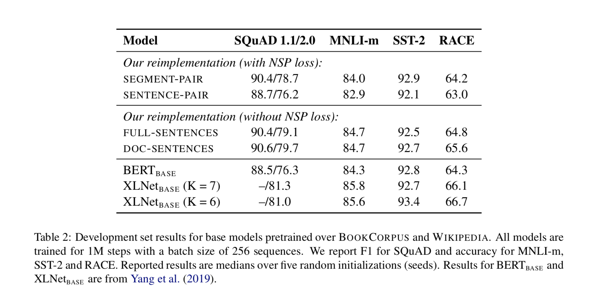
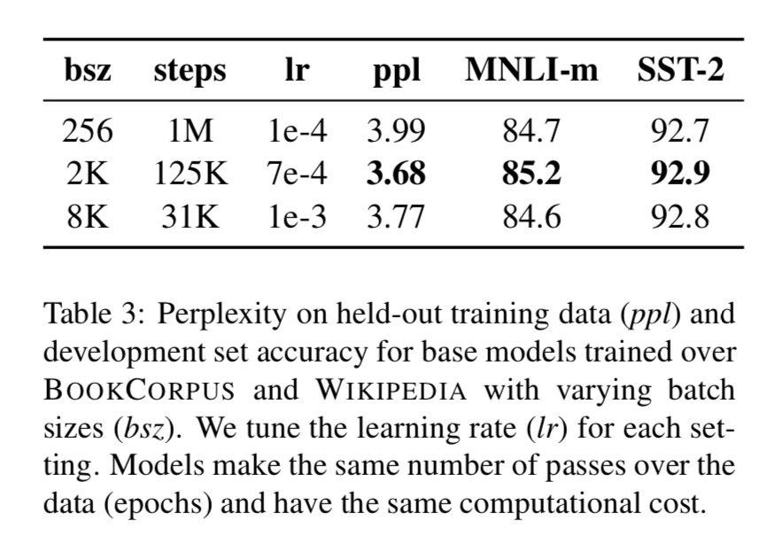
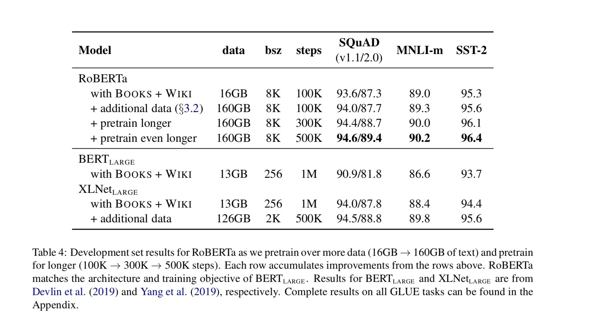
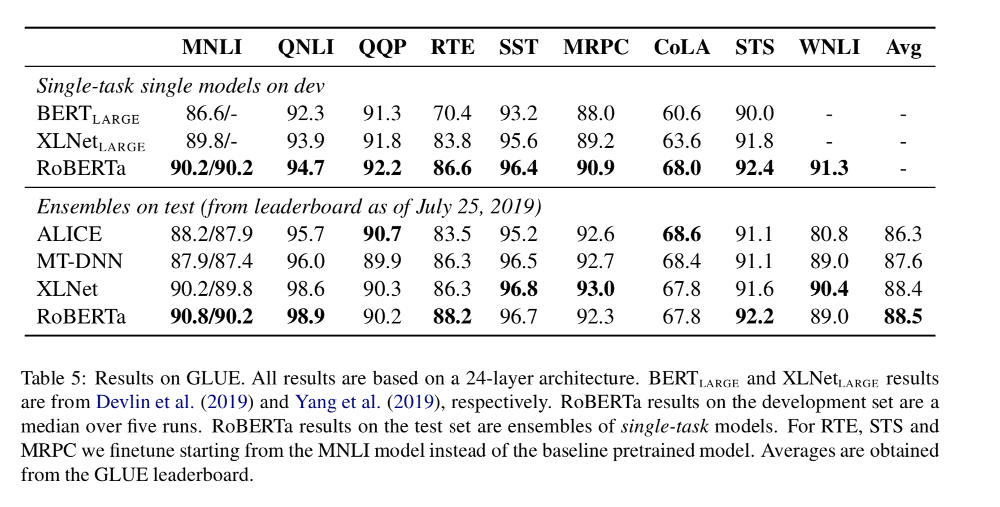
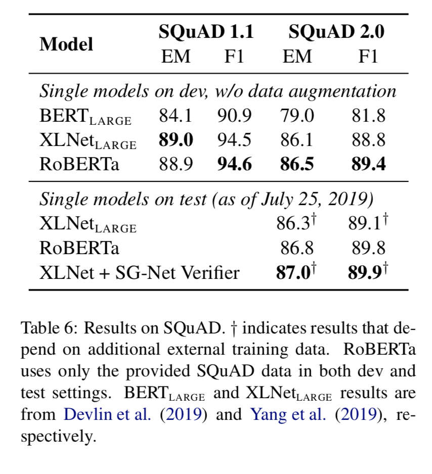
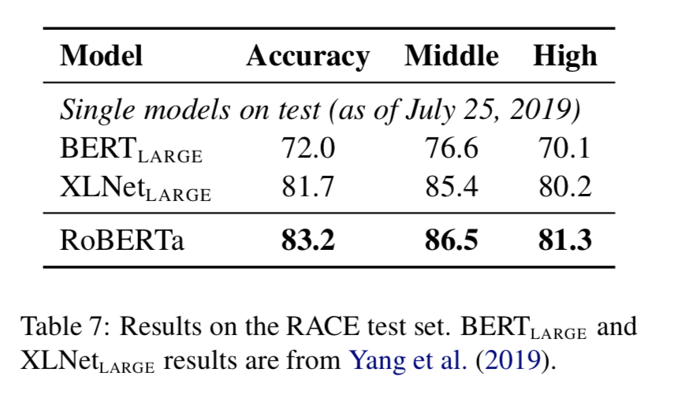

# Citation  

RoBERTa :  A robustly optmized BERT Pretraining approach  
Liu et al 2019

# Tags  

RoBERTa

# Significance

A bunch of improvements on top of the BERT architecture, to improve performance 

# Context and summary  

Roberta works on top of [BERT](../bert_devlin_2018/bert_devlin_2018.md) 
The authors find that BERT was significantly undertrained, and propose an improved recipe for
training BERT models, including
1) training the model for longer, on bigger batches, on more data
2) removing the next sentence prediction objective
3) training on longer sequences
4) dynamically changing masking pattern applied to training data instead of having static masks

All these improvements help Roberta achieve a score of 88.5 on the GLUE leaderboard, (similar to a score of 88.4 for XLNET),
matching SOTA on SQUAD and RACE, and in addition establish a new SOTA for 4 out of the 9 GLUE tasks - MNLI, QNLI, RTE and STS-B

# Method in more detail   (mainly changes on top of the BERT architecture)

## Static vs Dynamic masking  

The original BERT performing masking once during dataprocessing, resulting in a single static mask
To avoid using the same static mask in every epoch for every training instance, training data was duplicated
10 times so that every sequence was masked in 10 different ways over the 40 epochs of training 
(Each training sequence sees the same mask 4 times) 

Instead , roberta uses dynamic masking, where the masking pattern is generated every time
a sequence is fed to the model , found to be critical for pretraining for longer on larger datasets   

Image credit - table 1 in paper  

here, we see that dynamic masking is comparable or slightly better than static masking

## Model input format and next sentence prediction task 

In the BERT paper, the objective for LM pretraining was a combination of masked LM, and next sentence prediction (NSP) objective. 
In fact, the ablation analysis exercise in BERT found that removing the NSP objective 
costs significant performance degradation on QNLI, MNLI and SQUAD 1.1 datasets

To analyze this, the authors construct 4 different scenarios 
1) the original BERT implementation, where *segment pairs* are chosen for the NSP LM pbjective, such that the length of tokens
of the segment pair <= 512 (segments in BERT are typically longer than sentences, and span multiple sentences)
2) A new implementation, where instead of segment pairs, sentence pairs are used (actual english sentences). This invariably
ensures that a sentence pair length is much less than 512 tokens, so the batch size is increased to ensure total no of tokens per batch
is comparable to implementation 1
3) full-sentences :  a new implementation, where instead of using sentence pairs, the NSP loss is removed. each input
consists of full multiple sentences, such that the total length is at most 512 tokens. Document boundaries
are not respected ie when the end of a doc is reached, simply continue adding sentences from the next doc to the same input, and an extra separator between documents
4) doc-sentences - exactly similar to the full sentence formulation, except that doc boundaries are respected
inputs sampled near the end of documents may thus be less than 512 tokens, to compensate for this , batch size is increased

Image credit - table 2 in paper

Here, the conclusion is that full sentence or doc sentences are comparable in terms of accuracy to the original
implementation, hence the NSP objective is removed from the cost function, therefore, the full-sentence
implementation is used 

## Training with larger batches

The original BERTbase model was trained for 1MM steps with a batch size of 256 sequences. 
Instead, roberta experiments with larger batch sizes (2K and 8K), such that the no of steps is adjusted
to ensure computational cost is approximately the same. 

  

batch size of 8K is found to be better, and is used for subsequent experiments  

## Text Encoding  

The base BERT implementation uses a character level BPE vocab of size 30K. 
Following [Radford et al, 2019](../opengpt2_radford_2018/opengpt2_radford_2018.md) ,
bytes are used by Roberta instead of unicode characters as base subword units. (this eliminates the need for UNK tokens)
the byte level vocab size used is 50K, adds 15MM parameters to bert base, and 20MM parameters to bert large

Performance wise, this is very slightly worse than the bert encoding, but is used because
of better generalizability 

##ROBERTA

ROBERTA basically combines all the above 4 improvements,
and adds two other changes  - data used for pretraining and no of passes through data. 

the first model is trained on the same data as BERT large , then trained with 10 times additional data (16 GB -> 160 GB of text)
In addition, pretraining for longer is also tested (100K -> 300K -> 500K)

  

Image credit - table 4 in paper

# Results  

## GLUE results  

Two settings evaluated - 
1) setting 1 - Roberta is finetuned on the corresponding training data for each GLUE task separately 
Hyperparameter range chosen :batch size in (16,32), learning rate in (1e-5, 2e-5, 3e-5)
with linear warmup for first 6% of steps followed by linear decay to 0. Fine tune for 10 epochs
with early stopping on dev set. 
2) setting 2 - while comparing with other multi-task fine tuned models on the GLUE leaderboard, for RTE,
STS and MRPC,  finetuning is done starting from trained weights on MNLI task, rather than baseline Roberta.
a slightly wider hyperparameter space than setting 1 is done, and ensembling of 5-7 models is done per task

For QNLI and WNLI, certain task specific modifications were done - 
1) QNLI - For direct comparison to BERT, used the pure classification approach (traditional), whereas 
for the leaderboard, adopted a different more recent pairwise ranking formulation (Liu et al 2019) , where multiple candidate answers
are mined poer question, and compared to one another, with a single (question, answer) pair classified
as positive 
2) WNLI - (Remember, the base BERT paper doesn't tackle WNLI due to complexities in dataset) - 
Use reformatted WNLI from superGLUE (Wang et al 2019) which indicates span of query pronoun and referrent. 
Fine tune Roberta using margin ranking loss from Kocijan et al 2019, use spacy to extract additional candidate
Noun phrases from sentence, fine tune models so that it assigns higher scores to positive referent phrases 
than any of the negative referent phrases. However, this formulation allows using only the positive training
samples, and not the negative training samples 

  

Image credit - table 5 in paper

For single tasks, Roberta outperforms BERTLARGE and XLNETLARGE, even though it uses a similar masked training
objective as BERT, and same architecture as BERT - indicating that mundane things like dataset size, and training time
have a substantial effect on performance 
On the second ensemble setting, roberta attains SOTA ON 4/9 tasks, even though  it does not depend on multi
task finetuning , unlike other top submmissions.  

## SQUAD results  

While both BERT and XLnet augment training data with additional QA datasets, Roberta finetunes
only using provided SQUAD data. Same LR used for all layers unlike some other architectures. 
SQUAD1.1 - same training procedure as basic BERT, for SQUAD v2.0, additionally classify whether a question
is answerable, this is trained jointly with span predictor by summing up both classification and
span predictor losses. 

  

Image credit - table 6 in paper

## RACE results  

In RACE, candidates are provided 4 answers to a question based on an associated paragraph, and have
to pick the right answer. For this, each candidate answer is concatenated with corresponding question
and passage, each of the 4 options is encoded, and the CLS representation passed through a fully 
connected layer which is used to predict correct answer. The total length
of the QA pair + passage should be 512 tokens, so QA pair greater than 128 tokens is truncated, and if needed ,
the passage too.

  

Image credit - table 7 in paper

