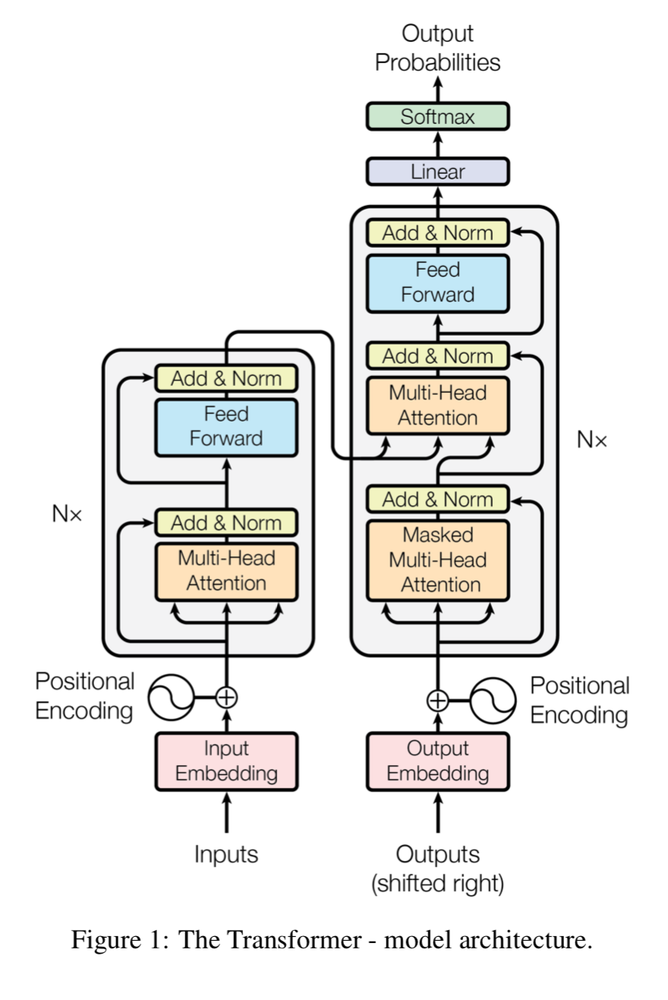
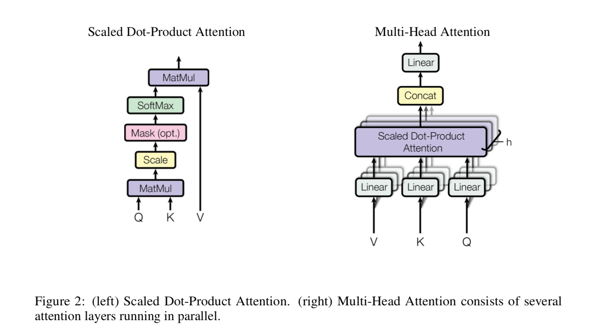
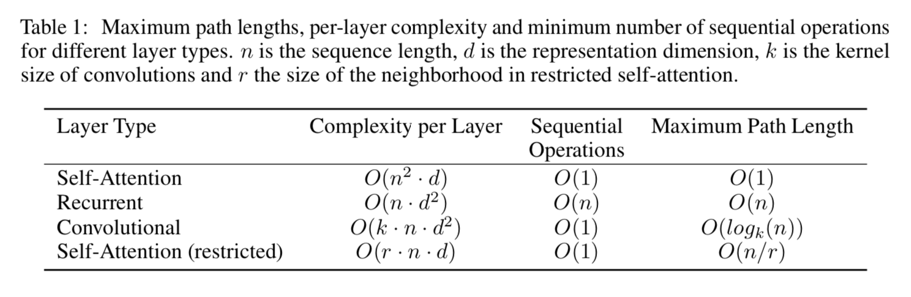
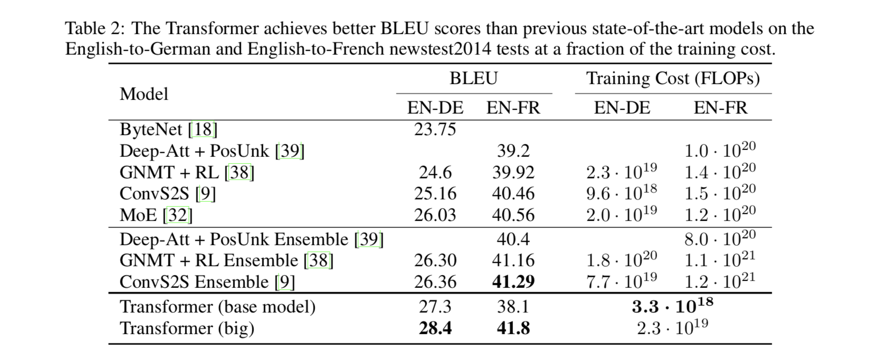

# Citation  

Attention is all you need
Vaswani et al 2017

# Tags  

self attention, transformer

# Significance

An alternative architecture to recurrent architectures such as LSTM using only self-attention , which is faster and better

# Context and summary  

Recurrent NN have been SOTA thus far (2017) for sequence modeling/transduction approaches. 
However, the inherently sequential nature of RNN  (where ht = f(ht-1, xt)) precludes easy parallelization. 
While attention mechanisms have been used earlier (Bahdanau et al 2015, Cheng et al 2016),
they have been used in conjunction with LSTM's.  

In this paper, recurrent architectures are not used, an only self attentions are used to get representations
of input and output sequences. This allows for significantly more parallelization (much faster), and better accuracy (SOTA).

What about CNN based architectures (which are also faster than RNN because they can be parallelized) - Such as Conv2S (Gehring et al 2017) ,
Extended Neural GPU (Kaiser and Bengio 2016), Bytenet (Kalchbrenner et al 2017) ?
The number of operations required to relate signals from two arbitrary input/output positions 
grows linearly with distance between positions for Conv2S and logarithmically for ByteNet, making it harder to learn
dependencies between distant positions, whereas in transformers, this is reduced to a constant number of operations.

# Method in more detail  

1) Goal is to get representations of input and output sequences for NMT/Seq transduction .  ie Map input sequence *x*(x1..xn) to 
sequence of continuous representations *x*(z1...zn). Given *z*, decoder generates an output y1...ym one step at a time.  

2) Standard methods is the encoder-decoder architecture, with/without attention .

3) The transformer architecture in more detail.   
    
Image credit- Figure 1 in paper  

4) The main pieces are   

## Encoder   

1) Composed of a stack of 6 (identical)  layers. 
2) Each layer has 2 sub-layers - multi-headed self-attention of input sequence, and position wise fully connected feed forward network. 
3) Residual connections, and layer normalization are applied around each sublayer.. 
ie output of sublayer i  = LayerNorm(x + SubLayer(x)) where x is the input of sublayer i, and SubLayer is the function implemented by the sublayer itself. 
To make this possible, all sub-layers and embedding layers are constrained to have same dimension dmodel = 512..

## Decoder   
1) architecture identical to encoder (6 layers of sub-layers, residual connections and layer normalization around each sublayer) 
- except for the following differences 
    a) Each layer has 3 sublayers instead of 2 for the encoder.  
    b) These sub-layers are multi-headed self-attention of target sequence, multi-headed attention of output of encoder target, and fully connected feedforward network
    c) To prevent positions from attending onto future positions while computing self-attention of target sequence
        i) masking is performed.  
        ii) output embeddings are offset by position   
        
        
        
## Implementation of attention 

Different from earlier implementations of attention ( [Bahdanau et al 2015](../attention_bahdanau_2015/Attention_Bahdanau_2015.md) or [Luong et al 2015](../attention_luong_2015/Attention_Luong_2015.md)) or self attention 
([Cheng et al 2016](../lstmn_cheng_2016/LSTMN_Cheng_2016.md))
Use the concept of Key, query , value, where alignment scores are computed between query and key; instead 
of alignment scores between ht,st (representations of hidden states of source and target) in the Bahdanau and Luong papers,
 or alignment scores between yt and hthat (the Cheng paper)  
 
 
Output is computed as the weighted sum of values, weights decided by alignment scores between query and key  ..
What is the alignment score used ? 
Note : each key and query is of dimension k (dk), and values are of dimension v (dv)

a(Q,K) = QKT/(dk**0.5)  

Attention(Q,K,V) = softmax(a(Q,K))V  (weighted average of values, weights determined by a(Q,K))

Q and K are matrices where many queries and keys are packed together respectively
This is similar to the multiplicative attention proposed in the Liong paper, 
except for the normalization factor in the denominator which accouts for the length of the key/query vector..
(The hypothesis is that if length of dk (the query vector/key vector increases), qTk becomes very large, and so this normalization of dk**0.5 helps )
(Also, multiplicative attention was chosen instead of concat attention (the Bahdanau attention) as it is much faster because it is pure matrix multiplication, 
performance wise, for small values of dk, both are comparable, for larger values, concat (which these authors called additive attention) is better, but normalizing
multiplicative by dk**0.5) helps reduce/eliminate this performance gap.    

## Multi Head Attention - 

Instead of a single attaention operation (one key value query operation), it is beneficial in practice 
to do projections h times (similar to having multiple filters in CNN)   

So instead of choosing dk = dv = dq = dmodel, and performing attention,
start with vectors of size dmodel for each, do linear projections h times to get h sets of vectors of size (dkey, dquery, dvalue) respectively
For each of the h sets, do Attention(Q,K,V) as defined above;
Then concat output from each of these h operations (to get a vector of size h*dv), and do a linear projection to get
a vector of size dmodel for any downstream operation.   

In practice, if dmodel = 64, and h (no of parallel attention operations/ no of heads) = 8,
use dk = dv = dq = 64/8 = 8, to keep the total computational cost of multiheaded attention similar to a single attention
operation with dk = dv = dq = dmodel

Note that there are 3 kinds of attention -
1) self-attention in encoder : Each position in encoder attends to all positions in previous layers of encoder, all keys,
values, queries come from output of previous layers of encoder
2) self-attentin in decoder - each position in decoder attends to all positions upto and including current position in decoder. 
To perform this masking, set to -inf all inputs to softmax which correspond to non-allowed connections. 
3) encoder-decoder attention layers : queries come from previous decoder layer, memory key and values come from output of encoder
allows every position in decoder to attend over all positions in encoder. 

## Fully connected feedforward network  (FFN). 

This corresponds to two FCN with a Relu in beweek
ie FFN(x) = Relu(xw1 + b1)w2 + b2 where Relu(y) = max(0,y)

Dimensionality of input and output = dmodel = 512, inner layer has dimensionalty 2048   

## Embeddings and softmax 

Both input and target sequences are converted to embeddings of dimensions dmodel, (learned embeddings used) 
The output of the decoder is fed to a softmax to get final output. The same weight model is shared between two embedding layers
and pre-softmax linear transformation.  In embedding layers these weights are multiplied by sqrt(dmodel)  

## Positional encoding 

Since no RNN or CNN are used, to encode the relative positions of words in sentences, positional embeddings are used
, of same size (dmodel) as embeddings, so both can be summed. 
PE(pos,2i) = sin(pos/10000**(2i/dmodel))
PE(pos,2i+1) = cos(pos/10000**(2i/dmodel))  

(positional embeddings can also be learned instead of setting it explicitly - with similar results )   

 
# Advantages of self attention   

   

Image credit - Table 1 in paper

Constant time sequential operations (compared to RNN's which have N operations per sequence) - very parallelizable similar to CNN
path -length between long range dependencies in network is of O(1), smaller than other CNN architectures ByteNet which is O(logN)
complexity is of O(dn**2) where n is sequence length, d is representation length. So if n<<d which is typical , this works quite well  

# Experiments   
1) Trained on standard WMT 2014 English-German dataset ~ 4.5 MM sentence pairs, and English-French dataset ~36 MM sentences  
sentence pairs batched together by similar sequence length, each batch contained sentence pairs having ~25K source and target tokens respectively  
2) Used 8 NVIDIA P100 GPUs - base model trained in 12 hoursr for 100K steps
3) Optimizer - Adam, LR increased for first 4000 steps, decreased  proportional to inverse square root of step number after that. 
4) Regularization - Residual dropout - applied to output of each sublayer before addition and layer normalization, apply
dropout to sums of embedding and positional encoding in both encoder and decoder stacks. Dropout rate of 0.1 used
5) Label smoothing of 0.1 used, which hurts perplexity but improves accuracy and BLEU scores

# Results  

   
Image credit - Table 2 in paper

# References
[1] : https://medium.com/dissecting-bert/dissecting-bert-part-1-d3c3d495cdb3