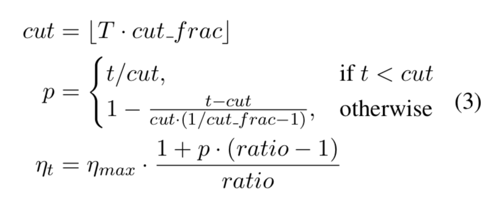
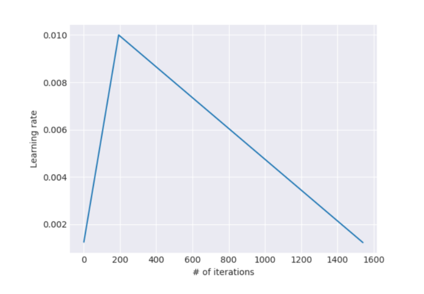
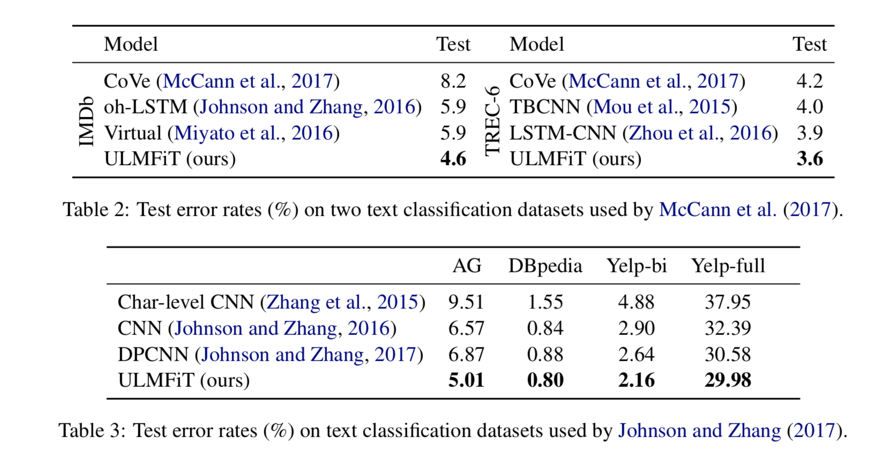
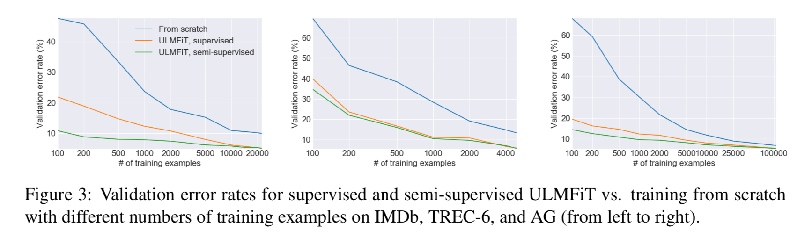
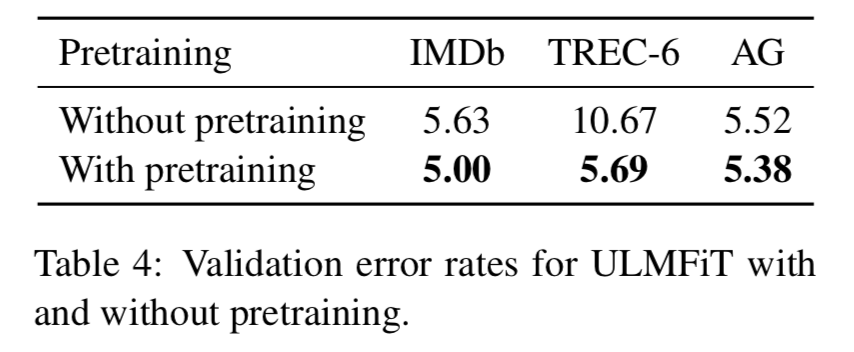
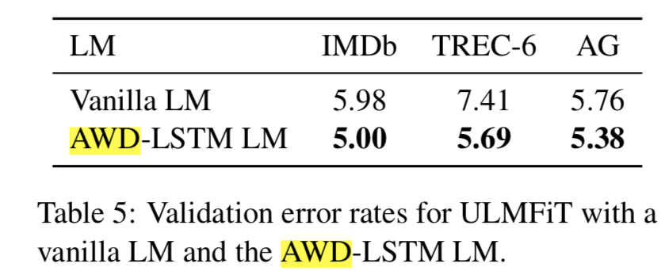
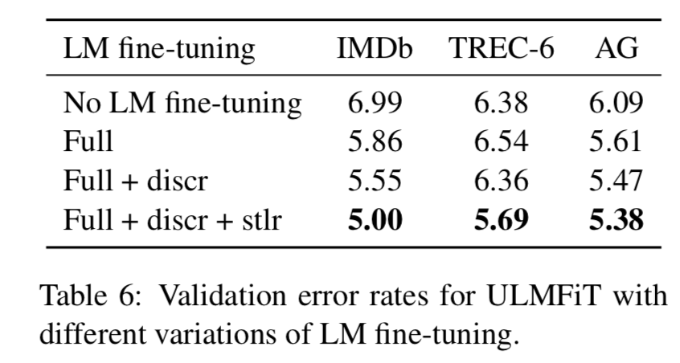
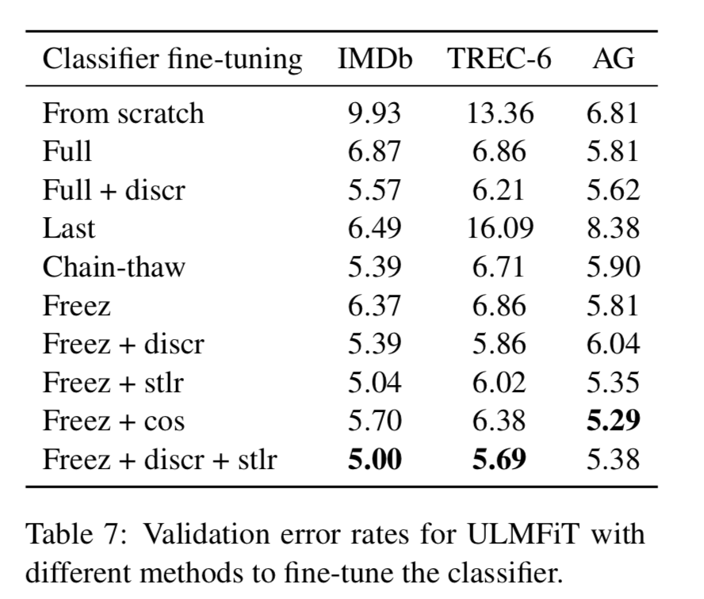
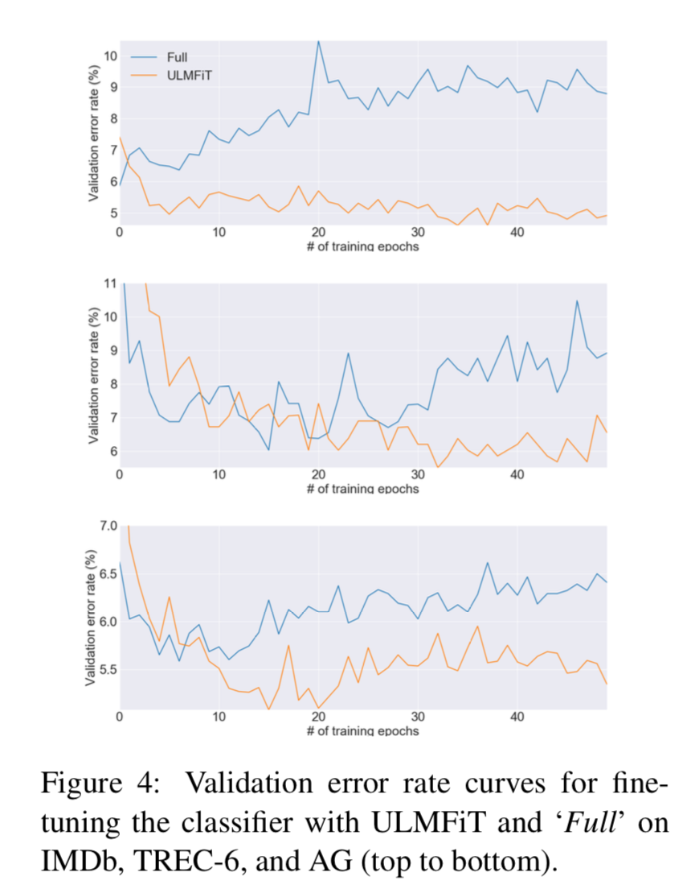

# Citation  

Universal Language Model Fine tuning for text classification
Howard and Ruder 2018

# Tags  

ulmfit, fastai, transfer learning, low-shot learning

# Significance

A technique for (inductive) transfer learning for NLP

# Context and summary  

Inductive transfer learning has had a large impact on computer vision . Applied CV models are rarely fine-tuned 
from scratch, instead fine tune models that have been pre-trained on ImageNet, MS-COCO and other datasets

As of 2018 - NLP lags behind in use of transfer learning - some methods used are   
1) Fine tuning word embeddings (Milolov 2013) - simple technique as only the first layer of the model is affected  
2) Concatenating embedings from other tasks with inputs at different layers (Mccann 2013, Peters 2017 2018) {Method called hypercolumns in CV community}  still train main model from scratch, treat pretrained embeddings as fixed parameters  
3) Current approaches for fine tuning more layers (Moue et al 2016, Dai and Le 2015 who proposed fine tuning a language model) have been unsuccessful.  
4) Authors argue - idea of LM fine tuning is not wrong, the way this was done was not correct - because compared to CV, NLP models are typically shallow, require different fine tuning methods - LMs thus far built overfit, undergo catastrophic forgetting  
5) ULMfit enables robust transfer learning for any downstream NLP task, the same model (3 layer AWD LSTM) outperforms customized models for 6 classification tasks  
6) ULMfit matches performance from training from scratch with 10x or 100x more data    

# Method in more detail  

1) Goal is to perform well on most general inductive transfer learning setting for NLP (Pan and Yang 2010) i.e. Given static source task TS  and  any target task TT, we would like to improve performance on TT  
2) Language modeling (LM) seen as ideal source task as opposed to other tasks like Machine Translation and Entailment ; as a good LM captures long term dependendies, heirarchy, sentiment, and also can leverage unlimited unlabeled data  
3) 3 steps of ULMFIT
    - General domain LM training
    - Target task/domain specfic LM fine tuning
    - Training final model of interest  
    
## General domain LM training  
1) Pretrained LM on Wikitext 103  - 28595 preprocessed wikipedia articles and 103MM words  

## Target task/domain LM finetuning  
1) Fine tune pre-trained LM on spefic task data/domain. ; as training data for particular task might come from different distribution  
2) Since weights start from pre-trained LM, this step can work on a small corpus  
3) Two learning variants to enable robust LM finetuning and prevent catastrophic forgetting 
    - Discriminative fine tuning 
        a) Intuition : Different layers capture different type/levels of information, so different layers should have different learning rates  
        b) Choose n learning rates l_1... l_n for layers 1 to n. For each layer l , SGD update looks like
            theta_l := theta_l - l_l*gradtheta_l(J)  
        c) Heuristically, choose learning rate of last layer l_n by finetuning only last layer, use l_k-1 = l_k/2.6 for other layers  
        
        
    - Triangular learning rate
        a) The earlier  step (discriminative fine tuning) used different learning rates for different layers, now, for same layer, we vary learning rate with time  
        b) We linearly increase learning rate with time/epochs, and then decrease learning rates after a cutoff  
            
        
        Credit : Equation 3 in paper  
        
        where 
            * T is the number of training iterations (# of epochs * # of updates per epoch),   
            * cut_frac is fraction of training iterations we increase learning rate (recommended value 0.1), 
            * cut = \[T*cut_frac is the exact\] iteration we switch from increasing to decreasing the LR   
            * p is fraction of no of iterations we have currently increased or decreased divided by total no of iterations in increase or decrease phase  
            * etamax  is max learning rate used (recommended value 0.01 for the top most layer ? )  
            * ratio - How much smaller the lowest LR is from max LR rate (recommended value 32)  
                
            
            Credit : Figure 4 in paper  
            

## Target task classifier finetuning  
1) LM from step 2 is augmented with two additional linear blocks  
2) Each block uses batch normalization  
3) RELU used as activation function for input layer, softmax for final layer  
4) First of these two linear layers takes as input pooled hidden layers from language model  
5) Pooling is done by concatenating last hidden layer hT, max-pooled and min-pooled representation of hidden layers across multiple steps. ie h = \[ht,maxpool(H),minpool(H)\] where H = {h1...hT} - we can use as many steps to create H as can fit in memory  
6) This final step of classifier fine tuning is critical - over tuning can cause catastrophuc forgetting, too cautious fine tuning can lead to slow convergence and overfitting  
7) In addition to discriminative fine tuning and triangular learning rate, gradual unfreezing is an additional step used in this step  
8) Gradual unfreezing - unfreeze last layer, train for one epoch such that only last layer weights change; then last two layers; then last three until all layers are unfrozen  

## BPTT for text classification (BPTT3C)  
1) Additional step to make possible gradient propagation for large input sequences  and large corpora  
2) Divide document into fixed length batches of size b. 
3) At beginning of each batch model is initialized with final state of previous batch
4) Hidden states which contributed to mean and max pooling are kept track off  
5) gradients are backpropagated to batches whose hidden states contribute to final prediction  

## Bidirectional language model  
1) Both forward and backward trained LM are used in classifier fine tuning step seperately, classifier predictions averaged   

## Preprocessing and architecture used  
1) Same preprocessing as Johnson and Zhang 2017, Mccann 2017  
2) AWD LSTM model (Merity 2017) used, embedding size 400, 3 layers, 1150 hidden nodes per layer, BPTT batch size 70. Dropout of 0.4 to layers, 0.3 to RNN layers, 0.4 to input embedding layers, 0.05 to embedding layers, 0.5 to RNN hidden to hidden weight matrix  
3) ADAM with beta1 = 0.7 , beta2 = 0.99, batch size 64, base learning rate 0.004 for LM finetuning, 0.01 for classifier finetuning 

# Experiments  
Focused on text classification even though it is applicable for other tasks like NER as well  

## Sentiment Analysis  
Evaluated on binary sentiment IMDB data set (Maas 2011) and five class version of Yelp  (Zhang 2015)  

## Question Classfication  
Six class version of small TREC dataset (Voorhees and Tice 1999)  

## Topic Classification  
Large scale AG news and DBPedia ontology datasets created by Zhang (2015)  

# Results

 

    Credit : Tables 2 and 3 in paper  
    
    
    
# Analysis 

1) Impact of finetuning LM on performance - two cases investigated - finetuning LM only on labeled classification target data, and finetuning LM on larger target corpus

    Credit : Figure 3 in paper    - shows that having only task labeled classification data for finetuning domain specific LM (orange line) reduces data requirements by 10-20X for similar performance, compared to training from scratch, 
    Finetuning LM on a larger corpus of domain data than just data with labels (blue line) is still better, reduces data requirements by 50-100X for similar performance compared to training from scratch

        
2) Impact of pretrained LM (on wikitext, etc)        

  

    Credit : Table 4 in paper

3) Impact of LM used  - AWD LSTM vs Regular LSTM     
   

    Credit : Table 5 in paper

4) Impact of LM finetuning - No LM finetuning vs Full LM finetuning with and without discriminative fine tuning and slanted triangular learning rates  
   

    Credit : Table 6 in paper  
    
    
5) Impact of classifier finetuning  - training from scratch vs finetuning full model vs finetuning only last layer vs chain-thaw vs gradual unfreezing with and without discriminative fine tuning and slanted triangular learning rates  
   

    Credit : Table 7 in paper  
    
    
    
    
    
    Next, we observe ulmfit finetuning paradigm compares with training from scratch as # of epoch increases, we observe that training from scratch results in catastrophic forgetting - error increases with no of epochs on validation data set, this is not the case with ulmfit  
    
    
       
    
    Credit : Figure 4 in paper  
    
6) Impact of bidirectionality  

    Ensembling predictions from forward and backward LSTM gives a performance boost of 0.5-0.7 compared to only forward LSTM  
    
    
# Conclusion  

This method/architecture significantly beats other methods when limited amount of labeled data iin target domain is available, but reasonable amount of unlabeled data is available in target domain to finetune LM  

 
        