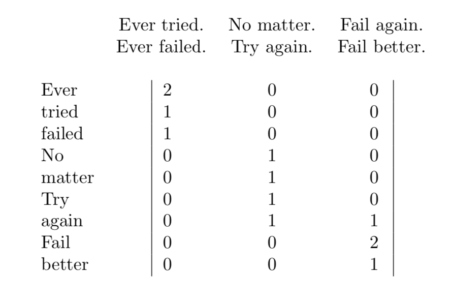
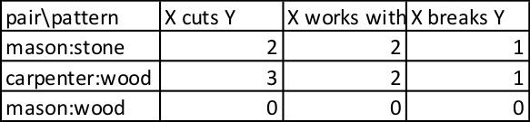
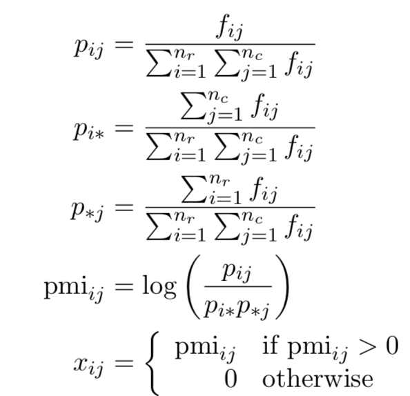
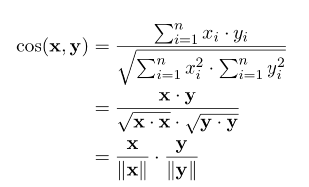

# Citation  

From Frequency to Meaning : Vector Space Models of Semantics
Turney and Pantel Journal of Artificial Intelligence Research 2010

# Tags  

vector space models, representations, embeddings

# Significance

Review paper describing vector space models in NLP - different ways of representing natural language as vectors/matrices/tensors by using *event frequencies*; which allows discovery of semantic information  
There are other vector representations of natural language which do not use event frequencies, these are not covered here.    

# Section 2 (Main types of VSM)

Talks about 3 main vector space models of semantics, the term-document matrix, the word-context matrix, the pair-pattern matrix  

## The term - document matrix  
1) This representation is used to figure out similarity between *documents*  
2) Represent a corpus as a matrix *X* of dimension m*n, where rows(=m) correspond to unique terms (usually words, but other possibilities exist), and columns(=n) correspond to documents  
3) A document vector *X\[,j\]*(column) represents that document j as a bag of words
4) The simplest representation of *X* is where each cell xij is the count of the number of times word i appears in document j  
5) This matrix will be sparse, as most documents will use only a small fraction of the whole vocabulary  
6) The column vector *X\[,j\]* is a crude representation of document j as counts of words in document j. Ignores sequence of words in j, and the structure of the phrases, sentences, and sections in document j.   
7) So if you want to find "similarity" between two documents, find some distance measure between two column vectors corresponding to the two documnents in the TDM  

Here's an example of a term-document matrix  

    
## The word - context matrix  
1) This representation is used to figure out similarity between *words*  
2) Assumes the *distributional hypothesis* in linguistics, that words which occur in similar contexts have similar meanings - know a word by the company it keeps (Firth , 1957)  
3) One possible way to think of a word context matrix is identical to the term-document matrix above, but look at the row vectors representing words instead of the column vectors representing documents . Also , contexts are snippets (much smaller than whole documents typically))   
4) So if you want to find "similarity" between two words, find some distance measure between two row vectors corresponding to the two words in the matrix above   
 

## The pair-pattern matrix  
1) This representation is used to figure out similarity between *relations*  
2) row vectors correspond to word pairs  , and columns correspond to patterns   
3) Lin and Pantel (2001) - patterns that cooccur have similar meaning - distance between column vectors (pattern) in pair-pattern matrix  . Example : "X solves Y" and "Y is solved by X" have similar meanings  
4) Similarly, Pantel (2003) extended this by looking at similar row vectors - which indicates which word pairs are similar because they occur in similar patterns. Example : carpenter:wood and mason:stone are similar word pairs   
   i.e. Pairs of words that co-occur in similar patterns tend to have similar semantic relations  ; which is the inverse of extended distributional hypothesis - that patterns with similar column vectors in pair pattern matrix tend to have similar meanings    
     

## More on "Similarities"  
1) While the word-context matrix measures similarity between words (which the paper calls attributional similarity - Example : That dog and wolf are similar), the pair-context matrix measured relational similarity - Example : That dog:barks is similar to cat:meows  
Relational similarity cannot be reduced to attributional similarity  
2) Note that attributional similarity also refers to antonyms - For example, hot and cold will be attributionally similar since they are used in very similar contexts, even though they are antonyms  
3) The authors argue that *semantic similarity* which has been used historically to talk about words which share a hypernym (Example : Car and bicyle are semantically similar as they share the hypernym vehicle) is only one subset of attributional similarity; and they prefer the word taxonomic similarity to talk about this  
4) Words can be both a) taxonomically similar and semantically associated (cooccur together in corpuses) - Eg : Doctor and Nurse; b)  Taxonomically similar but not semantically associated - Eg : horse and platypus  c) Semantically similar but not taxonomically associated - Eg : cradle and baby d) Neither taxonomically associated nor semantically similar - Eg : calculus and candy  

## Other VSM's  
1) We can generalize pair-pattern matrix to ntuple - pattern matrix but this combinatorially  increases matrix size, and also increases sparseness  
2) We can generalize matrices to tensors - Turney (2007) used a tensor of shape 3 where rows correspond to words from TOEFL multiple choice questions, columns to Words from English, and depth to patterns that join rows and columns   

## A summary on hypothesis  

1) Statistical semantic hypothesis - statistical patterns of human  word usage can be used  to figure out meaning - In a text frequency matrix, if units of text have similar vectors, tend to have similar meaning (this is a general hypothesis subsuming the four specific hypothesis below)   
2) Bag of words hypothesis - Frequency of words in document tend to indicate relevance of document to query - In a term document matrix, if documents have similar vectors, tend to have similar meaning  
3) Distributional hypothesis - words that occur in similar contexts have similar meaning  
4) Extended distributional hypothesis - patterns which co-occur with similar word pairs have similar meanings - If patterns have similar column vectors in pair-pattern matrices, they have similar meaning  
5) latent relation hypothesis - word pairs which co-occur in similar patterns have similar semantic relations between them -  If word pairs have similar row vectors in pair-pattern matrices, they have similar semantic relations between them   

# Section 3 (Linguistic processing of VSM)   

1) For any of the three VSM's above, before we generate matrix, applying linguistic preprocessing on raw corpus helps  
2) Three main kinds of preprocessing needed - tokenization (decide what constitutes a term in corpus, get tokens) , normalization (car/cars can be both called car) and annotation (to mark identical strings in corpus which means different things as different - example : fly as a verb is annotated as fly/VB and fly as a non as fly/NN)  

## Tokenization  
1) Seperate by spaces in English, in addition, A good tokenizer should handle punctuation (don't, Jane's); hyphenation (state-of-the-art and state of the art mean the same thing); multi-word terms as one token (Barack Obama is 1 token))), 
2) We may choose to ignore stop words (high frequency words with low information content such as and, of, etc); and pronouns (he, who, that)  
3) Other languages with different scripts will need different tokenization strategies  

## Normalization  
1) Different strings which convey the same meaning have to be normalized to same string  
2) Most common normalization are case-folding (convert all words to lower case) and stemming  
3) casefolding can cause problems, both in english and other languages for some words - have to be careful  
4) Stemming - reduce words to root/stem. Relatively simpler in english, can be complex for agglutinative languages where multiple concepts can be combined in a single word   
5) Normalization reduces precision and increases recall. For a very large corpus, normalization may not be that important  

## Annotation  
1) The converse of normalizion in some sense - same strings which mean different things have to be captured differently. 
2) common forms of annotation - POS annotation (tagging POS to words), word sense tagging (marking ambiguous words according to meaning)  and dependency parsing (analyzing grammatical structure of sentences and marking words in sentences according to roles)  
3) Annotation increases precision and decreases recall   
4) Annotation is useful for measuring semantic similarity of words and contexts. Example : algorithm which clusters row vectors in word-context matrix, using contextual information derived from parsing  can discover word senses (Pantel and Lin 2002a))  

# Section 4 (Mathematical processing of VSM)    
Consists of 4 broad steps, a) calculate the frequencies, b) transform the raw frequency counts, c) smooth the space (dimensionality reduction), d) calculate the similarities.

## Building frequency matrix  
1) In all 3 types of VSM above, building frequency matrices is the first step i.e each cell in a term-document matrix, word-context matrix or pair-pattern matrix is the *counts* of that row-column combination  
2) In practice , getting this matrix for a large corpus can be complicated  
3) First scan through corpus,   record events (row-column combinaton) and frequency  in a hash table, database, or search index  
4) Use resulting data structure to generate frequency matrix with a sparse representation  

## Weighting elements  
1) Purpose is to normalize/weight the raw counts to give more importance to surprising/rare events; and less to very common events  
2) For term-document matrix - one common stratefy is the TF-IDF family of weighting functions. weighting = tf*idf where tf(t) = frequency of term t in document d / (total no of terms in document); idf(t) = ln(total no of documents / no of documents with term t in it))  . High tf means that term is present a lot in that document, high idf means that term is present rarely in other documents  
Note that other variants exist tf = ln(a + frequency of term t in document d), etc  . Logarithms are taken to prevent terms from blowing up, and restricting range  
3) Length normalization - a variant of tfidf where document length is accounted for  
4) Another weighting strategy - PMI (pointwise mutual information) - which works well for both word-context and term-document matrices  
      

5) If word wi and context cj are independent, pij = pi\**p\*j; then PMIij = 0. If PMIij \> 0, it means word and context are positively related, If PMIij \< 0, it means word and context are not related  
6) Positive PMI just sets all PMI \< 0 to 0 i.e. Positive PMIij = max(0,PMIij))    
7) PMI is biased towards infrequent events  . This can be seen by looking at the case where context and word are completely dependent,  ie pij = pi* = p*j; then PMIij = ln(1/pi*)); therefore if probability of word decreases, PMI increases    
This can be dealt with by using discounting factors or by laplace smoothing of the probability esimates where each fij is replaced by fij + K; K is a positive scalar, the greater the K, the more the smoothing      

## Smoothing/Dim reduction  
1) We want to reduce the number of vector components in VSM, to remove non-informative vectors such as vector corresponding to word 'the' in word-context matrix, which will match almost everything , thus having lower semantic discriminative power. In addition, having such not-very-useful vectors increases compuational cost of computing distances (next step) a lot 
2) By definition, PMI will reduce the weights corresponding to cells for such words - therefore, if we keep only those dimensions with PMI above a certain threshold, no of vectors greatly decreases . Lin(1998) showed that doing this did not affect precision, but greatly sped up computation  
3) Another approach is by doing a truncated SVD, where X = U \Sigma V where \Sigma is a diagonal matrix containing eigen values of the covariance matrix XT; and U and V are orthonormal (UTU = I, VTV = I), contain eigen vectors . If X is of rank r, \Sigma is also of rank r. Choose k < r, Let \Sigmak<\sub> be the top k rows of the diagonal matrix, and Uk and Vk the matrices obtained by selecting correspondong columns from U and V  
Then Uk\SigmakVk is the truncated SVM. This can be thought of as i) capturing latent meaning between row space and column space ii) Reducing noise, iii) reducing sparsity  and iv) Finding higher order cooccurences - find co-occurence when two words appear in similar, not identical contexts  
4) Most recent smoothing models  are more expensive computationally than truncated SVD, but work better. SVD assumes that elements in X have gaussian distribution, but it is known that word frequencies do not have gaussian distributions  

## Comparing distance or similarity between word vectors  
1) After all steps above, we want to compare vectors in matrix (row or column depending on kind of matrix and kind of similarity we are looking for as discussed earlier)  
2) most popular measure - cosine distance :  

   

3) Distance can be converted to similarity sim(x,y) = 1/dist(x,y) or sim(x,y) = 1 - dist(x,y)))))  

4) Other distance measures - euclidean distance, manhattan distance, jaccard coefficient  
5) Given a word w, Lee (1999) mentioned that  
    - High frequency sensitive measures score words similar to w, which are high in frequency - Example : cosine, jensen-shannon, recall
    - Low frequency sensitive measures score words similar to w, which are low in frequency - Example : precision  
    - Similar frequency sensitive measures score words similar to w, which are similar in frequency - Example : jaccard, jaccard + Mutual information, harmonic mean  
    
## Efficient comparisons  

## Optimization techniques  
1) Computing similarity between all rows and columns is very expensive computationally - cubic O(m2n))  
2) Optimization solutions (sparse matrix multiplication) - only non-zero cells contribute to distance - Determine which vectors share a non-zero coordinate by building an inverted index, 
Then for each vector x we retrieve in constant time only those vectors y which share a non-zero coordinate with x. computational cost of this is O(Ni2) where Ni is no of vectors having non-zero ith coordinate. This is efficeint the more sparse the matrix is, in practice, linear running time complexity in n was observed where n is no of vectors to be compared  
3) By setting to 0 all cells which have a low PMI OR TFIDF, sparsity can be increased dramatically increasing speed at cost of losing little discriminative power  

## Distributed implementations  
1) Use mapreduce   

## Use in ML  
VSM's can be used in supervised (any algorithm which can use real valued vectors), unsupervised (clustering) and semi-supervised techniques  

# Applications of VSM  

## Term Document matrix  
1) Document retrieval - given a query, rank all documents in decreasing cosine distance of angle between query and document vectors.  
2) Document Clustering -  Cluster documents into groups such that similarity is high within a group  (clustering can be heirarchical or partitional) 
3) Document classification - Most ML approaches take a TDM as an input  
4) Essay grading - grading essays of students by comparing to previously annotated high quality essays  
5) Document segmentation / sectioning  - treat document as a series of blocks, detect where "block shift" happens, Use a word-block VSM  
6) Question answering - Most QA systems have 4 steps - question anaysis, document retrieval, passage retrieval, answer extraction - Vector based similarity can be used in document retrieval and passage retrieval  
7) Call routing - based on caller's spoken answer, route a call  

## Word Context matrix  
1) Word similarities - compare row vectors in TDM, used to answer TOEFL achieving human level performance  
2) Word clustering - able to generate differnet clusters for different concepts underlying same words  
3) Word classification - classify words as positive or negative  
4) automatic thesaurus generation - 
5) Word sense disambiguation  
6) context sensitive spelling correction  
7) semantic role labeling - label parts of sentence according to roles they play in sentence (similar to POS tagging ? )  
8) Query expansion in search engines   
9) Textual advertising - generate ads related to search queries  - columns correspond to advertiser identifiers, rows to bidterms (words advertisers pay for to search engines)  
10) Information extraction - fact extraction, NER, etc  

## Pair pattern matrix  
1) Relational similarity  - distance between rows in pair pattern matrix - is  mason:stone similar to carpenter:wood ?  
2) Pattern similarity - distance between columns in pair pattern matrix - X causes Y similar to Y is caused by X - useful in natural language generation, question answering, text summarization, information retrieval   
3) Relational clustering - cluster word pairs together which potentially have same relation - automatically generate multiple choice anology questions like in SAT  
4) Relational classification - classify pairs of words into classes  by feeding pair pattern matrix into ML model  
5) Relational search - "list all X such that X causes diabetes " - envisioned as two steps - conventional search engine lists potential answers, relation classification algorithm removes incorrect answers  
6) automatic thesaurus generation - Snow, Jurafsky and Ng (2006) used a pair pattern matrix to build a hypernym-hyponym taxonomy, Pennacchiotti and Pantel (2006)  built a meronymy and causation taxonomy , Turney  2008a was able to distinguish synonyms from antonyms, synonyms from non-synonyms, etc   
7) Analogic mapping - a:b::c:d such as mason:stone::carpenter:wood are proportional analogies, which can be solved with relational similarity (see 1 above). This can be extended  to analogies which are many more terms (Turney 2008a)  

# Alternative approaches to semantics  

1) Probabilistic models can be used instead of VSM for measuring document similarity, etc  instead of TDM 
2) Lexicons such as WordNet which represent lexicons as graphs, nodes corresponding to word senses and edges to relations  can be used instead of word similarity matrices to measure similarity between words   
3) Instead of pair pattern amtrices, reducing relational similarity to attributional similarity (sim(a:b,c:d)  = sim(a,c) + sim(b,d)  ))) and then using lexicons is an alternative. 

# Future of VSM  
1) One common criticism - order is ignored in VSM - can be handled by using different weightings of contributions of vector components (Mitchell and Lapata 2008))   

  

