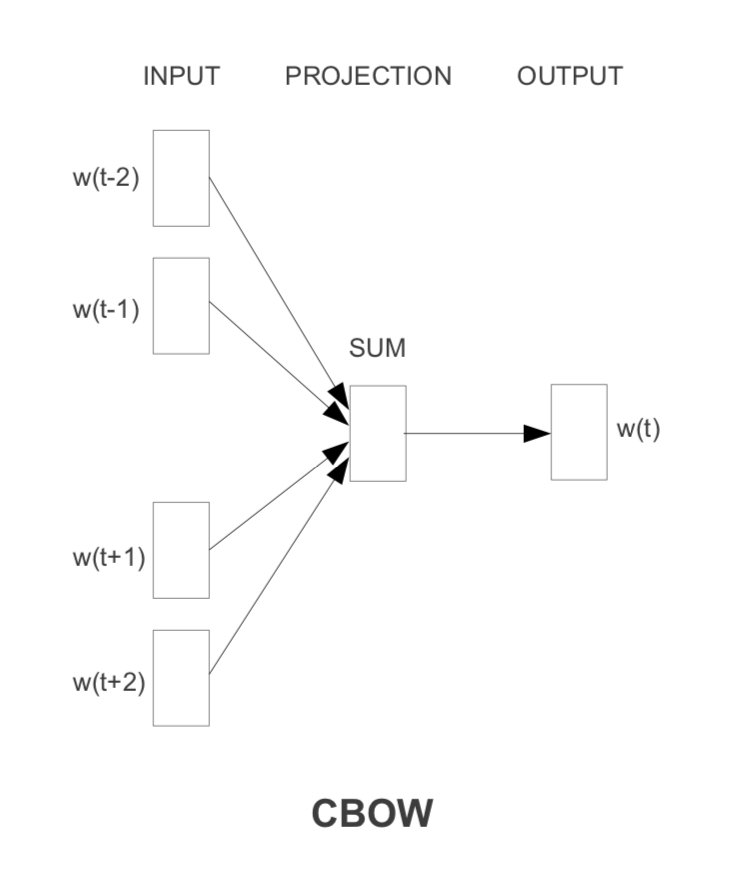
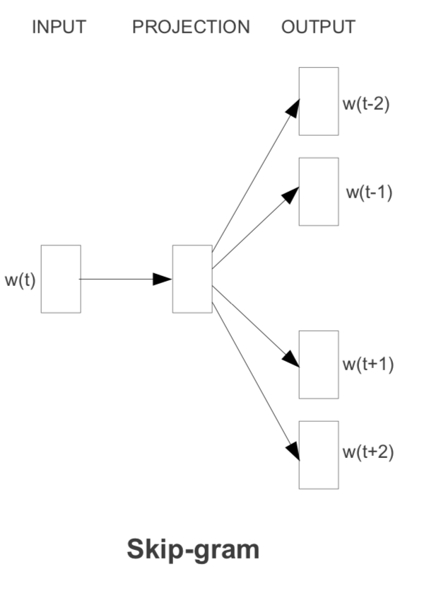
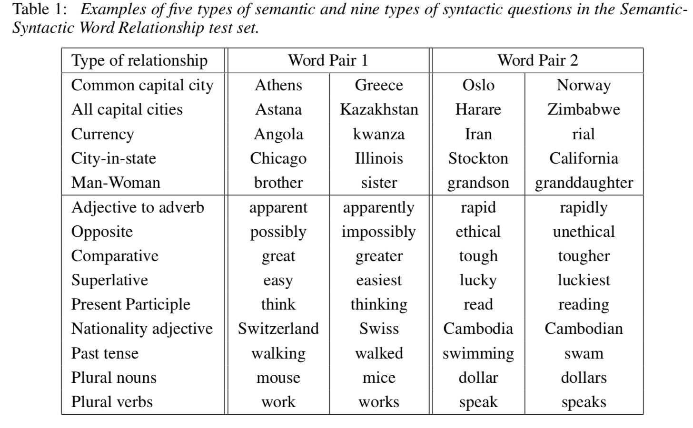
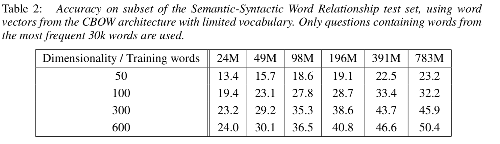
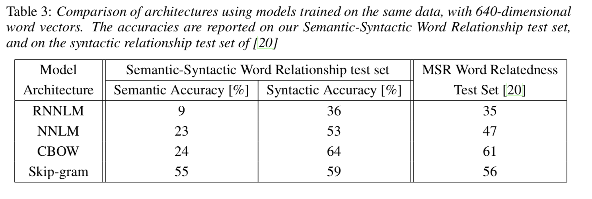
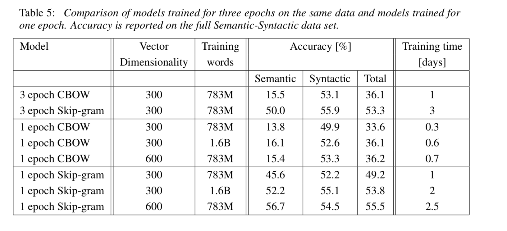
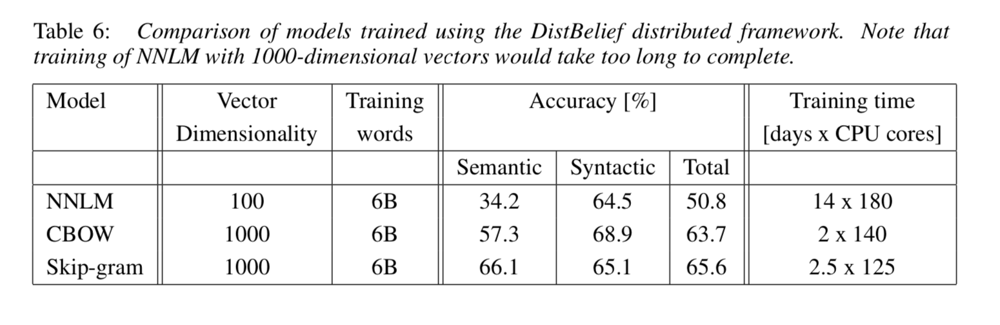

# Citation  

Efficient Estimation of Word Representations in Vector Space
Mikolov, Chen, Corrado and Dean 2013

# Tags  

vector space models, representations, embeddings

# Significance

The first popular word embedding model Word2vec. Scales Bengio's 2003 paper on Neural probabilistic language model

# Context and summary  

Methods which don't have a concept of similarity between words (representing each word by an index), and statistical language modeling methods like N gram models can work on large data sets, but on areas where in-domain data is limited (eg automatic speech recognition ), performance bottle necks are reached.  
This paper introduces an NN architecture for learning high quality word representations from huge data sets with billions of words and millions of words in vocab.   
Also introduces a new comprehensive test set to measure syntactic and semantic regularities   

NNLM (Feed forward NN Language model)   [Bengio's 2003 Neural probabilistic language model paper](./NLP/neural_probabilistic_model_bengio_2003.md)   

Complexity as follows -   
If |V| is vocab size, m is size of distributed representation desired, if the NPL model uses the last n-1 words,  
(note - this paper uses a different notation, sticking to notation in Bengio's paper)  
Computational complexity per training Q  = (n*m (Dimension of embedding layer - n previous words (Bengio's paper uses n-1, we use n as notation ), each of dimension m) +   
                                          (n)*m*h (Dimension of embedding to hidden layer) +  
                                           h*|V|  (Dimension of hidden to final softmax layer) - Ignores skip connections which original paper proposes  
Bengio's paper talked about how h*|V| is a lot of parameters and is the dominating term because of vcab size |V|, but this can be made less complex using heirarchical softmax which can replace h*|V| as h*ln(|V|)  

The next significant bottleck is the (n-1)*m*h term  which this paper tries to solve  

RNNLM (Recurrent NN Language model) (Recurrent neural network based language model, Mikolov et al 2013) uses RNN instead of FNN  
No projection layer exists ((n-1)*m) term, only input , hidden and output layer. One adv over NNLM is that n does not need to be prespecified (sequence length)  

Complexity Q = h*h  (hidden to hidden connections)  +  
               h*|V|   (hidden to final softmax layer)  
               
Just as in NNLM, h*|V| can be simplified to h*ln(|V|), therefore , most of the complexity is the h*h term  
               
               
 
# Method in more detail 

Two architectures implemented - Continuous bag of words model (CBOW) and continuous skip gram   

##CBOW  

Given context, predict word  

1) Same principle as Bengio, with three changes -   
    a) No non-linear layer (the h layer is removed)  
    b) Instead of using only previous n-1 terms, use some words next to the word too. Therefore, slight change in notation - instead of n-1 representing previous n-1 words, we use n which is a combination of previous and next words (best performance was with 4 previous and 4 next words)  
    c) Instead of the (n)*m term (each of the n words is a seperate input), these are averaged to create just one vector of dimension m   
    
    Therefore, complexity is simply  
    
    Q = n*m (Dimension of embedding layer - n words, each of dimension m) +    
        (m*ln(|V|))  - embedding of n-1 words averaged to get 1 vector of dimension m, which is passed through heirarchical softmax  
        
    Much simpler model !! 
    
        
    
    Image Credit : Figure 1 in paper     
    
    

    
    
## Continous skip gram  

Given word, predict context  

1) Flipped version of CBOW - given only representation of 1 word as input, predict C words before and after current word    
  In implementation, C is an upper limit, For each iteration, a random integer R between 1 and C is chosen , and 2*R words used   . Also, words further away from current word are sampled less than words nearer
 
 
    Therefore upper limit on complexity is 
    
    Q = m (dimension of single word , paper uses C*m instead of m here, don't understand how)  +    
        m*ln(|V|)*C  (For C words, actually 2*C forward and backward), we get a seperate heirarchical softmax output ie 2C seperate classifications  +
        

     
  
  Image Credit : Figure 1 in paper  
  
  
    
    
## Training Details  

Google news corpus used for training vectors - 6B tokens, vocab restricted to 1MM most frequent words  

# Results  

Authors create a test set which represents five types of semantic questions and 9 types of syntactic questions  
contains 8869 semantic and 10675 syntactic questions (examples below)   

For each of the question types, Use word analogy for a formal quantification of accuracy of word vectors 
i.e. If we find vector(”biggest”) − vector(”big”) + vector(”small”), this should be closest (cosine distance) to vector("smallest")  
    

       
    
    
  Image Credit : Table 1 in paper    
  
  
  
Tried different vector dimensions, and training data size - observed that both have to be increased together to improve performance, otherwise bottleneck reached  

         
    
    
    Image Credit : Table 2 in paper   
    
    
    
    
Compared RNNLM, NNLM, CBOW and skip gram     

         
     
     
     
     Image Credit : Table 3 in paper        
     
     
     
Variation of performance with epoch no, and training time, on single CPU  

        
    
    Image Credit : Table 5 in paper 

Performance using a distributed framework of CPU's called Distbelief, which enables longer dimension word vectors to be trained  

        
    
    
    Image Credit : Table 6 in paper   

