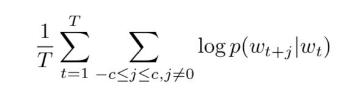
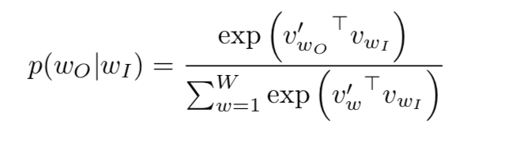
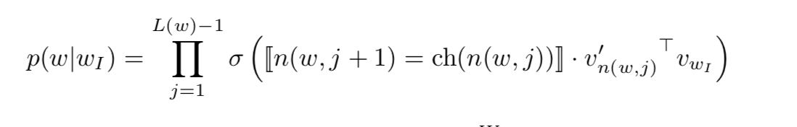
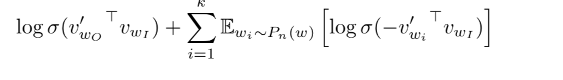
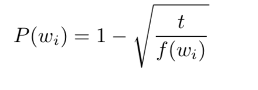
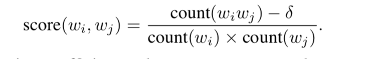
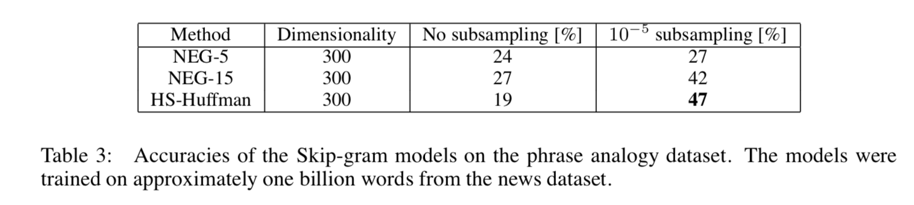

# Citation  

Distributed Representations of Words and Phrases and their Compositionality
Mikolov, Sutskever, Chen, Corrado and Dean 2013

# Tags  

vector space models, representations, embeddings

# Significance

Companion paper to the the [slightly earlier w2vec paper](./NLP/nw2vec_1_mikolov_2013.md). Talks about
extensions to the skipgram model

# Context and summary  

Extensions to skip gram model -
1) Speed up of training by subsampling of frequent words (2x-10x). This method also helps in improving accuracy of embeddings of infrequent words  
2) Instead of heirarchical softmax , use a variant of NCE (Noise contrastive estimation) - Negative sampling  
3) Handle phrases like "Newyork Mets" (the earlier model would have used two words here Newyork and mets which is not the right thing to do)  

# Method in more detail

1) Basic skipgram cost function :

  

  Image credit : equation 1 in paper

  where

    

  Image credit : equation 2 in paper

  This formulation is impractical as cost of computing grad log p(wo|wI) is proportional to vocab size W which is very large  

2) Heirarchical softmax, the approach used in the companion paper has formulation  

    

  where n(w,j) is the jth node on the path from root of tree to word w, L(w) is length of this path ie n(w,1) = root, n(w,L(w)) = w. For
  any inner node n, ch(n) is a child of n and let [[x]] be 1 if x is true, and -1 otherwise  
  Here, cost of computing grad log p(wo|wI) is proportional  to L(wo) which is no greater than logW.  
  Also, unlike standard skip gram where each word has two embedding representations vw and vw' for every word (vw from embedding layer and vw' from weights of NN)  ,
  here this is only 1 representation for every word vw and 1 representation vn' for every inner node n in binary tree  

  Image credit : equation 3 in paper

3) Negative sampling, an alternative to heirarchical softmax  

   has this term     

   Image credit : equation 4 in paper

   instead of P(wo|wI) in skip gram objective  
   Intuition - instead of updating during backprop all the d*W weights where d is embedding size, and W is vocab size;
   update weights only corresponding to positive word, and a small number of negative words (k) chosen randomly  
   The best distribution used to randomly select k words was found to be a unigram distribution raised to 3/4 power.  
   k is found to be best in range 2-5 for large datasets and 5-20 for small data sets  

4) Subsampling  of frequent words  

   Most common words like "the", "a" have very little discrimitative power.  To handle this,
   each word in training set is discarded with probability

     

   Image credit : equation 5 in paper  

   where f(wi) is frequency of word i in corpus, t is a threshold chosen to be 10-5  

   Advantage - it removes frequent words mostly , thus reducing time taken to train model  
   In addition, it can learn better representations of frequent words because it doesn't use all possible contexts to learn frequent word representations  

5) Handling phrases  

   phrases that appear frequently in some contexs and infrequently in some others such as "New york times" are replaced during preprocessing by a single tokens  
   universally common tokens such as "this is" are kept unchanged  

       

   Image credit : equation 6 in paper  
   all word pairs with score above a certain threshold are identified as phrases   

# Results  

      

  Image credit : table 3 in paper  

  Also, trained word vectors can be added to create meaningful phrases - (Vector compositionality)  

      

  Image credit : table 5 in paper   
