# Citation  

XLNet: Generalized Autoregressive Pretraining for Language Understanding
Yang et al 2019

# Tags  

xlnet

# Significance

Change the cost function (minor architecture changes,  major changes in the cost function) of BERT.
avoid masking the way bert does, incorporate features like permutation and attention masks to allow 
autoregressive cost function formultations like elmo, but at the same time enable using deep bidirectional
context like bert.

# Context and summary  

Two main kinds of transfer learning frameworks - autoregressive frameworks (AR) such as ELMO, Open GPT
Here, the LM objective is to maximize P(xt|x1..xt-1)
The disadvantage is that it doesn't enable using bidirectional context (ELMO uses bidirectionality but shallow)

The other  approach is what the authors call the AE (auto encoding) approach such as BERT, where 
tokens are corrupted intentionally (replaced by MASK), and instead of maximizing P(xt|x1...xt-1) as in
the AR frameworks, we maximize P(x_token=mask|x_token_notequal_mask). In addition, BERT has a NSP objective. 
The disadvantage of this approach is  - 
1) we get a discrepancy between the pretrain LM step and the finetuning step, as during pretraining LM,
algorithm sees MASK tokens, but during fine tuning algorithm does not see MASK tokens - BERT addresses 
this partly by replacing the masked tokens with the MASK only 80% of the time, keeping the word unchanged
10% of the time, and replacing by random word 10% of the time, but this doesn't solve the problem
as only in 10% of the cases (10% of 15% words which are masked) is the original word seen during pre-training,
but they cant be used more often, as trying to predict the word by using the word itself in context is trivial.
 
2) the masked tokens are assumed to be independent while formulating the cost function (dependencies between 
masked tokens are not taken into account) - giving a contrived example - given a sentence,
the MASK was MASK on the riverside, either the boat was beached on the riverside, or the parade was seen on the riverside
are valid examples (ie boat,beached and parade,seen are valid replacements of mask) .
However, since BERT does not take dependencies of masked tokens into account, it may think
that the parade was beached on the riverside is acceptable which is False) 
Example from [this link][1] 
3) A third disadvantage is that the BERT LM can use some words as crutches to avoid learning valid connections
Example : the MASK was beached on the riverside. BERT may use the word riverside to predict that MASK is boat
and avoind learning that beached also implies that MASK is a boat

XLNet combines the pros of the AR and AE approaches while avoiding the cons by changing the cost function - 
1) Instead of using a fixed forward or backward factorization order as in classic AR LM
ie find P(xt| xt<T) or P(xt| xt>T), XLNet maximizes the expectation of Log likelihood
over all possible factorization orders . This way, the context can contain tokens from either 
the forward or backward direction, allowing for deep bidirectional information to be captured
2) Does not rely on data corruption or masking - therefore, no pre-train fine tune discrepancy, etc

In addition, architectural changes include - 
1) integrating segment recurrent mechanism and relative encoding scheme of transformer XLNet into pretraining
2) reparametrize the transformer XL network, as naively using it does not work because of arbitrary factorization 
order and ambiguous target. 

By doing these, it outperforms BERT on a wide spectrum of GLUE tasks, reading comprehension tasks like 
SQUAD and RACE, text classification tasks like yelp and imdb, doc ranking tasks clueweb 09b

# Method in more detail  

1) Conventional AR LM maximizes likelihood under the forward autoregressive factorization approach 

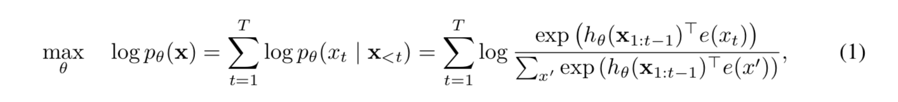  

Image credit - Equation 1 from paper  

where e(xt) is the embedding of the xt word, h\theta(x1:t-1) is the context representation 
produced by neural models such as RNNs or transformers. 

2) BERT in contrast uses the cost function to reconstruct masked tokens from the surrounding context

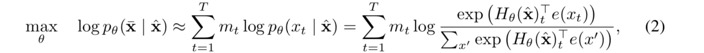  

Image credit - Equation 2 from paper 

where mt=1 if token is masked, and H\theta(x) is a transfomer which maps a T length input sequence
to a T length sequence of hidden vectors. 

where x with a bar on top indicates the masked tokens 
the approximate equal to indicates the assumption that all masked tokens are assumed to be indepdendent,

3) XLNET objective - permutation langauge modeling 

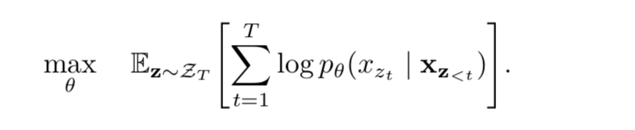  

Image credit - Equation 3 from paper 

where given a phrase of T tokens 1...T, ZT refers to all possible permutations of the phrase
(the total no of permutations will be T!, but not all permutations are used, only a sample is taken)
The same model parameter is shared across all the permutations used. 
Since all permutations are used, bidirectional contexts naturally follow in the AR framework.

Note however, that the sequence order is not changed - only the permutation is 
ie positional encodings are used to keep track of exact position of word in the sequence.

4) The attention mask

How does the model keep track of relative word position when permutations happen ?

(This section is based on [this website][1])
Given a sentence "This is a sentence"
there are 16 permutations of the 4 words, and thus 16 different terms in the cost function on which 
expectation is taken (note that in reality, only a sample of these 16 combinations are used in the cost function
for memory reasons)

Given two examples P(This|is) and P(This|a), how does the model know  the relative positions of is and the
with respect to This ?

Having position embeddings in the BERT model help - 
ie P(This | is + 2) and P(a | is + 2) 
but once permutations happen, this information is lost

For implementation, this is dealt with using an attention mask 
the same sequence order (the original sequence order) is always kept
and tokens with t>=T for the specific permutation are masked using an attention mask

For example - taking the specific permutation order (3,2,4,1) - 
This gives rise to 4 terms in the cost function - P(3|nothing), P(2|3), P(4|3,2) and P(1|3,2,4)

This can be captured using a masking matrix where 0 represents masked terms
(0,1,1,1
 0,0,1,0
 0,0,0,0
 0,1,1,0)
 
 row 1 here represents the P(1|3,2,4) term  (more explicitly P(This | _, is+2, a+3, website+4)); 
 row 2 represents the P(2|3) term ((more explicitly P(is | _, _, a+3, _)
 row 3 the P(3|nothing) (P (a | _,_,_,_))
 row 4 represents P(sentence|_,is +2, a+3, _)
 
5) The two-stream self attention aka decopuling word and positional embedding
 
In bert word and positional embedding are added
 
In the representation above - for example P(This | _, is+2, a+3, website+4))
we also weant to capture the positional information the target word (that This is the first word), 
apart from capturing the positions of the context words
 
however, in bert the positional and context embeddings are coiupled
so the only way we can do that is to compute
P(This | This +1, is+2, a+3, website+4)) which is trivial because the word sees itself
so we need a way to decompose positional and word embeddings
  

The two stream self attention framework does exactly this - 
Each token position i has two associated vectors at each self attention layer m,
him, and gim  - him is called the content stream whose vectorws are initialized with the usual embeddings
(ie sum of token and positional embeddings)
gim is called the query stream which captures just the positional information, - initialized
with generic embedding vector across all tokens w added to positional embeddings 
his are updated using the unmasked ht's and itself ie all t<=T, or the matrix above with diagonal values changed to 1
h3m is updated using h3m-1, h1m by h1m-1,h2m-1,h3m-1,h4m-1, etc above

gis are updated using the unmasked content vectors hi's and the gi of the current token
For example, above, g1m is updated using h2m-1, h3m-1, h4m-1 and g1m-1; g2m by h3m-1 and g2m-1; g3m by g3m-1; g4m is updated using h2m-1, h3m-1 and g4m-1

Mathematically, 
hi(0) = e(xi)  (the embedding of token xi - sum of context and position embedding)
gi(0) = w  (a common word vector across all tokens)

For each subsequent self attention layer m (m=1..M); 

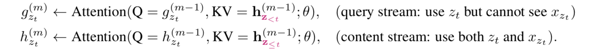 
Image credit - from page 5 in paper

The g of the M layer is used as follows

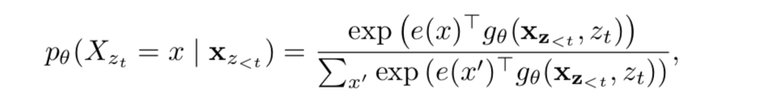 
Image credit - Equation 4 in paper

6) Partial prediction.

Rather than using the full cost function

  

Image credit - equation 3 in paper,

which is a challenging optmization problem due to slow convergence, and permutations, 
For any given factorization order, we predict only the last c tokens  

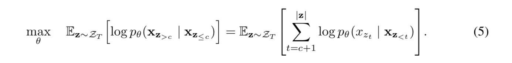  

Image credit - equation 6 in paper 

To normalize c for length of sentence, choose a hyperparameter K such that 1/K tokens are selected for predictions
 |z|/(|z| - c) approximately K

7) Incorporating transformer XL 

Integrate relative position encoding and segment recurrence mechanism from transformer XL (Dai et al 2019)

Relative positional encodings are integrated as discussed earlier
Segment recurrence mechanism is integrated as follows : 

Suppose we have two segments from a long sequence s : xtilda = s1:T, x = sT+1:2T
Let ztilda and z be permutations of xtilda and x respectively

Based on ztilda, the permutation of the first segment, process first segment, and cache content representations 
htildam for each layer 

For the next segment x, 
use the hidden representations of the first segment as follows 

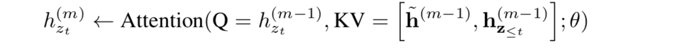  

Image credit - from page 5 in paper

Since the update of the second part is dependent only on htildam (content stream vectors of first part), and not on ztilda (the permutations
of the first part directly), these can be cached, and knowledge of the factorization order of the previous segment is not necessary

8) Modeling multiple segments

For tasks like QA tasks where there are two segments to be passed as input, how DOES XLnet work ?

similar to BERT, Randomly sample two segments (either from same context or not), and treat concatenation
of two sequences as one sequence to perform permutation language modeling. 
Reuse memory only for sequences belonging to same context. 

So given two segments A and B, we input (CLS,A,SEP,B,SEP)
Note that NSP cost function is not used, as it does not seem to help

Also, in contrast to BERT which adds absolute segment embeddings to word embeddings at each position,
similar to transformer XL, XLNETuses relative segment embeddings.

Basically, given a pair of positions i and j in sequence, if i and j are from same segment
use segment encoding sij = s+, if not, use sij = s-
instead of using absolute segment embeddings - 
ie instead of considering which specific segments the tokens are from, 
we are only interested if they are in the same segment or not.
s+ and s- are learnable parameters
When token i attends to token j in the self-attention layer, 
we compute an attention weight aij = (qi + b)Tsij where qi is the usual query vector,
b is a learnable head specific bias vector. This aij is added to the normal attention weight

The benefit of relative segment encoding - 
inductive bias of relative encodings improve generalization
allows for extension of this framework for finetuning on tasks with more than two input segments,
which is not possible (why ?) with absolute segment encoding

9) More on BERT vs XLNET

Both BERT and XLNET perform partial prediction (predict on subset of tokens in sentence) - 
necessary in BERT because it is not possible to mask all tokens,
also helps reducing optimization difficulties

However,    BERT's independence of masked tokens assumption prevents learning dependencies between targets,
which XLNET does

Eg : Given sentence New York is a city
If first two tokens are masked
MASK MASK is a city
in BERT we learn P(New|is a city) + P(York|is a city)

However, if the factorization order of XLNET is (is, a, city, new , york)
it learns P(New|is a city) and P(York | New, is a city)

so the second term leans a new dependency between York and New which Bert is unable to do

# Experiments

## Pretraining

Books corpus + English wikipedia (13 GB combined plain text)
In addition, include Giga5, clueweb 2012-B and common crawl for pretraining - 
tokenize with sentence piece. 
K is chosen to be 6 ie 1/6 tokens are used for predictions

# Results

## Comparison with BERT

Trained on the same books corpus + English wiki data

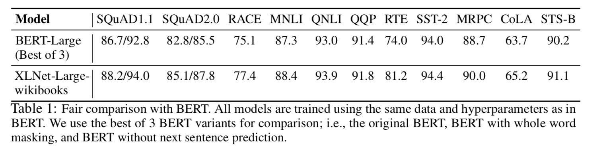 
Image credit - Table 1 in paper

## Comparison with Roberta

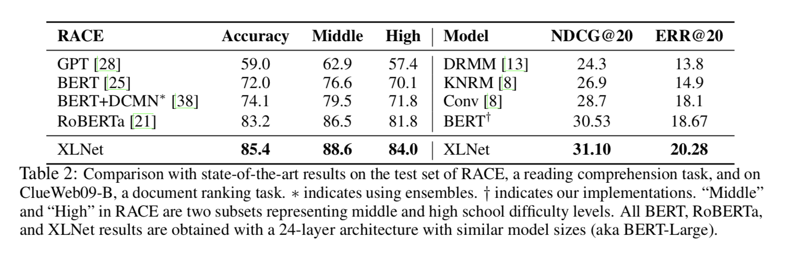 
Image credit - Table 2 from paper

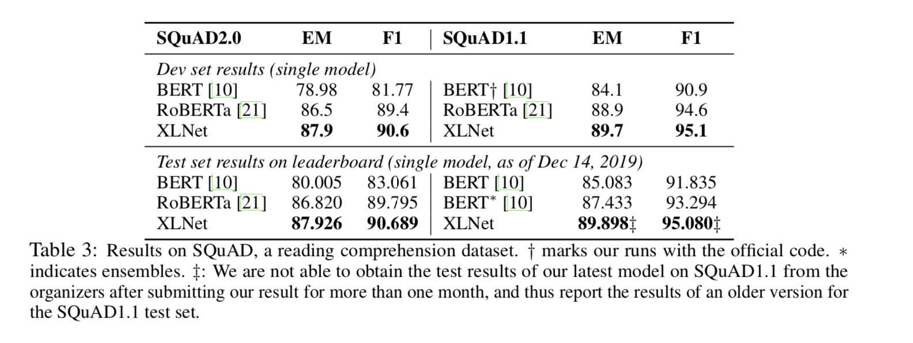 
Image credit - Table 3 from paper

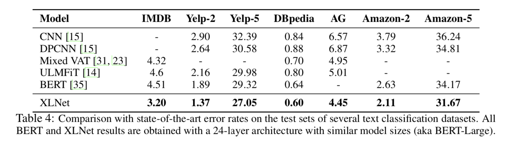 
Image credit - Table 4 from paper

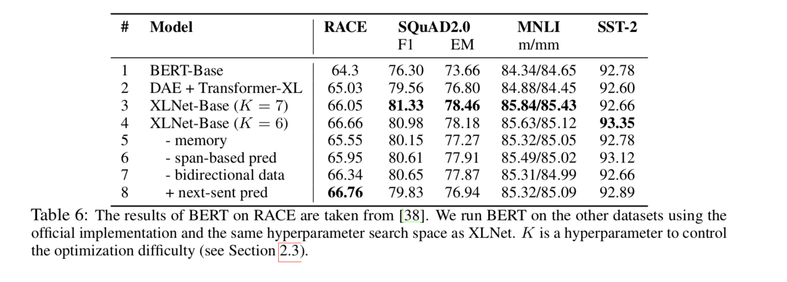 
Image credit - Table 5 from paper

## ablation study 

 
Image credit - Table 6 from paper

Both transformer XL and permutation language modeling help

 
 
 

# References
[1] : https://www.borealisai.com/en/blog/understanding-xlnet/
